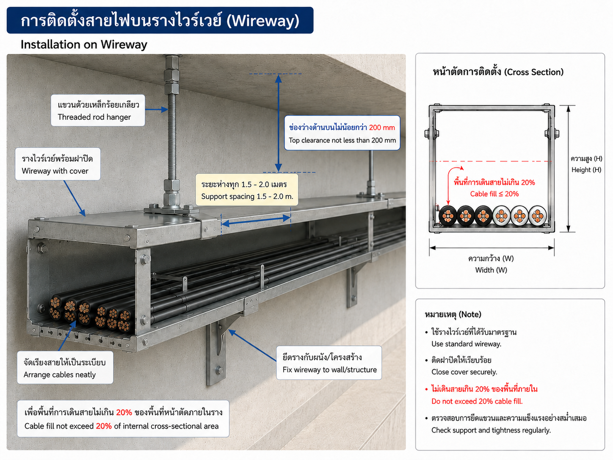
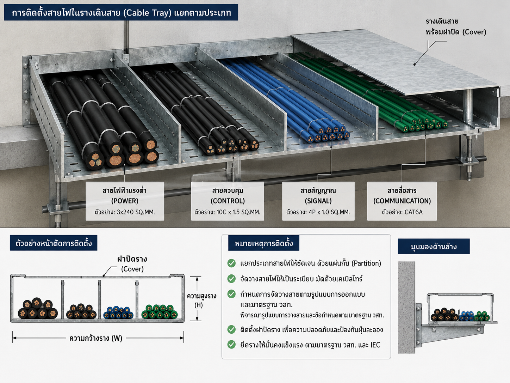

# คู่มือใช้งาน Prompt Master Template: Solar Rooftop

## PHASE 0 - Input & Readiness Review

**สถานะเอกสาร:** Expert reference update สำหรับส่ง Lead Engineer ตรวจและเติมข้อมูลโครงการ  
**วันที่ปรับปรุง:** 1 สิงหาคม 2026 
**Revision:** R5 - Adapted to `2.Cable_Containment_Data_Register_ExpertRev.6.xlsx` 
**ขอบเขตของรอบนี้:** ตรวจ workbook Rev.6, ปรับแหล่งอ้างอิง PV/OD master, ปรับตาราง IMC, ladder/tray, wireway และ thermal screening ให้ตรงกับสูตร/ค่าที่ workbook ใช้จริง
**สถานะการตัดสินใจ:** **NO-GO - ยังไม่เริ่ม Preliminary Design หรือ Calculation Book**

> เอกสารนี้เป็นเครื่องมือจัดระบบข้อมูลและร่างเชิงวิศวกรรม ไม่ใช่แบบก่อสร้าง ไม่ใช่เอกสาร IFC และไม่ใช่การรับรองแบบแทนวิศวกรไฟฟ้าผู้มีใบอนุญาต

---

## 1. Executive Summary

ตรวจพบ `Solar_Rooftop_Project_Data_Form.xlsx` และตรวจครบ 8 ชีตแล้ว แต่ยังเป็นแบบฟอร์มว่าง จึงยังไม่มี Project Design Input ที่ใช้ปิดขนาดระบบ จุดเชื่อมต่อ หรือราคาได้ ตรวจ vendor list จาก `เอกสารแนบ2_vendor list_OM plan.pdf` ครบ 13 หมวด และจัดทำ Vendor Register เทียบกับ datasheet ที่เก็บใน `Datasheet/Vendor_Reference/` รวมทั้งเพิ่มตัวอย่าง PV module LONGi และ inverter Sungrow ซึ่ง **อยู่นอก vendor list และใช้เป็น reference เท่านั้น**

ผลการตรวจความพร้อมยังเป็น **NO-GO สำหรับ PHASE 1-5** เพราะ datasheet ที่เพิ่มเป็น reference screening ไม่ใช่ Approved Project Input และยังขาด layout/SLD/load profile/utility requirement/structural verification. สำหรับ containment workbook Rev.6 ใช้หลักดังนี้: IMC ใช้เกณฑ์พื้นที่ตามจำนวนสายรวม 53%/31%/40%; wireway ใช้พื้นที่สายรวมไม่เกิน 20% ตาม วสท. 022001-22 ข้อ 5.12 และแสดง `ΣD_cable ≤ 0.8W` เป็น **supplementary single-layer cross-check** ซึ่งไม่ใช่เกณฑ์มาตรฐานหลัก ไม่มีผลต่อการใช้งานจริง และใช้แทนเกณฑ์ 20% ไม่ได้; ladder/tray ไม่ใช้เปอร์เซ็นต์ 20% เป็นเกณฑ์แทน แต่ใช้ชนิดสาย การจัดวาง และเกณฑ์ตาม วสท. 022001-22 ข้อ 5.15

**Document-control note:** ชื่อไฟล์ระบุ `Rev.6` แต่ `Read Me` และข้อความบางชีตภายใน workbook ยังระบุ `Rev.4/Rev.3` และมีข้อความค้างเป็น Prysmian ในขณะที่สูตร/OD master downstream ใช้ Phelps Dodge. คู่มือนี้จึงยึดค่าที่คำนวณ/เชื่อมโยงจริงจาก Rev.6 เป็นหลัก และถือข้อความค้างดังกล่าวเป็น **OPEN discrepancy** ที่ต้องแก้ใน workbook ก่อนออกเอกสารควบคุมหรือ IFC

รอบถัดไปควรเริ่มจากส่งไฟล์ข้อมูลหลักและเอกสารประกอบตาม Missing Information Register โดยคงชื่อไฟล์และวันที่เอกสารให้ตรวจย้อนกลับได้ เมื่อได้รับข้อมูลแล้วจึงทำ Input Register ระดับไฟล์/แท็บ/ช่วงเซลล์ และประเมินว่าอนุญาตให้เดินหน้าได้ถึงระดับ Preliminary Design หรือไม่

## 2. วิธีใช้คู่มือนี้

1. วางไฟล์ทั้งหมดในโฟลเดอร์โครงการเดียวกัน โดยไม่เปลี่ยนชื่อไฟล์ต้นฉบับหลังเริ่มตรวจ
2. เพิ่ม revision/date ในชื่อไฟล์หรือเอกสาร และระบุผู้ส่งหรือเจ้าของข้อมูล
3. กรอก `Solar_Rooftop_Project_Data_Form.xlsx` ให้ครบเท่าที่ทราบ โดยไม่เดาค่า
4. ใช้คำว่า `UNKNOWN`, `TBC` หรือ `N/A` แทนช่องว่างที่มีความหมาย และอธิบายเหตุผล
5. ให้เจ้าของข้อมูลตอบ Missing Information Register ตาม Priority และ Go/No-Go
6. ให้ Lead Engineer ปิด Assumption Register และอนุมัติ Design Basis ก่อนเริ่มคำนวณ
7. เก็บไฟล์ที่ใช้คำนวณทุกฉบับไว้เป็นชุด frozen input พร้อม checksum หรือ revision log

### 2.1 สถานะข้อมูลที่อนุญาต

| สถานะ | ความหมาย | วิธีใช้ |
|---|---|---|
| VERIFIED SOURCE | มีเอกสารต้นทาง ระบุ revision/date และตรวจความสอดคล้องแล้ว | ใช้เป็น Design Input ได้ภายใต้ขอบเขตเอกสาร |
| PROVIDED - UNVERIFIED | ได้รับจากเจ้าของโครงการหรือหน้างาน แต่ยังไม่มีหลักฐานรองรับครบ | ใช้เพื่อ screening เท่านั้นและต้องมี Hold Point |
| ASSUMPTION - ต้องยืนยัน | ตั้งขึ้นเพื่อให้เห็นผลกระทบหรือดำเนินการชั่วคราว | ห้ามนำเสนอเป็นข้อเท็จจริงและห้ามปิดแบบโดยไม่ยืนยัน |
| CALCULATED | ผลจากสูตรที่แสดงหน่วย การแทนค่า และแหล่งข้อมูลครบ | ต้อง trace กลับ Design Input ได้ |
| MISSING | ยังไม่มีข้อมูล | บันทึกใน Missing Information Register |
| NOT APPLICABLE | ไม่เกี่ยวข้องกับขอบเขตที่อนุมัติ | ต้องระบุเหตุผล ไม่ปล่อยว่าง |

## 3. Input Register

### 3.1 เอกสารที่ตรวจพบ

> รูปแบบรายการด้านล่างออกแบบให้เปิดอ่านบน GitHub มือถือได้ง่ายกว่าตารางหลายคอลัมน์ โดยแตะที่แต่ละรายการเพื่อดูรายละเอียด

<strong>IN-000</strong> — Solar_Rooftop_Project_Data_Form.xlsx

- **Type:** Project input workbook
- **Sheet / Section:** 8 sheets
- **Revision / Date:** ตรวจเมื่อ 16 ก.ค. 2026
- **Source / Owner:** Workspace ที่ผู้ใช้กำหนด
- **Reliability:** VERIFIED FILE / UNPOPULATED
- **Review Result:** รูปแบบไฟล์ใช้งานได้ แต่ยังไม่มีข้อมูลโครงการ

<strong>IN-010</strong> — Bangkok_Cable_Electrical_Design_Installation_Guide.pdf

- **Type:** Manufacturer guide
- **Sheet / Section:** THW, NYY, CV/XLPE, cable dimensions, ampacity และ voltage drop
- **Revision / Date:** Revised Third Edition; พ.ศ. 2564
- **Source / Owner:** Bangkok Cable
- **Reliability:** Manufacturer source - example only
- **Review Result:** ใช้กรอกข้อมูลตัวอย่างสาย AC; exact current product datasheet ยังต้องยืนยัน

<strong>IN-011</strong> — Panasonic_White_Conduit_Catalogue.pdf

- **Type:** Manufacturer catalogue
- **Sheet / Section:** White Conduit IMC และ certificate overview
- **Revision / Date:** Revision/date ไม่ปรากฏชัดในไฟล์ที่ตรวจ
- **Source / Owner:** Panasonic SPT (Thailand)
- **Reliability:** Manufacturer source - example only
- **Review Result:** มี item no., OD, minimum wall thickness และ length; actual ID ยังไม่มี

<strong>IN-012</strong> — KJL_Catalogue_Cable_Ladder.pdf

- **Type:** Manufacturer catalogue
- **Sheet / Section:** KLSG Hot-Dip Galvanized Cable Ladder
- **Revision / Date:** Catalogue 2022-2023
- **Source / Owner:** KJL
- **Reliability:** Manufacturer source - example only
- **Review Result:** มี nominal W/H/L, thickness, material/finish; usable dimensions/load rating ยังไม่มี

<strong>IN-013</strong> — Cable_Containment_Data_Register_Example.xlsx

- **Type:** Derived working register
- **Sheet / Section:** Conduit Data, Ladder Data, Fill Check - EIT, Thermal Check, Source Register
- **Revision / Date:** 15 ก.ค. 2026
- **Source / Owner:** Codex draft from IN-011/IN-012
- **Reliability:** CALCULATED / working file
- **Review Result:** สูตรตรวจแล้ว; ช่องเหลืองต้องกรอก/ยืนยันก่อน Pass/Fail

<strong>IN-014</strong> — เอกสารแนบ2_vendor list_OM plan.pdf

- **Type:** Owner vendor/O&M attachment
- **Sheet / Section:** Vendor list 13 categories; O&M schedule
- **Revision / Date:** ตรวจเมื่อ 16 ก.ค. 2026
- **Source / Owner:** Owner attachment
- **Reliability:** VERIFIED SOURCE
- **Review Result:** ใช้เป็นฐาน Candidate Vendor Register; ไม่ใช่การอนุมัติรุ่น

<strong>IN-015</strong> — Datasheet/Vendor_Reference/*.pdf

- **Type:** Manufacturer reference set
- **Sheet / Section:** PV module/inverter/cable/connector, relay, meter, breaker, sensor, communication, pump, mounting
- **Revision / Date:** ตรวจเมื่อ 16 ก.ค. 2026
- **Source / Owner:** Official manufacturer sources
- **Reliability:** REFERENCE SCREENED
- **Review Result:** ตรวจเปิดไฟล์และบันทึกใน workbook; exact project model ยัง TBC

<strong>IN-016</strong> — 2.Cable_Containment_Data_Register_ExpertRev.6.xlsx

- **Type:** Expert working register / output ที่ปรับปรุงล่าสุด
- **Sheet / Section:** 12 sheets: `Read Me`, `EIT Rules`, `Conduit Data`, `Ladder Data`, `Vendor Register`, `Thermal Check (เลือกสาย)`, `1.IMC Max Count`, `2.Ladder-(AC)`, `2.Ladder-Tray-(PV)`, `3.PV Wireway`, `Fill Check - EIT`, `Source Register`
- **Revision / Date:** ชื่อไฟล์ Rev.6; modified 1 ส.ค. 2026; internal `Read Me` ยังระบุ Rev.4 จึงต้องปิด discrepancy
- **Source / Owner:** Derived from sources in this package; formulas link PV OD to `Vendor Register`
- **Reliability:** CALCULATED / preliminary working file; not approved for construction
- **Review Result:** มีตารางจำนวนสูงสุด PV 4/6/10/16 mm², AC 1C/2C/3C/4C, user-entry mix, wireway 20% area check พร้อม 0.8W single-layer cross-check และ thermal examples; exact cable, certified dimensions, grouping and project inputs ยัง HOLD

### 3.2 เอกสารที่คาดหวังแต่ยังไม่พบ

<strong>IN-001</strong> — ข้อมูลใน Solar_Rooftop_Project_Data_Form.xlsx

- **Minimum Content:** ทุกแท็บที่เกี่ยวข้อง พร้อมหน่วย ผู้กรอก และหลักฐาน
- **Intended Use:** Design basis และ input traceability
- **Status:** FILE EXISTS / DATA MISSING

<strong>IN-002</strong> — แบบสถาปัตยกรรมและโครงสร้าง

- **Minimum Content:** Roof plan, section, material, design load, revision
- **Intended Use:** Layout, route, structural interface
- **Status:** MISSING

<strong>IN-003</strong> — SLD และ panel schedule เดิม

- **Minimum Content:** Transformer, MDB, busbar, breaker, fault data, PCC
- **Intended Use:** Interconnection และ protection
- **Status:** MISSING

<strong>IN-004</strong> — บิลค่าไฟและ load profile

- **Minimum Content:** อย่างน้อย 12 เดือน; interval data ถ้ามี
- **Intended Use:** System sizing และ self-consumption
- **Status:** MISSING

<strong>IN-005</strong> — รูปถ่าย/ผลสำรวจหน้างาน

- **Minimum Content:** Roof, MDB, route, earthing, LPS, access
- **Intended Use:** Verify site constraints
- **Status:** MISSING

<strong>IN-006</strong> — Datasheet และ certificate อุปกรณ์

- **Minimum Content:** Module, inverter, cable, connector, SPD, breaker, mounting
- **Intended Use:** Engineering selection
- **Status:** MISSING

<strong>IN-007</strong> — เงื่อนไขการไฟฟ้า/ใบอนุญาต

- **Minimum Content:** Export policy, PCC, relay/meter/CT, test requirement
- **Intended Use:** Utility interface
- **Status:** MISSING

<strong>IN-008</strong> — ใบเสนอราคา/price source

- **Minimum Content:** Model, unit, qty, currency, VAT, validity date
- **Intended Use:** BOQ และ cost estimate
- **Status:** MISSING

<strong>IN-009</strong> — รายชื่อผู้ผลิตตัวอย่างจากเจ้าของโครงการ

- **Minimum Content:** AC cable: Phelps Dodge, Bangkok Cable, Thai Yazaki; DC cable: Phelps Dodge, Bangkok Cable; conduit: Panasonic, Arrow Pipe; cable tray/ladder: KJL, United, SCI
- **Intended Use:** Candidate vendor register สำหรับขอ datasheet/quote
- **Status:** PROVIDED - UNVERIFIED; owner message 15 ก.ค. 2026; model TBC

### 3.3 Source Verification Notes

<strong>SRC-CAB-001</strong> — Bangkok Cable Electrical Design & Installation Guide

- **Local File:** `Datasheet/Bangkok_Cable_Electrical_Design_Installation_Guide.pdf`
- **SHA-256:** `407AA9AAC9CC7F130B1F0DEDDB010561769EEEF85413FE22C4339D61A46960FC`
- **Pages / Sections:** PDF pp. 57-73, 152, 175-190, 240-241, 352, 383-387
- **Acceptance:** EXAMPLE ONLY; ต้องยืนยัน current product code/datasheet/certificate

<strong>SRC-CON-001</strong> — Panasonic White Conduit & Conduit Fittings

- **Local File:** `Datasheet/Panasonic_White_Conduit_Catalogue.pdf`
- **SHA-256:** `EAC580225D7CF090AAB84AB2FDFDEDE2E1095BD0BCA6678925D9743EB127D219`
- **Pages / Sections:** PDF pp. 2 และ 5
- **Acceptance:** EXAMPLE ONLY; actual internal diameter/tolerance TBC

<strong>SRC-LAD-001</strong> — KJL KLSG Hot-Dip Galvanized Cable Ladder

- **Local File:** `Datasheet/KJL_Catalogue_Cable_Ladder.pdf`
- **SHA-256:** `4EF6DB535BF779196E858254D88F2AEAAC4AE80104E1FEDEC043ACE24991DD07`
- **Pages / Sections:** PDF pp. 122-125
- **Acceptance:** EXAMPLE ONLY; usable dimensions/support load/shop drawing TBC

<strong>SRC-EIT-001</strong> — วสท. 022001-22 พ.ศ.2564 official sample/TOC

- **Local File:** `Standards/EIT_022001-22_2564_Official_Sample_TOC.pdf`
- **SHA-256:** See package checksum register
- **Pages / Sections:** ข้อ 5.12 หน้า 5-18; ข้อ 5.15 หน้า 5-21
- **Acceptance:** ใช้ยืนยันฉบับ/เลขข้อ; ต้องใช้มาตรฐานฉบับได้รับอนุญาตในการออกแบบ

> **DC cable active for screening:** Rev.6 ใช้ Phelps Dodge H1Z2Z2-K เป็น OD master ที่เชื่อมกับตาราง PV containment ขนาด 1C 4/6/10/16 mm² โดยมี OD screening 6/7.0*/8.2/9.8 mm ตามลำดับ. ค่าดังกล่าวยังเป็น reference screening ไม่ใช่ approved project selection จนกว่าจะปิด string design, route, ambient/grouping, connector compatibility และข้อกำหนดการไฟฟ้า

## 15. Cable Containment & Voltage Drop Design Book

ส่วนนี้เป็น **Design Book Template** สำหรับใช้หลังปิดข้อมูล Critical เท่านั้น ค่า TBC หมายถึงยังไม่มีข้อมูลและห้ามใช้คำนวณหรือสรุป Pass/Fail ข้อมูลที่เติมจากเอกสารผู้ผลิตติดสถานะ **Manufacturer source - example only** ไม่ใช่ approved vendor/model และไม่ใช่การรับรองความเทียบเท่าทางเทคนิค ข้อมูลสาย DC ใช้ทำ screening ได้เฉพาะแถวที่ระบุ source และ OD ชัดเจน

### 15.1 Candidate Manufacturer Register

ตรวจจากเอกสารแนบครบทั้ง 13 หมวดแล้ว รายละเอียดเต็มอยู่ในชีต `Vendor Register` ของ workbook expert. สรุปยี่ห้อตามเอกสารแนบ:

| Category | Brands in owner attachment | Reference reviewed in this package |
|---|---|---|
| PV Mounting Structure | Goomax, Chiko, Reddot, Sunforson | Chiko 7Rail |
| PV MDB Panel | Precise, Mitsubishi, CPT, Asefa, PMK, Sangchai | **GAP - ยังไม่มี exact panel assembly datasheet** |
| Weather Sensor | Kipp & Zonen, Hukseflux, Rika, Ingenieurburo | Kipp & Zonen SMP10x/SMP22x |
| Protective Relay | Schneider, Siemens, ABB | Schneider PowerLogic P3 |
| Power Meter | Janitza, Schneider, ISKRA | Schneider PowerLogic PM5000 |
| Revenue Meter | EDMI, Landis & Gyr | EDMI Mk10E |
| PV Connector | Stäubli (MC) | Stäubli MC4-Evo 2 |
| PV Cable | Thai Wonderful, Phelps Dodge, Prysmian, Bangkok Cable | **Phelps Dodge H1Z2Z2-K เป็น active OD master ใน Rev.6**; Bangkok Cable เป็น option |
| AC Cable | Bangkok Cable, Thai Yazaki, Phelps Dodge | Phelps Dodge CV/CV-FD family; Bangkok Cable guide |
| Communication Cable | LINK, Belden | Belden 3106A RS-485 |
| Transformer | QTC, Charoenchai, Tirathai, Ekarat | QTC web reference only; exact datasheet ยังขาด |
| Circuit Breaker | Schneider, Siemens, ABB, Mitsubishi, Fuji | Schneider ComPacT NSX |
| Water Pump | Ebara, Mitsubishi, Grundfos | Grundfos CR/CRI/CRN |

เพิ่มนอก vendor list เพื่อให้มี reference สำหรับอุปกรณ์หลักที่เอกสารแนบไม่ได้ระบุ: LONGi Hi-MO 9 PV module และ Sungrow SG125CX-P2 inverter. ทั้งสองรายการเป็น **OUTSIDE VENDOR LIST / ต้องขอ owner approval** ก่อนนำเข้า specification หรือ BOQ

สำหรับ Rev.6 ต้องแยกให้ชัดระหว่าง **Vendor Register ที่เป็น input เชื่อมสูตร** กับ **reference vendor list**: เฉพาะค่า OD ในแถว `PV-PD-*` ที่มีสถานะ `YES` ถูกนำไปคำนวณ downstream โดยตรง; แถว `PV-BK-*` เป็น `OPTION` และยังไม่ใช่ค่าที่ใช้ในตารางหลัก

**Procurement rule:** การเสนอ “เทียบเท่า” ต้องทำ technical deviation list เทียบค่าทีละรายการ ห้ามอนุมัติจากชื่อยี่ห้อหรือขนาดหน้าตัดเพียงอย่างเดียว

### 15.3 Legacy Manufacturer Data Reference - Bangkok Cable AC

ข้อมูลส่วนนี้คัดจาก `Bangkok_Cable_Electrical_Design_Installation_Guide.pdf` เพื่อใช้เป็นตัวอย่างและคัดกรองความครบถ้วนเท่านั้น ไม่ใช่ current exact-model datasheet ของโครงการ และ **ไม่ใช่ OD master หลักของ Rev.6**. ตาราง PV/containment ของ Rev.6 ใช้ค่าจาก `Vendor Register` โดยมี Phelps Dodge เป็น active downstream input

| Cable ID | Product family | Construction / classification found | Rated voltage / max conductor temperature | Application stated | Source | Status |
|---|---|---|---|---|---|---|
| CDR-THW-BC | 60227 IEC 01 (THW) | Single-core non-sheathed, annealed copper, PVC insulation | 450/750 V; 70 °C | General use; fixed installation in raceway; not direct burial/conduit in ground | PDF p. 68 | Manufacturer guide - screening only |
| CDR-NYY-BC | NYY | PVC insulated and PVC sheathed; single-core/multicore families | 450/750 V; max temperature ต้องยืนยันจาก exact datasheet | General fixed wiring/application ตาม product family | PDF pp. 70-73 | Manufacturer guide - screening only |
| CDR-CV-BC | 0.6/1 kV CV/XLPE | Annealed copper, XLPE insulation; 1-4 core family described | 0.6/1 kV; XLPE 90 °C basis described | General, buried/direct buried, cable tray; installation restrictions must follow exact construction | PDF pp. 57-61 | Manufacturer guide - screening only; ไม่ยืนยัน FD-CV |

#### 15.3.1 Screening OD Table from Manufacturer Guide

ค่าต่อไปนี้มาจากตารางที่ 6.3 PDF หน้า 152 โดยตรง ใช้สำหรับ screening เท่านั้น เครื่องหมาย `-` หมายถึงไม่มีค่าในตารางที่ตรวจ ไม่ใช่ศูนย์ และห้าม interpolate

| Conductor size (mm²) | 60227 IEC 01 OD (mm) | NYY 1/C OD (mm) | NYY 3/C OD (mm) | NYY 4/C OD (mm) | XLPE 1/C OD (mm) |
|---:|---:|---:|---:|---:|---:|
| 1 | - | 8.8 | 13.0 | 14.0 | - |
| 1.5 | 3.3 | 9.2 | 13.5 | 14.5 | 6.5 |
| 2.5 | 4.0 | 9.8 | 15.0 | 16.0 | 7.0 |
| 4 | 4.6 | 10.5 | 16.5 | 17.5 | 7.5 |
| 6 | 5.2 | 11.0 | 18.0 | 19.0 | 8.0 |
| 10 | 6.7 | 12.0 | 20.5 | 23.0 | 8.5 |
| 16 | 7.8 | 13.0 | 24.5 | 26.5 | 9.5 |
| 25 | 9.7 | 14.5 | 28.5 | 31.0 | 11.5 |
| 35 | 10.9 | 16.0 | 31.5 | 35.0 | 12.5 |
| 50 | 12.8 | 17.0 | 36.0 | 39.5 | 14.0 |
| 70 | 14.6 | 19.0 | 40.5 | 44.5 | 15.5 |
| 95 | 17.1 | 21.5 | 46.0 | 51.5 | 17.5 |
| 120 | 18.8 | 23.0 | 50.5 | 56.0 | 19.5 |
| 150 | 20.9 | 26.0 | 56.0 | 62.0 | 21.5 |
| 185 | 23.3 | 28.0 | 61.5 | 68.0 | 23.8 |
| 240 | 26.6 | 31.5 | 69.0 | 76.5 | 26.5 |
| 300 | 29.6 | 35.0 | 76.0 | 85.0 | 29.0 |
| 400 | 33.2 | 38.5 | - | - | 32.5 |
| 500 | - | 43.0 | - | - | 36.5 |

#### 15.3.2 Electrical Data Status

| Data item | Source located | Current use | Missing before design release |
|---|---|---|---|
| Ampacity tables | PDF pp. 175-190 แยกตาม installation group, insulation temperature และ ambient basis | ใช้ระบุตำแหน่ง source เท่านั้น ยังไม่เลือกค่าพิกัด | Exact cable, installation method, ambient/grouping, approved standard edition |
| DC conductor resistance / AC R | มีแนวทางในบท voltage drop แต่ยังไม่ lock exact product value | HOLD | Current datasheet/table, reference temperature และ correction method |
| Reactance X | คู่มืออธิบายว่าขึ้นกับระบบ/การจัดวาง แต่ยังไม่มีค่าที่ lock กับวงจรโครงการ | HOLD | Frequency, trefoil/flat, spacing, magnetic containment และ parallel-run arrangement |
| Voltage-drop method | PDF pp. 257-266 มีสูตร 1-phase/3-phase และนิยาม R/X/PF | ใช้เป็น method reference เท่านั้น | Project voltage-drop criterion/source และวงจรจริง |
| FD-CV / 5-core | ไม่พบข้อมูลตรงรุ่นครบจากหน้าที่ใช้ | ไม่กรอกค่า | Exact product code, fire classification, certificate, OD/R/X/ampacity |

> **Engineer Review Hold Point:** ก่อนนำ OD หรือ ampacity จากตารางนี้เข้าสู่ calculation ต้องยืนยันว่า product family, core count, conductor size, construction, revision และ installation method ตรงกับรายการเสนอจริง

### 15.4 Rev.6 populated thermal examples

ชีต `Thermal Check (เลือกสาย)` แยกการตรวจ ampacity ออกจาก physical fill และมีตัวอย่างที่กรอกไว้ 3 แถว. ตัวเลขด้านล่างเป็น **ตัวอย่างการคำนวณจากค่าใน workbook ไม่ใช่ design current ของโครงการ**:

| Circuit ID | Cable / size | Design current | Base ampacity | Ambient factor | Grouping factor | Adjusted ampacity | Result | Installation example |
|---|---|---:|---:|---:|---:|---:|---|---|
| CIR-EX-001 | Phelps Dodge H1Z2Z2-K 4 mm² | 17.69 A | 55 A | 0.95 | 0.95 | 49.64 A | PASS | Wireway / ventilated |
| CIR-EX-002 | Phelps Dodge H1Z2Z2-K 6 mm² | 17.69 A | 70 A | 0.95 | 0.90 | 59.85 A | PASS | Wireway / ventilated |
| CIR-EX-003 | Bangkok Cable H1Z2Z2-K 16 mm² | 100 A | 132 A | 0.80 | 0.80 | 84.48 A | FAIL | Wireway / ventilated |

สูตรที่ workbook ใช้คือ `Adjusted ampacity = Base ampacity × Ambient factor × Grouping factor × Other factor`. ก่อนใช้กับโครงการต้องแทน design current, base ampacity, installation method, ambient, grouping และ factor อื่นด้วย source ที่ตรงกับสาย/เส้นทางจริง. ผล `PASS` ในชีตนี้จึงเป็นเพียง arithmetic example; ไม่ได้ปิด Hold Point ด้าน route, CCC, short-circuit หรือ voltage drop

## 16. Conduit and Tray Capacity Schedules

ตารางจริงต้องมี schema ต่อไปนี้ โดยใน PDF แบ่งเป็น Part A/Part B เพื่อให้อ่านได้ แต่ใช้ Circuit ID เดียวกันในการ join:

> Circuit ID | Cable type/model | Core x mm2 | OD (mm) | No. of cables/conductors | Containment type/model/size | Internal diameter or usable width/depth | Arrangement | Physical fill rule/source | Calculated physical fill | Thermal grouping factor/source | Ambient/install factor/source | Adjusted ampacity | Design current | Pass/Fail | Remark

### 16.5 Physical Fill Calculation Sheet

**Conduit formulas**

- A_cable_i = pi x OD_i^2 / 4
- A_used = sum(A_cable_i x quantity_i)
- A_internal = pi x ID_actual^2 / 4
- Allowed usable area = A_internal x adopted fill limit
- Fill_percent = 100 x A_used / A_internal
- N_physical_max = floor(Allowed usable area / A_one_cable)

**Tray/Ladder formulas**

- ห้ามใช้สูตร wireway 20% หรือถือว่า 30% open area ของ ventilated tray คือ cable fill
- Method = cable type eligibility + table/width/area method selected from วสท. 022001-22 ข้อ 5.15 และตาราง 5-7
- Usable area/width = actual internal dimension less required margin/segregation
- Calculated occupancy = sum(actual cable OD/area based on the adopted method)
- N_physical_max is a physical-space result only; it is not an ampacity approval

สำหรับ AC 1-core ต้องบันทึก trefoil/flat, phase order, spacing, number of complete circuits, parallel-run symmetry และผลต่อ X/ampacity ห้ามนับ phase conductor แยกจากวงจรครบชุด

### 16.6 เกณฑ์ วสท. สำหรับ Wireway และ Cable Ladder/Tray

| ประเด็น | Wireway | Cable ladder / tray |
|---|---|---|
| Physical fill | ช่วงปกติ `ΣA_cable ≤ 0.20 × A_internal`; จุดต่อที่เปิดตรวจได้ `ΣA_cable+connector ≤ 0.75 × A_internal` | ไม่มี universal fill %. ใช้ชนิดสายและตารางตามข้อ 5.15/ตาราง 5-7 |
| Current carrying conductors | ถ้าเกิน 30 CCC ให้ตรวจ grouping/ampacity เพิ่ม; นับแกนที่มีกระแส ไม่ใช่จำนวน jacket | ใช้ grouping factor ตามจำนวนวงจรและ arrangement; ตารางใช้กับการจัดชั้นเดียวตามเงื่อนไข |
| PV cable 1C 4/6/10/16 mm² | ใส่ได้เมื่อชนิด wireway/ฉนวน/thermal check เหมาะสม; นับ OD linked/จริงทุกเส้น; area 20% เป็น standard check ส่วน width 0.8W เป็น supplementary single-layer cross-check และไม่มีผลต่อการใช้จริง | ไม่วางเปิดตรงบน ladder/tray ภายใต้เกณฑ์ทั่วไป 1C ≥25 mm²; ใช้ conduit/closed wireway หรือวิธีอนุมัติเฉพาะ |
| FD-CV | ใช้ OD จริงของ exact product code ในสูตร 20%; CCC = ผลรวมแกนที่มีกระแส | 1C พิจารณาวางตรงเมื่อ ≥25 mm²; multicore พิจารณาได้ทุกขนาดตามเงื่อนไข จัดชั้นเดียว/trefoil และวงจรครบชุด |
| THW / IEC 01 | ใช้ได้ใน raceway ที่อนุญาตและคำนวณ fill/thermal | ห้ามวางสายไม่มีเปลือกตรงบน tray/ladder |
| AC กับ DC | Project default ให้แยกคนละ wireway หรือใช้ solid divider แม้ข้อกำหนดฉนวนทั่วไปอาจอนุญาตบางกรณี | แยกโซน/รางหรือ divider ตาม design; รักษาระยะและ identification |

สูตร wireway สำหรับสายชนิดเดียว:

`N_physical_max = floor(0.20 × W_internal × H_internal / (π × OD_max² / 4))`

สำหรับ Rev.6 ให้คำนวณเพิ่ม `N_width_crosscheck = floor(0.8 × W_internal / OD_max)` เพื่อเปรียบเทียบการจัดวาง 1 ชั้นเท่านั้น ไม่ให้ใช้ `min(N_physical_max, N_width_crosscheck)` เป็นจำนวนใช้งานจริง. ตัวอย่าง 100×100 mm internal จากค่า OD linked ของ Phelps Dodge: 4 mm² ได้ 70 เส้นตาม area และ 13 เส้นตาม cross-check; 6 mm² ได้ 51/11; 10 mm² ได้ 37/9; 16 mm² ได้ 26/8. ค่าหลังเป็น cross-check เท่านั้น ไม่มีผลต่อการใช้จริง; หากจำนวน current-carrying conductors เกิน 30 ต้องตรวจ grouping derating, ambient, ampacity, voltage drop และ short-circuit withstand เพิ่ม

สำหรับ FD-CV ไม่ระบุจำนวนเหมารวม เพราะ OD เปลี่ยนตามยี่ห้อ, 1C/หลายแกน, ขนาดตัวนำและ construction. ต้องกรอก `OD_max` ของ product code จริงในชีตที่ใช้คำนวณ/ตาราง user-entry; สำหรับหลายแกน ให้นับ jacket ใน physical fill แต่ให้นับแกนที่มีกระแสใน CCC/thermal check

### 16.7 Maximum Cable Count in IMC, Cable Ladder, Cable Tray and Wireway

ตารางในหัวข้อนี้ตอบคำถาม “ใส่ได้สูงสุดกี่เส้น” ในเชิง **physical capacity screening ตามชนิดสายที่ วสท. อนุญาต** โดยยังไม่ใช่จำนวนออกแบบสุดท้าย ต้องตรวจพิกัดกระแส, grouping factor, ambient/solar temperature, voltage drop, bending radius, pulling tension, short-circuit force, cable cleat, divider และพื้นที่สำรองก่อนอนุมัติ

#### 16.7.1 เกณฑ์คำนวณ IMC

อ้างอิง วสท. 022001-22 ตาราง 5-3 ตามที่สรุปใน Bangkok Cable Guide PDF หน้า 149-150:

- สาย 1 เส้น: พื้นที่สายรวมไม่เกิน 53% ของพื้นที่ภายในท่อ
- สาย 2 เส้น: พื้นที่สายรวมไม่เกิน 31%
- สายตั้งแต่ 3 เส้นขึ้นไป: พื้นที่สายรวมไม่เกิน 40%
- `A_cable = π × OD² / 4`; ใช้ OD สูงสุดหรือค่าที่ conservative จาก datasheet
- จำนวนที่แสดงเป็น “จำนวนสาย/เคเบิลเป็นชิ้น” ไม่ใช่จำนวนวงจร: DC 1 วงจรใช้ 2 เส้น (+/-); AC 1C ระบบ 3P4W ใช้ 4 เส้นต่อวงจร; สาย 4C หนึ่งเคเบิลอาจเป็นหนึ่งวงจรแต่ PE แยกต้องนับเพิ่ม
- ขนาดภายใน IMC ด้านล่างเป็นค่า screening จาก Panasonic `OD - 2 × minimum wall thickness`; ต้องแทนด้วย actual certified ID ก่อน issue design

**DC PV cable 1C — จำนวนเส้นสูงสุดใน IMC จาก Rev.6**

| Cable | OD (mm) | 1/2 in | 3/4 in | 1 in | 1-1/4 in | 1-1/2 in | 2 in | 2-1/2 in | 3 in | 3-1/2 in | 4 in |
|---|---:|---:|---:|---:|---:|---:|---:|---:|---:|---:|---:|
| Phelps Dodge H1Z2Z2-K 1C 4 mm² | 6.0 linked | 3 | 5 | 8 | 15 | 20 | 33 | 47 | 73 | 97 | 125 |
| Phelps Dodge H1Z2Z2-K 1C 6 mm² | 7.0* linked | 1 | 4 | 6 | 11 | 15 | 24 | 34 | 53 | 71 | 92 |
| Phelps Dodge H1Z2Z2-K 1C 10 mm² | 8.2 linked | 1 | 2 | 4 | 8 | 11 | 18 | 25 | 39 | 52 | 67 |
| Phelps Dodge H1Z2Z2-K 1C 16 mm² | 9.8 linked | 1 | 1 | 3 | 5 | 7 | 12 | 17 | 27 | 36 | 47 |

ตัวอย่างการแปลงเป็นวงจร: PV 1C 4 mm² ใน IMC 1/2 in ได้สูงสุด 3 เส้นทางกายภาพ แต่จัดเป็นคู่ +/- ได้เพียง `floor(3/2) = 1 string circuit`; เส้นที่เหลือห้ามแยกขั้วของวงจรไปคนละท่อโดยไม่ตรวจ electromagnetic loop และข้อกำหนดการเดินวงจรครบชุด

**AC Phelps Dodge CV/CV-FD reference 1C — จำนวนเส้นสูงสุดใน IMC**

Rev.6 มี AC 1C ตั้งแต่ 25-630 mm²; ส่วน AC multicore มี 2C/3C/4C ตั้งแต่ 10-400 mm². ตัวเลขทั้งหมดเป็น family reference/physical screening และต้องแทน OD จาก product code จริงก่อนออกแบบ

| CSA mm² | OD ref. mm | 1/2 | 3/4 | 1 | 1-1/4 | 1-1/2 | 2 | 2-1/2 | 3 | 3-1/2 | 4 |
|---:|---:|---:|---:|---:|---:|---:|---:|---:|---:|---:|---:|
| 10 | 10 | 1 | 1 | 3 | 5 | 7 | 12 | 17 | 26 | 35 | 45 |
| 16 | 11 | 1 | 1 | 2 | 4 | 6 | 10 | 14 | 21 | 29 | 37 |
| 25 | 12 | 1 | 1 | 1 | 3 | 5 | 8 | 11 | 18 | 24 | 31 |
| 35 | 13 | 0 | 1 | 1 | 3 | 4 | 7 | 10 | 15 | 20 | 26 |
| 50 | 15 | 0 | 1 | 1 | 1 | 3 | 5 | 7 | 11 | 15 | 20 |
| 70 | 16 | 0 | 1 | 1 | 1 | 2 | 4 | 6 | 10 | 13 | 17 |
| 95 | 18 | 0 | 0 | 1 | 1 | 1 | 3 | 5 | 8 | 10 | 13 |
| 120 | 20 | 0 | 0 | 1 | 1 | 1 | 3 | 4 | 6 | 8 | 11 |
| 150 | 22 | 0 | 0 | 0 | 1 | 1 | 1 | 3 | 5 | 7 | 9 |
| 185 | 24 | 0 | 0 | 0 | 1 | 1 | 1 | 2 | 4 | 6 | 7 |
| 240 | 27 | 0 | 0 | 0 | 1 | 1 | 1 | 1 | 3 | 4 | 6 |
| 300 | 30 | 0 | 0 | 0 | 0 | 1 | 1 | 1 | 2 | 3 | 5 |
| 400 | 33 | 0 | 0 | 0 | 0 | 0 | 1 | 1 | 1 | 3 | 4 |
| 500 | 37 | 0 | 0 | 0 | 0 | 0 | 1 | 1 | 1 | 1 | 3 |
| 630 | 41 | 0 | 0 | 0 | 0 | 0 | 0 | 1 | 1 | 1 | 2 |

สำหรับ AC 1C ระบบ 3P4W จำนวนวงจรครบชุดในท่อ = `floor(N_cable / 4)`. ตัวอย่าง 1C 25 mm² ใน IMC 2 in ได้ 8 เส้น หรือ 2 วงจร 3P4W ทางกายภาพ ก่อนตรวจ grouping/ampacity และ parallel-circuit symmetry. สำหรับระบบ/วงจรที่ใช้ 2C/3C/4C ให้ใช้แถว core count ที่ตรงกันในชีต `1.IMC Max Count` ห้ามใช้แถว 1C แทน multicore

**AC Phelps Dodge CV/CV-FD reference 4C — จำนวนเคเบิลสูงสุดใน IMC**

| CSA mm²/core | OD ref. mm | 1/2 | 3/4 | 1 | 1-1/4 | 1-1/2 | 2 | 2-1/2 | 3 | 3-1/2 | 4 |
|---:|---:|---:|---:|---:|---:|---:|---:|---:|---:|---:|---:|
| 10 | 18 | 0 | 0 | 1 | 1 | 1 | 3 | 5 | 8 | 10 | 13 |
| 16 | 20 | 0 | 0 | 1 | 1 | 1 | 3 | 4 | 6 | 8 | 11 |
| 25 | 24 | 0 | 0 | 0 | 1 | 1 | 1 | 2 | 4 | 6 | 7 |
| 35 | 27 | 0 | 0 | 0 | 1 | 1 | 1 | 1 | 3 | 4 | 6 |
| 50 | 30 | 0 | 0 | 0 | 0 | 1 | 1 | 1 | 2 | 3 | 5 |
| 70 | 35 | 0 | 0 | 0 | 0 | 0 | 1 | 1 | 1 | 2 | 3 |
| 95 | 39 | 0 | 0 | 0 | 0 | 0 | 1 | 1 | 1 | 1 | 2 |
| 120 | 43 | 0 | 0 | 0 | 0 | 0 | 0 | 1 | 1 | 1 | 1 |
| 150 | 48 | 0 | 0 | 0 | 0 | 0 | 0 | 0 | 1 | 1 | 1 |
| 185 | 53 | 0 | 0 | 0 | 0 | 0 | 0 | 0 | 1 | 1 | 1 |
| 240 | 60 | 0 | 0 | 0 | 0 | 0 | 0 | 0 | 0 | 1 | 1 |
| 300 | 66 | 0 | 0 | 0 | 0 | 0 | 0 | 0 | 0 | 1 | 1 |
| 400 | 74 | 0 | 0 | 0 | 0 | 0 | 0 | 0 | 0 | 0 | 1 |

#### 16.7.2 เกณฑ์และจำนวนสูงสุดบน Cable Ladder

เกณฑ์ วสท. 022001-22 ข้อ 5.15 ที่ใช้ก่อนคำนวณ:

- สายไม่มีเปลือก เช่น THW/IEC 01 ห้ามวางตรงบน ladder
- สาย 1C มีเปลือกวางตรงได้เมื่อขนาดตัวนำไม่น้อยกว่า 25 mm²; ดังนั้น PV 1C 4/6/10/16 mm² และ AC 1C 10/16 mm² มี **จำนวนอนุญาตตรงบน ladder = 0**
- สาย multicore พิจารณาวางได้ทุกขนาดตามเงื่อนไข
- ต้องวางชั้นเดียวหรือ trefoil และมัดสาย 1C ของวงจรเดียวกันเป็นกลุ่ม ห้ามซ้อนหลายชั้น
- ตารางนี้ใช้เกณฑ์ screening `W_required ≥ 1.25 × ΣOD` จากแนวทาง Bangkok Cable Appendix G หรือ `N_max = floor(W_nominal / (1.25 × OD))`; ต้องแทน nominal width ด้วย usable width จริงและตรวจตาราง grouping factor วสท. 5-40/5-41

##### รูปแบบการติดตั้งอ้างอิง — Cable Ladder

  

<em>Fig.2 — ตัวอย่างการจัดวางสายบน Cable Ladder/Tray และการแยกประเภทสาย</em>

  

<em>Fig.1 — ตัวอย่างการจัดกลุ่มสาย 1C แบบ trefoil และแบบที่ไม่ควรใช้</em>

> **วิธีใช้ภาพในการออกแบบ:** ภาพเป็น installation reference เพื่ออธิบายการจัดกลุ่มและการแยกประเภทสาย ไม่ใช่ IFC drawing หรือข้อยกเว้นจากเกณฑ์ วสท. สำหรับระบบ 3P ให้จัดสายของวงจรเดียวกันเป็นกลุ่มให้ครบเฟส/นิวทรัลตาม SLD และยืนยันระยะห่าง, cleat/support, bending radius, ampacity/grouping derating และการ bonding ก่อนอนุมัติแบบ. สำหรับ PV H1Z2Z2-K 1C ขนาด 4/6/10/16 mm² สถานะ **วางตรงบน ladder = 0** ตาม working rule ในหัวข้อนี้ แม้ค่าทางกายภาพในตารางจะแสดงจำนวนได้ก็ตาม

**AC 1C ขนาดที่อนุญาต — จำนวนเส้นสูงสุดชั้นเดียวบน KJL ladder (nominal width)**

| CSA mm² | OD ref. mm | 200 | 300 | 400 | 500 | 600 | 700 | 800 | 900 | 1000 |
|---:|---:|---:|---:|---:|---:|---:|---:|---:|---:|---:|
| 25 | 12 | 13 | 20 | 26 | 33 | 40 | 46 | 53 | 60 | 66 |
| 35 | 13 | 12 | 18 | 24 | 30 | 36 | 43 | 49 | 55 | 61 |
| 50 | 15 | 10 | 16 | 21 | 26 | 32 | 37 | 42 | 48 | 53 |
| 70 | 16 | 10 | 15 | 20 | 25 | 30 | 35 | 40 | 45 | 50 |
| 95 | 18 | 8 | 13 | 17 | 22 | 26 | 31 | 35 | 40 | 44 |
| 120 | 20 | 8 | 12 | 16 | 20 | 24 | 28 | 32 | 36 | 40 |
| 150 | 22 | 7 | 10 | 14 | 18 | 21 | 25 | 29 | 32 | 36 |
| 185 | 24 | 6 | 10 | 13 | 16 | 20 | 23 | 26 | 30 | 33 |
| 240 | 27 | 5 | 8 | 11 | 14 | 17 | 20 | 23 | 26 | 29 |
| 300 | 30 | 5 | 8 | 10 | 13 | 16 | 18 | 21 | 24 | 26 |
| 400 | 33 | 4 | 7 | 9 | 12 | 14 | 16 | 19 | 21 | 24 |
| 500 | 37 | 4 | 6 | 8 | 10 | 12 | 15 | 17 | 19 | 21 |
| 630 | 41 | 3 | 5 | 7 | 9 | 11 | 13 | 15 | 17 | 19 |

สำหรับระบบ 3P4W ที่ใช้สาย 1C จำนวนวงจรครบชุด = `floor(N_cable / 4)`. ตัวอย่าง 1C 25 mm² บน ladder nominal 200 mm ได้ 13 เส้นทางกายภาพ แต่จัดได้ 3 วงจร 3P4W (12 เส้น) ก่อนตรวจ grouping factor; ไม่ควรใช้เส้นที่ 13 แยกเป็นคนละวงจร

**AC 4C — จำนวนเคเบิลสูงสุดชั้นเดียวบน KJL ladder (nominal width)**

| CSA mm²/core | OD ref. mm | 200 | 300 | 400 | 500 | 600 | 700 | 800 | 900 | 1000 |
|---:|---:|---:|---:|---:|---:|---:|---:|---:|---:|---:|
| 10 | 18 | 8 | 13 | 17 | 22 | 26 | 31 | 35 | 40 | 44 |
| 16 | 20 | 8 | 12 | 16 | 20 | 24 | 28 | 32 | 36 | 40 |
| 25 | 24 | 6 | 10 | 13 | 16 | 20 | 23 | 26 | 30 | 33 |
| 35 | 27 | 5 | 8 | 11 | 14 | 17 | 20 | 23 | 26 | 29 |
| 50 | 30 | 5 | 8 | 10 | 13 | 16 | 18 | 21 | 24 | 26 |
| 70 | 35 | 4 | 6 | 9 | 11 | 13 | 16 | 18 | 20 | 22 |
| 95 | 39 | 4 | 6 | 8 | 10 | 12 | 14 | 16 | 18 | 20 |
| 120 | 43 | 3 | 5 | 7 | 9 | 11 | 13 | 14 | 16 | 18 |
| 150 | 48 | 3 | 5 | 6 | 8 | 10 | 11 | 13 | 15 | 16 |
| 185 | 53 | 3 | 4 | 6 | 7 | 9 | 10 | 12 | 13 | 15 |
| 240 | 60 | 2 | 4 | 5 | 6 | 8 | 9 | 10 | 12 | 13 |
| 300 | 66 | 2 | 3 | 4 | 6 | 7 | 8 | 9 | 10 | 12 |
| 400 | 74 | 2 | 3 | 4 | 5 | 6 | 7 | 8 | 9 | 10 |

ตารางเต็มสำหรับ AC 1C, 2C, 3C และ 4C อยู่ใน workbook Rev.6 ชีต `1.IMC Max Count`; ตาราง cable ladder อยู่ใน `2.Ladder-(AC)`. ค่า OD ของ AC มาจาก Phelps Dodge CV/CV-FD family และเป็นค่า approximate/reference; ก่อนใช้กับ FD-CV จริงต้องแทนค่า OD จาก product code/revision ที่เสนอ

#### 16.7.3 สาย PV บน Cable Tray

Cable tray ทั้งชนิด ventilated และ solid-bottom ที่ยังจัดประเภทเป็น cable tray ใช้เกณฑ์ชนิดสายตาม วสท. 022001-22 ข้อ 5.15 เช่นเดียวกับ ladder. ดังนั้น PV cable Phelps Dodge H1Z2Z2-K 1C ขนาด 4/6/10/16 mm² มีจำนวนที่อนุญาตให้วางตรง = 0. ฝาปิด tray ไม่ได้เปลี่ยนสาย 1C ขนาดต่ำกว่า 25 mm² ให้เป็นสายที่อนุญาตโดยอัตโนมัติ และต้องตรวจ width/support/arrangement แยกจาก wireway fill

| PV cable | CSA mm² | OD max mm | สถานะ วสท. วางตรง | ประเภท จำนวน | 200 | 300 | 400 | 500 | 600 | 700 | 800 | 900 | 1000 |
|---|---:|---:|---|---|---:|---:|---:|---:|---:|---:|---:|---:|---:|
| Phelps Dodge H1Z2Z2-K | 4 | 6.0 linked | ไม่อนุญาตให้วางตรง | ค่าทางกายภาพเท่านั้น | 26 | 40 | 53 | 66 | 80 | 93 | 106 | 120 | 133 |
| Phelps Dodge H1Z2Z2-K | 6 | 7.0* linked | ไม่อนุญาตให้วางตรง | ค่าทางกายภาพเท่านั้น | 22 | 34 | 45 | 57 | 68 | 80 | 91 | 102 | 114 |
| Phelps Dodge H1Z2Z2-K | 10 | 8.2 linked | ไม่อนุญาตให้วางตรง | ค่าทางกายภาพเท่านั้น | 19 | 29 | 39 | 48 | 58 | 68 | 78 | 87 | 97 |
| Phelps Dodge H1Z2Z2-K | 16 | 9.8 linked | ไม่อนุญาตให้วางตรง | ค่าทางกายภาพเท่านั้น | 16 | 24 | 32 | 40 | 48 | 57 | 65 | 73 | 81 |

ค่าทางกายภาพคำนวณจาก `floor(W_nominal / (1.25 × OD))` สำหรับชั้นเดียวและใช้ดูพื้นที่เท่านั้น. หากใช้ tray เป็นแนวรองรับ IMC/ช่องเดินสายปิด ให้หาจำนวนสายจาก containment ที่หุ้มสายจริง และตรวจ usable width, support load, ระยะยึด, corrosion class และ shop drawing ของ tray. ตารางใน workbook ชีต `2.Ladder-Tray-(PV)` แสดงทั้ง ladder และ tray เพื่อยืนยันว่า **ชนิด containment เปลี่ยนแล้วไม่ทำให้ PV 1C <25 mm² กลายเป็น direct-on-tray ที่อนุญาตโดยอัตโนมัติ**

#### 16.7.4 สาย PV ใน Wireway

Rev.6 แสดง Wireway สองการตรวจสำหรับมุมมอง PV: (1) ช่วงปกติ `ΣA_cable ≤ 0.20 × A_internal` ตาม วสท. 5.12 และ (2) `ΣD_cable ≤ 0.8W` ซึ่งเป็น **supplementary cross-check สำหรับการจัดวางสาย 1 ชั้นจาก logic ของ workbook ไม่ใช่ข้อกำหนดมาตรฐาน EIT โดยตรง**. ให้รายงานผลสองส่วนแยกกัน; ค่า 0.8W ใช้ตรวจเปรียบเทียบรูปแบบการวางเท่านั้น **ไม่มีผลต่อการใช้จริง ไม่ใช้เป็นตัวกำหนดจำนวนสายจริง และไม่ใช้แทนผลตามมาตรฐาน/การตรวจ thermal**. มิติด้านล่างเป็นตัวอย่าง internal W×H; ต้องแทนด้วยมิติภายในจริงของรุ่นที่เสนอ. จำนวน string pair = `floor(N_cable / 2)` และต้องเดินสาย +/− ของ string เดียวกันร่วมกัน

| Internal W × H (mm) | Area (mm²) | PV 4 max @20% | PV 6 max @20% | PV 10 max @20% | PV 16 max @20% | CCC checkpoint |
|---:|---:|---:|---:|---:|---:|---|
| 50×50 | 2,500 | 17 | 12 | 9 | 6 | ≤30 CCC screening |
| 75×75 | 5,625 | 39 | 29 | 21 | 14 | Derating check >30 CCC |
| 100×50 | 5,000 | 35 | 25 | 18 | 13 | Derating check >30 CCC |
| 100×100 | 10,000 | 70 | 51 | 37 | 26 | Derating check >30 CCC |
| 150×100 | 15,000 | 106 | 77 | 56 | 39 | Derating check >30 CCC |
| 150×150 | 22,500 | 159 | 116 | 85 | 59 | Derating check >30 CCC |
| 200×100 | 20,000 | 141 | 103 | 75 | 53 | Derating check >30 CCC |
| 200×150 | 30,000 | 212 | 155 | 113 | 79 | Derating check >30 CCC |
| 200×200 | 40,000 | 282 | 207 | 151 | 106 | Derating check >30 CCC |

**Width screen ที่ 100×100 mm internal ใน Rev.6**

| Cable | OD linked (mm) | Max qty @20% area (standard physical check) | Max qty @0.8W (single-layer cross-check only) | Max complete string pairs (cross-check only) | Status / use |
|---|---:|---:|---:|---:|---|
| Phelps Dodge H1Z2Z2-K 4 mm² | 6.0 | 70 | 13 | 6 | รายงาน cross-check เท่านั้น; ไม่มีผลต่อการใช้จริง |
| Phelps Dodge H1Z2Z2-K 6 mm² | 7.0* | 51 | 11 | 5 | รายงาน cross-check เท่านั้น; ไม่มีผลต่อการใช้จริง |
| Phelps Dodge H1Z2Z2-K 10 mm² | 8.2 | 37 | 9 | 4 | รายงาน cross-check เท่านั้น; ไม่มีผลต่อการใช้จริง |
| Phelps Dodge H1Z2Z2-K 16 mm² | 9.8 | 26 | 8 | 4 | รายงาน cross-check เท่านั้น; ไม่มีผลต่อการใช้จริง |

**ตัวอย่างคำนวณเปรียบเทียบ: Phelps Dodge H1Z2Z2-K 1C × 6 mm² ใน Wireway 100×100 mm**

ตัวอย่างนี้แสดงผลของการเผื่อ OD จาก `6.5 mm` เป็น `7.0 mm*` โดยแยก **มาตรฐาน physical area check** ออกจาก **0.8W single-layer cross-check**. กำหนด `A_internal = 100 × 100 = 10,000 mm²`, area limit = `20%`, และ width cross-check = `0.8 × 100 = 80 mm`.

สูตรที่ใช้:

- `A_cable = π × OD² / 4`
- `N_area = floor(0.20 × A_internal / A_cable)` — ตรวจ physical area ตาม วสท. 5.12
- `N_width_crosscheck = floor(0.8 × W / OD)` — ตรวจการจัดวาง 1 ชั้นเพิ่มเติมเท่านั้น ไม่ใช่เกณฑ์มาตรฐานหลักและไม่มีผลต่อการใช้จริง

| ค่า OD | พื้นที่สายต่อเส้น | `N_area` ตาม 20% | คู่สายจาก `N_area` | `N_width_crosscheck` ที่ 0.8W | คู่สายจาก cross-check | Width utilization | ข้อสรุป |
|---:|---:|---:|---:|---:|---:|---:|---|
| 6.5 mm (เดิม) | 33.18 mm² | 60 เส้น | 30 คู่ | 12 เส้น | 6 คู่ | 78% | ใช้เปรียบเทียบการจัดวาง 1 ชั้นเท่านั้น |
| 7.0 mm* (เผื่อ) | 38.48 mm² | 51 เส้น | 25 คู่ | 11 เส้น | 5 คู่ | 77% | ค่า screening ใน Rev.6; cross-check เท่านั้น |

ผลเปรียบเทียบคือ เมื่อเพิ่ม OD จาก 6.5 เป็น 7.0 mm จำนวนตาม **20% physical area check** ลดจาก 60 เป็น 51 เส้น ส่วนผล `0.8W` ลดจาก 12 เป็น 11 เส้น. ตัวเลข 0.8W ทั้งสองแถวใช้เพื่อ cross-check การจัดวางแบบ 1 ชั้นและ **ไม่ควรนำไปลด/กำหนดจำนวนสายที่ใช้งานจริง**; การใช้งานจริงต้องพิจารณา circuit arrangement, cable grouping, ampacity, bending radius, support, thermal และวิธีติดตั้งที่ได้รับอนุมัติ

##### รูปแบบการติดตั้งอ้างอิง — Wireway

  

<em>Fig.3 — ตัวอย่างการติดตั้ง Wireway พร้อมฝาปิด, จุดรองรับ และภาพตัดขวาง</em>

  

<em>Fig.4 — ตัวอย่างการเดินสายรวมใน Wireway โดยแยกกลุ่มสายด้วย partition</em>

> **วิธีใช้ภาพในการออกแบบ:** ให้ใช้ภาพเพื่อสื่อรูปแบบการติดตั้งและการจัดระเบียบสายเท่านั้น โดยต้องยืนยันชนิด/ขนาด Wireway, internal W×H, cover, partition, support spacing, cable entry/exit และการเข้าถึงจุดต่อกับแบบจริง. เกณฑ์ `20% area fill` ยังเป็น physical check หลักตาม วสท. 5.12; ส่วน `0.8W` เป็นเพียง supplementary cross-check ของการวางสาย **1 ชั้น** ไม่มีผลต่อการใช้จริง ไม่ใช้แทนเกณฑ์ 20% และไม่แทนการตรวจ thermal/ampacity หรือการอนุมัติวิธีติดตั้ง. การแยก power/control/signal/communication ในภาพต้องปรับตาม SLD, EMC และ project requirements ที่ได้รับอนุมัติ

ตัวอย่าง scenario ที่ workbook กรอกไว้ใน `3.PV Wireway` ใช้ wireway 100×100 mm และ selected quantity 15/10/8/6 สำหรับ PV 4/6/10/16 mm² ตามลำดับ. ผลคือ 4 mm² ถูกทำเครื่องหมาย `CHECK` จาก width utilization 90% แม้ area fill 4.24% จะผ่าน; สถานะนี้เป็น **cross-check การจัดวาง 1 ชั้นเท่านั้น ไม่มีผลต่อการใช้จริง**. ค่า 6/10/16 mm² ผ่านการ cross-check ที่ width utilization 70%/65.6%/58.8% และมี area fill 3.85%/4.22%/4.53%. แถว 150×100 mm ที่เลือก 50 เส้นของ 16 mm² ให้ `FAIL` ด้าน area ซึ่งเป็นประเด็น physical check ที่ต้องแก้แยกต่างหาก

ตารางนี้เป็น physical area screening โดยมี 0.8W เป็น cross-check การจัดวาง 1 ชั้นเท่านั้น ไม่ใช่ ampacity approval และไม่มีผลต่อการใช้จริง. เมื่อจำนวนตัวนำที่มีกระแสเกิน 30 เส้น ต้องตรวจ grouping/ampacity derating เพิ่ม แม้พื้นที่ยังไม่เกิน 20%. เกณฑ์ 75% ใช้เฉพาะบริเวณจุดต่อ/แยกที่เปิดตรวจได้และต้องรวม connector จึงไม่ใช้เพิ่มจำนวนตลอดแนว wireway. `Fill Check - EIT` เป็น calculator แบบ area-only แยกต่างหาก และไม่ควรสับสนกับ cross-check 0.8W ใน `3.PV Wireway`

### 16.8 Manufacturer Containment Data Populated

#### 16.8.1 Panasonic White Conduit IMC

ข้อมูล manufacturer อยู่ใน Panasonic catalogue PDF หน้า 5 ตาราง IMC. ค่า `ID_screening` และ `Area_screening` เป็น **ASSUMPTION - ต้องยืนยัน** ซึ่งคำนวณจาก nominal OD และ minimum wall thickness เพื่อ screening เท่านั้น ไม่ใช่ certified actual internal dimension

| Item No. | Trade size | OD (mm) | Min. wall t (mm) | Length (mm) | ID screening (mm) | Area screening (mm²) | Actual ID / Status |
|---|---:|---:|---:|---:|---:|---:|---|
| DWM012Y | 1/2 in | 20.70 | 1.79 | 3,030 | 17.12 | 230.20 | TBC / HOLD |
| DWM034Y | 3/4 in | 26.14 | 1.90 | 3,030 | 22.34 | 391.97 | TBC / HOLD |
| DWM100Y | 1 in | 32.77 | 2.16 | 3,025 | 28.45 | 635.70 | TBC / HOLD |
| DWM114Y | 1-1/4 in | 41.59 | 2.16 | 3,025 | 37.27 | 1,090.96 | TBC / HOLD |
| DWM112Y | 1-1/2 in | 47.81 | 2.29 | 3,025 | 43.23 | 1,467.78 | TBC / HOLD |
| DWM200Y | 2 in | 59.93 | 2.41 | 3,025 | 55.11 | 2,385.34 | TBC / HOLD |
| DWM212Y | 2-1/2 in | 72.56 | 3.56 | 3,010 | 65.44 | 3,363.38 | TBC / HOLD |
| DWM300Y | 3 in | 88.29 | 3.56 | 3,010 | 81.17 | 5,174.65 | TBC / HOLD |
| DWM312Y | 3-1/2 in | 100.86 | 3.56 | 3,005 | 93.74 | 6,901.44 | TBC / HOLD |
| DWM400Y | 4 in | 113.40 | 3.56 | 3,005 | 106.28 | 8,871.42 | TBC / HOLD |

Catalogue แสดง listing `UL 1242` สำหรับ IMC และหน้า certificate overview แสดง `TIS 770 (EMT/IMC/RSC)` แต่ต้องขอ certificate ปัจจุบันที่ตรงกับ item/product ที่เสนอจริงก่อนอนุมัติ

#### 16.8.2 KJL KLSG Hot-Dip Galvanized Cable Ladder

ข้อมูล manufacturer อยู่ใน KJL catalogue PDF หน้า 122-123. Catalogue ระบุ SPHC hot rolled mild steel sheet, thickness 2.0 mm, Hot-Dip Galvanized และ coating average 45-60 micron โดยอ้าง ASTM A123/A123M

| Model | Nominal W (mm) | Nominal H (mm) | Length (mm) | Steel t (mm) | Usable W / D | Support span / load rating | Status |
|---|---:|---:|---:|---:|---|---|---|
| KLSG 0200 | 200 | 100 | 3,000 | 2.0 | TBC | TBC | HOLD |
| KLSG 0300 | 300 | 100 | 3,000 | 2.0 | TBC | TBC | HOLD |
| KLSG 0400 | 400 | 100 | 3,000 | 2.0 | TBC | TBC | HOLD |
| KLSG 0500 | 500 | 100 | 3,000 | 2.0 | TBC | TBC | HOLD |
| KLSG 0600 | 600 | 100 | 3,000 | 2.0 | TBC | TBC | HOLD |
| KLSG 0700 | 700 | 100 | 3,000 | 2.0 | TBC | TBC | HOLD |
| KLSG 0800 | 800 | 100 | 3,000 | 2.0 | TBC | TBC | HOLD |
| KLSG 0900 | 900 | 100 | 3,000 | 2.0 | TBC | TBC | HOLD |
| KLSG 1000 | 1,000 | 100 | 3,000 | 2.0 | TBC | TBC | HOLD |

Nominal W x H ห้ามนำไปใช้เป็น usable area โดยตรง ต้องยืนยัน side-rail profile, rung arrangement, cover/divider, cable cleat, fitting geometry, support spacing และ load test/shop drawing ก่อนสรุป width-occupancy หรือ BOQ

#### 16.8.3 Working Calculation File

ไฟล์ `2.Cable_Containment_Data_Register_ExpertRev.6.xlsx` มี 12 ชีต โดยหน้าที่ของชีตหลักและวิธีอ่านผลมีดังนี้:

| Sheet | หน้าที่ใน Rev.6 | ข้อควรระวัง |
|---|---|---|
| `Read Me` | สถานะ workbook, selected containment และคำเตือน | internal revision ยังแสดง Rev.4/Rev.3 บางข้อความ ต้องแก้ก่อน controlled issue |
| `EIT Rules` | กฎ 20%/75%, CCC >30, AC/DC separation และ cable eligibility | เป็น design rule/reference ไม่ใช่ project approval |
| `Conduit Data` | Panasonic IMC 1/2–4 in, OD, minimum wall, `ID_screening`, area และ actual ID ช่องกรอก | `ID_screening` คำนวณจาก OD−2t; actual ID ยังต้องยืนยัน |
| `Ladder Data` | KJL KLSG 200–1,000 mm, nominal W/H/L, material/finish | usable W/D และ support/load rating ยังว่าง/TBC |
| `Vendor Register` | PV OD master Phelps Dodge active 4/6/10/16 mm² และ Bangkok Cable option; owner vendor reference | เฉพาะ `PV-PD-*` ที่สถานะ `YES` เชื่อม downstream หลัก |
| `Thermal Check (เลือกสาย)` | ตัวอย่าง ampacity แยกจาก physical fill 3 แถว | factors/design current เป็น example inputs ต้องแทนด้วย project method |
| `1.IMC Max Count` | ตาราง PV/AC จำนวนสูงสุดใน IMC และ user-entry cable mix | Qty คือจำนวนชิ้นสาย/เคเบิล; ต้องตรวจ circuit completeness, thermal และ actual ID |
| `2.Ladder-(AC)` | AC 1C/2C/3C/4C ladder single-layer และ user-entry mix | 1C <25 mm² direct = 0; ผลอื่นเป็น width screen จาก nominal width |
| `2.Ladder-Tray-(PV)` | PV 4/6/10/16 mm² สำหรับ ladder และ tray รวม direct count/physical-only count | physical-only count ไม่ใช่ permission; ต้องใช้ actual usable width |
| `3.PV Wireway` | PV wireway area 20% + supplementary single-layer width 0.8W cross-check + selected scenarios + selection summary | area result เป็น physical check; 0.8W เป็น cross-check เท่านั้น ไม่มีผลต่อการใช้จริง; CCC/thermal ยังแยกตรวจ |
| `Fill Check - EIT` | generic area-only physical fill calculator | ไม่มี 0.8W condition; ห้ามใช้แทน `3.PV Wireway` |
| `Source Register` | local file, URL, page, SHA-256 และ limitation | ใช้ trace source/revision แต่ยังต้องยืนยัน exact project product |

หลักการอ่านผลที่สำคัญ:

- ช่องสีเหลืองเป็นข้อมูลที่ต้องกรอกจากโครงการ/ผู้ผลิต
- `PASS` ของ physical/width screen หมายถึงผ่านสูตร screening เท่านั้น ไม่ได้ปิด thermal, grouping, route, voltage drop, short-circuit หรือ construction eligibility
- Physical fill และ thermal ampacity ถูกตรวจแยกกัน; `Thermal Check (เลือกสาย)` มีผลตัวอย่าง `PASS/PASS/FAIL` แต่ไม่ใช่ project release
- Circuit ID/route ID ต้องใช้ร่วมกับ cable schedule, SLD, voltage drop และ BOQ
- ก่อน IFC ต้องแทน OD reference ด้วย exact product code/revision, ยืนยัน actual IMC ID, usable ladder/tray width, supports, fittings, earthing/bonding และ approved installation method

## 17. Voltage Drop Register

### 17.1 Formula and Variable Definitions

| System | Formula | Required Definitions |
|---|---|---|
| DC 2-wire | VD_V = 2 x L x I x R_cond(T) | L one-way length; I segment design current; R conductor resistance per metre at design temperature |
| AC 1-phase | VD_V = 2 x L x I x (R cos(phi) + X sin(phi)) | State whether denominator is V_LL or V_LN; PF and arrangement required |
| AC 3-phase | VD_V = sqrt(3) x L x I x (R cos(phi) + X sin(phi)) | V_nom is line-line; R/X and phase arrangement required |
| Percentage | VD_percent = 100 x VD_V / V_reference | V_reference must match the system definition |
| Gradient | ใช้สูตรเดียวกันโดยกำหนด L = 1 m | Report current, voltage, PF, R/X, temperature and arrangement with every V/m or percent/m value |

### 17.2 Segment Register - Part A: Electrical Inputs

| Segment | System | From–To | L (m) | V_nom | I_design | PF | Cable Type/Model | Core × mm² | Parallel Runs |
|---|---|---|---|---|---|---|---|---|---|
| VD-DC-STR | DC | PV string to combiner/inverter input | TBC | TBC | TBC | N/A | Phelps Dodge H1Z2Z2-K reference / exact project model TBC | 1C x TBC | HOLD |
| VD-DC-HR | DC | Combiner/parallel point to inverter | TBC | TBC | TBC | N/A | Exact PV cable TBC | 1C x TBC | HOLD |
| VD-AC-01 | AC | Inverter to ACDB | TBC | TBC | TBC | TBC | TBC | TBC | TBC |
| VD-AC-02 | AC | ACDB to MDB/PCC | TBC | TBC | TBC | TBC | TBC | TBC | TBC |

### 17.3 Segment Register - Part B: Calculation and Result

| Segment | R(T) | X | Formula | VD V/m | VD %/m | Total VD (V) | Total VD (%) | Project Limit / Source | Result | Assumption / Reference |
|---|---|---|---|---|---|---|---|---|---|---|
| VD-DC-STR | TBC | N/A | DC 2-wire | TBC | TBC | TBC | TBC | TBC | HOLD | ต้องมี string current, one-way length, conductor temperature และ exact cable |
| VD-DC-HR | TBC | N/A | DC 2-wire | TBC | TBC | TBC | TBC | TBC | HOLD | ต้องมีจำนวน parallel strings, route และ exact cable |
| VD-AC-01 | TBC | TBC | AC 1P/3P - TBC | TBC | TBC | TBC | TBC | TBC | HOLD | PF, arrangement and model required |
| VD-AC-02 | TBC | TBC | AC 1P/3P - TBC | TBC | TBC | TBC | TBC | TBC | HOLD | PCC basis and route required |

### 17.4 Project Design Criteria Options

| Option | DC segment limit | AC segment limit | Total-system rule | Source / approval | Cost / design effect | Status |
|---|---|---|---|---|---|---|
| Strict | TBC | TBC | TBC | Approved standard/owner criterion required | มีแนวโน้มใช้สายใหญ่ขึ้น แต่ต้องคำนวณจากข้อมูลจริง | Not selected |
| Balanced | TBC | TBC | TBC | Approved standard/owner criterion required | ใช้ trade-off ระหว่าง loss, ampacity, route และราคา | Not selected |

ห้ามเติมช่วง 2-5% หรือค่าอื่นในตารางนี้โดยไม่มี source และบันทึกอนุมัติโครงการ

## 18. PV-Specific Design Method

### 18.1 Current Map Template

> String 1...N: I_string_design -> Parallel point / MPPT -> DC homerun: I_HR = N_parallel x I_string_design -> Inverter DC input -> Inverter-ACDB: I_AC_design -> ACDB-MDB/PCC: sum of contributing inverter currents

Current map รอบคำนวณจริงต้องระบุจำนวน string ต่อ MPPT, จำนวน string ที่รวมในแต่ละ homerun, diversity ที่อนุญาตถ้ามี, protection point และ cable segment ID ให้ตรงกับ SLD

### 18.2 Mandatory PV Checks

| Check ID | Check | Required Inputs | Formula / Decision basis | Current Status |
|---|---|---|---|---|
| PV-01 | String design current | Module Isc/Imp และ factor จากมาตรฐาน/datasheet | TBC after standards lock | HOLD |
| PV-02 | DC homerun current | String current x actual parallel string count | Current map and SLD | HOLD |
| PV-03 | Cold Voc | Module Voc, temperature coefficient, Tmin, module count | Compare with inverter/max system DC voltage | HOLD |
| PV-04 | Hot Vmp | Module Vmp, coefficient, Tmax/cell basis, module count | Compare with MPPT operating range | HOLD |
| PV-05 | MPPT input current | String current and strings/MPPT | Compare with max input/short-circuit limits | HOLD |
| PV-06 | Connector compatibility | Exact connector manufacturer/model and current/voltage rating | Approved matching/compatibility evidence | HOLD |
| PV-07 | DC protection | Parallel sources, conductor/device ratings, standard basis | Fuse/isolator/SPD decision | HOLD |

## 19. Cable Size Trade-off Register

เมื่อข้อมูลครบ ให้เปรียบเทียบอย่างน้อย 2 ขนาดต่อวงจรที่มี trade-off โดยใช้สายผู้ผลิตและรุ่นเดียวกัน หรืออธิบายความแตกต่างของ construction ให้ชัด

| Circuit ID | Option | Manufacturer / Model | Core × mm² | Adjusted Ampacity | VD (%) | Fill / Occupancy | Material Cost Source / Date | Labour Impact | Loss / Operational Impact | Result |
|---|---|---|---|---|---|---|---|---|---|---|
| TBC | A - smaller candidate | TBC | TBC | TBC | TBC | TBC | Price to be obtained | TBC | TBC | HOLD |
| TBC | B - larger candidate | TBC | TBC | TBC | TBC | TBC | Price to be obtained | TBC | TBC | HOLD |

การเลือกต้องผ่าน ampacity, voltage drop, short-circuit withstand, termination range, fill, bending radius, installation practicality และ approved project criteria พร้อมกัน

## 20. BOQ Traceability Addendum

| BOQ Link ID | Route / Circuit ID | Item | Manufacturer / Model | Unit | Qty formula / trace basis | Price source / date | Included / Excluded | Status |
|---|---|---|---|---|---|---|---|---|
| BOQ-CAB-xx | VD/Route ID TBC | DC/AC cable | TBC | m | Measured route x runs + approved allowance | Price to be obtained | TBC | HOLD |
| BOQ-CON-xx | Route ID TBC | IMC/conduit | Panasonic/Arrow Pipe model TBC | m | Measured route by size | Price to be obtained | TBC | HOLD |
| BOQ-TRY-xx | Route ID TBC | Cable tray/ladder | KJL/United/SCI model TBC | m | Measured route by W x D | Price to be obtained | TBC | HOLD |
| BOQ-FIT-xx | Route ID TBC | Bends, tees, reducers, couplings, covers | TBC | lot/ea | Count from coordinated route | Price to be obtained | TBC | HOLD |
| BOQ-SUP-xx | Route ID TBC | Supports/hangers/anchors | TBC | ea | Route length / approved support spacing + endpoints | Price to be obtained | TBC | HOLD |
| BOQ-TER-xx | Circuit ID TBC | Glands, lugs, connectors, heat shrink | TBC | set/ea | Termination count by circuit | Price to be obtained | TBC | HOLD |
| BOQ-EAR-xx | Route/Equipment ID TBC | Earthing/bonding conductor and accessories | TBC | m/set | Earthing route and bonding points | Price to be obtained | TBC | HOLD |
| BOQ-SGN-xx | Equipment/route ID TBC | Labels and warning signs | TBC | ea | Count from SLD/layout/safety plan | Price to be obtained | TBC | HOLD |

## 21. Derating Register

| Circuit ID | Base Ampacity Source | Base Ampacity | Ambient Factor / Source | Grouping Factor / Source | Install / Other Factor / Source | Combined Factor | Adjusted Ampacity | Design Current | Result |
|---|---|---|---|---|---|---|---|---|---|
| TBC | Exact cable table TBC | TBC | TBC | TBC | TBC | Product of adopted factors - TBC | TBC | TBC | HOLD |

ต้องบันทึกว่าสามารถคูณ correction factors โดยตรงตามมาตรฐานที่เลือกหรือไม่ ห้ามสร้าง combined factor จากวิธีทั่วไปโดยไม่มี source

## 22. Engineering Review Hold Points - Cable/Containment/VD

| HP ID | Hold Point | Minimum Release Evidence | Approver | Status |
|---|---|---|---|---|
| HP-CV-01 | Cable datasheet locked | Manufacturer, model, construction, OD, R/X, ampacity table, ratings | Licensed Electrical Engineer | HOLD |
| HP-CV-02 | Route measurement locked | Segment start/end, one-way length, elevation, allowance rule, drawing revision | Site + Electrical Engineer | HOLD |
| HP-CV-03 | Installation method locked | Conduit/tray/direct method, spacing, trefoil/flat, parallel runs | Electrical Engineer | HOLD |
| HP-CV-04 | Ambient and grouping locked | Design temperature, solar exposure, circuit grouping and factor source | Electrical Engineer | HOLD |
| HP-CV-05 | Containment dimensions locked | Exact model, internal/usable dimensions, material, fittings, support data | Electrical/Structural Engineer | HOLD |
| HP-CV-06 | Short-circuit duty verified | Fault level, clearing time, conductor/device withstand | Protection Engineer | HOLD |
| HP-CV-07 | Protection coordination verified | Device curves/settings, selectivity and cable protection | Protection Engineer | HOLD |
| HP-CV-08 | Earthing and bonding verified | Conductor size/basis, tray bonding, terminations, test plan | Electrical Engineer | HOLD |
| HP-CV-09 | Standards and VD criteria approved | Document, edition, clause/project requirement and owner approval | Lead Engineer / Owner | HOLD |
| HP-CV-10 | BOQ-route reconciliation complete | Cable/conduit/tray/fitting/support quantities trace to route and circuit IDs | Lead Engineer / Cost Engineer | HOLD |

## 23. Cable/Containment/Voltage-Drop QA Checklist

- [ ] ทุก Circuit ID ตรงกันระหว่าง SLD, current map, route, cable, containment, VD และ BOQ
- [ ] OD มาจากรุ่นจริงและ core count/size ตรงกัน
- [ ] Conduit ID หรือ tray usable dimension มาจากรุ่นจริง ไม่ใช้ nominal size แทน
- [ ] Physical fill และ thermal derating ผ่านแยกกัน
- [ ] AC 1-core ถูกจัดเป็นวงจรครบชุดและบันทึก trefoil/flat/spacing
- [ ] DC homerun ใช้กระแสตามจำนวน parallel strings ของ segment จริง
- [ ] R(T) แสดงวิธีปรับอุณหภูมิและ source; X สอดคล้องกับ arrangement
- [ ] VD V/m และ percent/m แสดง I, V, PF, R/X, temperature และ arrangement
- [ ] Total VD รวมเฉพาะ segments ที่มีเส้นทางกระแสเดียวกันและไม่มี double count
- [ ] Project VD limits มี source/approval; ไม่มีการอ้าง 2-5% เป็นกฎสากล
- [ ] เปรียบเทียบอย่างน้อย 2 ขนาดเมื่อมี trade-off และราคาเป็น source/date จริง
- [ ] BOQ trace กลับ route/circuit พร้อม fittings, supports, glands, lugs, connectors, earthing และ signage
- [ ] HP-CV-01 ถึง HP-CV-10 ปิดก่อน issue for construction

---

## 24. Authoritative References and File Register

1. วิศวกรรมสถานแห่งประเทศไทย, `มาตรฐานการติดตั้งทางไฟฟ้าสำหรับประเทศไทย พ.ศ. 2564`, วสท. 022001-22 — ข้อ 5.12 Wireways และข้อ 5.15 Cable Trays. Official sample/TOC: <https://eit.or.th/api/public/file/book/66>
2. วิศวกรรมสถานแห่งประเทศไทย, `มาตรฐานการติดตั้งทางไฟฟ้าสำหรับประเทศไทย: ระบบการผลิตไฟฟ้าพลังงานแสงอาทิตย์และระบบกักเก็บพลังงานแบตเตอรี่ พ.ศ. 2568`, วสท. 022013-23. Official book page: <https://www.eit.or.th/order/book/view/236>
3. Bangkok Cable, `Electrical Design & Installation Guide`, Revised Third Edition พ.ศ.2564 — ใช้ตรวจ wireway 20%, >30 current-carrying conductors, cable type on tray และ arrangement; local file `Datasheet/Bangkok_Cable_Electrical_Design_Installation_Guide.pdf`
4. Phelps Dodge, `CV-FD` official product information: <https://www.pdcable.com/product/cv-fd-1/>; local catalog `Datasheet/Vendor_Reference/Phelps_Dodge_LV_Power_Control_Cables.pdf`
5. Phelps Dodge, `H1Z2Z2-K` PV cable datasheet; local file `Datasheet/Vendor_Reference/Phelps_Dodge_PV_Cable_H1Z2Z2-K_Datasheet.pdf` และ Bangkok Cable option อยู่ใน `Datasheet/Vendor_Reference/Bangkok_Cable_H1Z2Z2-K_PV_Cable_Datasheet.pdf`
6. Vendor list/O&M attachment: `เอกสารแนบ2_vendor list_OM plan.pdf`; complete mapping, OD master และ local datasheet paths อยู่ใน `2.Cable_Containment_Data_Register_ExpertRev.6.xlsx` sheet `Vendor Register`

**Revision closure (R5 / adapted from workbook Rev.6):** เปลี่ยน PV downstream reference เป็น Phelps Dodge H1Z2Z2-K และเพิ่ม 1C 10/16 mm²; ปรับ OD linked เป็น 6/7.0*/8.2/9.8 mm โดย `7.0 mm*` ปรับจาก 6.5 mm เพื่อเผื่อ; เปลี่ยนชื่อ/โครงสร้างชีตให้ตรงกับ 12-sheet workbook; เพิ่ม/ปรับตาราง AC 1C/2C/3C/4C; ปรับ ladder/tray เป็น combined `2.Ladder-Tray-(PV)`; และปรับ wireway ให้แสดง 20% area fill ตามมาตรฐานแยกจาก `ΣD ≤ 0.8W` ซึ่งเป็น supplementary project engineering check ไม่ใช่เกณฑ์มาตรฐาน EIT โดยตรง. Workbook internal revision text ที่ยังค้าง Rev.4/Prysmian ถูกบันทึกเป็น OPEN discrepancy

---

## ข้อจำกัดและคำเตือน

- มีข้อมูล reference สำหรับสาย AC/DC, Panasonic IMC, KJL KLSG และอุปกรณ์ใน vendor list หลายหมวดแล้ว แต่ยังไม่มี Project Design Input เพียงพอสำหรับปิด string/cable/protection/voltage drop หรือราคา
- ยืนยันฐานอ้างอิงทั่วไปเป็น วสท. 022001-22 พ.ศ.2564 ข้อ 5.12/5.15 และระบุให้ใช้ วสท. 022013-23 พ.ศ.2568 สำหรับ PV/BESS; ต้องให้ Lead Engineer ยืนยันฉบับจริงและข้อกำหนดการไฟฟ้าก่อน issue design
- ตัวอย่างจำนวน PV cable ใน wireway เป็น physical/width screening ของมิติภายในตัวอย่างเท่านั้น ไม่ใช่จำนวนออกแบบหรือ ampacity approval; Rev.6 ใช้ Phelps Dodge OD master และ FD-CV ต้องกรอก OD ของ exact product code จึงคำนวณจำนวนได้
- ค่า `PASS` ใน `3.PV Wireway`, `1.IMC Max Count` หรือ `2.Ladder-(AC)` ไม่ได้หมายถึงผ่านทุก engineering check; ต้องปิด actual dimensions, cable eligibility, CCC/grouping, ampacity, voltage drop, short-circuit, support, bonding และ route coordination
- ยังไม่มีข้อมูลโครงสร้าง การกันซึม อัคคีภัย ฟ้าผ่า และการเข้าถึงบำรุงรักษา
- การเดินหน้าสู่ PHASE 1 ต้องได้รับการปล่อย Hold Point โดยผู้รับผิดชอบที่ระบุ

**ผลลัพธ์จาก AI เป็นร่างเชิงวิศวกรรมและเครื่องมือจัดระบบข้อมูล ต้องตรวจสอบโดยวิศวกรไฟฟ้าผู้มีใบอนุญาตก่อนก่อสร้าง ยื่นขออนุญาต หรือออกเอกสารเพื่อใช้งานจริง**
