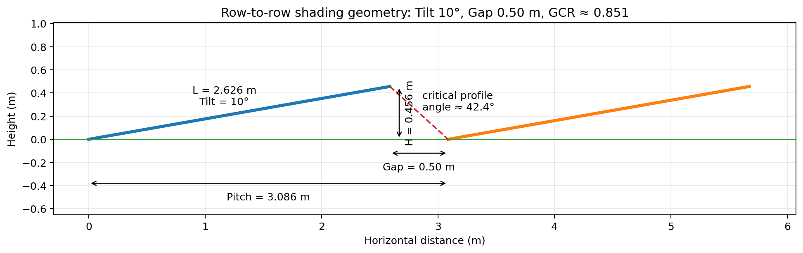
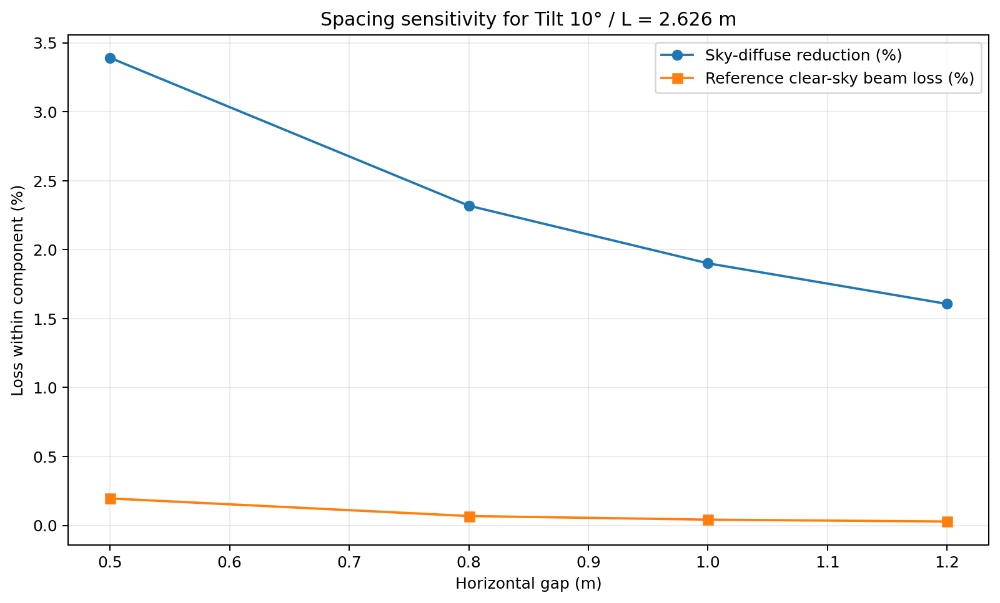
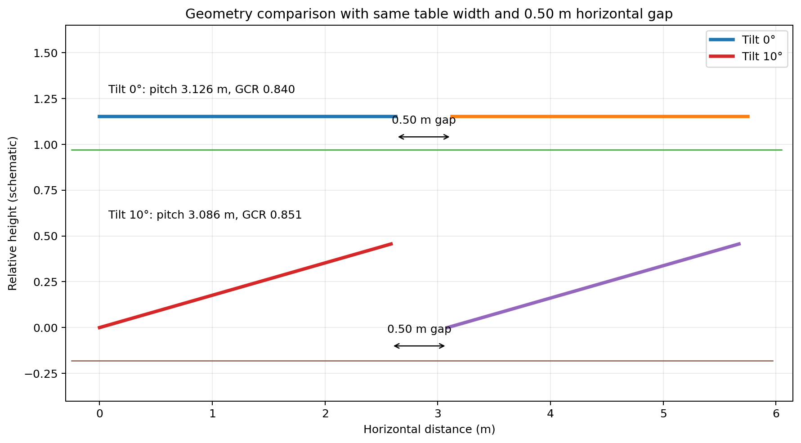

# วิเคราะห์ Shading Loss: Tilt 10° / Gap 0.50 m / Pitch 3.086 m / GCR 0.85

> **สถานะเอกสาร:** Engineering screening / pre-feasibility  
> **กรณีอ้างอิง:** Fixed-tilt, หันด้านหน้าประมาณทิศใต้, พื้นราบ, แถวขนานยาวมาก (infinite-sheds approximation)  
> **หมายเหตุสำคัญ:** ตัวเลข annual loss ที่ยังไม่มี site TMY / PVsyst variant จริง **ไม่ควรใช้เป็น bankable P50/P90 result**

---

## 1. Executive summary

สำหรับ geometry นี้:

- **Tilt = 10°**
- **Gap = 0.50 m**
- **Pitch = 3.086 m**
- **Slant width, L ≈ 2.626 m**
- **GCR ≈ 0.851**
- **Vertical rise, H ≈ 0.456 m**
- **Critical profile elevation ≈ 42.4°** สำหรับกรณีดวงอาทิตย์อยู่ในระนาบตั้งฉากกับแนว row

ผลที่คำนวณได้อย่างค่อนข้างมั่นคงจาก geometry และ infinite-sheds view-factor model คือ:

| รายการ | ผล | สถานะ |
|---|---:|---|
| GCR | **0.8509** | Derived from geometry |
| Critical profile elevation | **42.36°** | Derived from geometry |
| Isolated-plane sky view factor | **0.9924** | Geometric |
| Row sky view factor | **0.9588** | Infinite-sheds view-factor model |
| Sky-diffuse reduction | **3.39% ของ sky-diffuse component** | Model result |
| Reference clear-sky direct-beam shaded-energy loss | **≈ 0.20% ของ direct POA beam** | Screening estimate, weather-dependent |
| Beam + sky-diffuse shading, หาก annual POA diffuse share = 40–60% | **≈ 1.47–2.11%** | Sensitivity only |
| Recommended preliminary irradiance-shading estimate | **≈ 1.8%/yr** | Screening value |
| Electrical mismatch allowance | **ห้ามถือเป็น universal fixed %** | ต้องยืนยันจาก module/string/MPPT layout |

**ข้อสรุปเชิงออกแบบ:** GCR ≈ 0.85 ถือว่า compact มาก แต่ที่ tilt เพียง 10° และ latitude ต่ำ เงา direct-beam ที่ลึกมักเกิดช่วงเช้า/เย็นซึ่ง direct POA ต่ำ จึงทำให้ annual *beam-energy-weighted* loss ต่ำกว่าที่ดูจากจำนวนชั่วโมงเกิดเงา อย่างไรก็ตาม layout ที่แน่นทำให้ **sky-diffuse obstruction** เพิ่มขึ้นชัดเจน และผลทางไฟฟ้าจาก partial shading อาจมากกว่าสัดส่วนพื้นที่เงา

### Preliminary design decision — Tilt 0° vs Tilt 10°

ถ้าต้องเลือกเบื้องต้นระหว่าง **Tilt 0°** และ **Tilt 10°** สำหรับงาน fixed-tilt ในประเทศไทย โดยยังไม่มี site-specific TMY/PVsyst final simulation:

> **แนะนำ Tilt 10° เป็น default design choice สำหรับ annual-energy optimization**

เหตุผลคือ แม้ Tilt 10° จะมี mutual row-shading เพิ่มขึ้นประมาณ **1.5–2.1%/yr** ใน geometry Gap 0.50 m นี้ แต่ Tilt 10° อยู่ใกล้ช่วง optimum tilt ที่รายงานสำหรับประเทศไทยมากกว่า Tilt 0°. งานศึกษาสำหรับ Bangkok/Chonburi รายงาน optimum inclination ประมาณ **15° หันใต้** และ PVsyst ระบุว่าการเลือก tilt ของ shed ต้องพิจารณา **transposition gain, mutual shading, GCR และ cleaning/soiling ร่วมกัน** ไม่ใช่ shading เพียงตัวเดียว.

ดังนั้น **Tilt 0° ชนะเฉพาะด้าน mutual row shading** แต่สำหรับ annual specific yield โดยรวมในประเทศไทย **Tilt 10° มีแนวโน้มดีกว่า** และยังได้เปรียบเรื่อง rain drainage / self-cleaning. อย่างไรก็ตาม ยังไม่ควรระบุส่วนต่าง annual yield เป็นค่าตายตัวจนกว่าจะ run ทั้งสอง variant ด้วย TMY เดียวกัน.

---

## 2. รูป geometry



ภาพนี้เป็น schematic ตามค่าที่ใช้คำนวณจริง ไม่ใช่ภาพสเก็ตช์เชิงศิลป์

---

## 3. ตรวจ geometry และ GCR

Horizontal projection ของ table:

$$
L\cos(10^\circ) = 2.626\cos(10^\circ) \approx 2.586\ \mathrm{m}
$$

ดังนั้น pitch คือ:

$$
P = L\cos(10^\circ) + G
$$

$$
P \approx 2.586 + 0.500 = 3.086\ \mathrm{m}
$$

และ GCR:

$$
\mathrm{GCR} = \frac{L}{P}
$$

$$
\mathrm{GCR} = \frac{2.626}{3.086} \approx 0.8509
$$

นิยามนี้ตรงกับนิยามของ pvlib สำหรับ row-based fixed-tilt geometry: **GCR = row slant length / pitch**.

---

## 4. ความสูงต่างระดับ และ critical profile elevation

Vertical rise:

$$
H = L\sin(10^\circ)
$$

$$
H \approx 2.626\sin(10^\circ) \approx 0.456\ \mathrm{m}
$$

เมื่อ gap แนวนอนเท่ากับ 0.50 m:

$$
\alpha_{crit} = \tan^{-1}\left(\frac{H}{G}\right)
$$

$$
\alpha_{crit} \approx \tan^{-1}\left(\frac{0.456}{0.500}\right) \approx 42.36^\circ
$$

**ตีความให้ถูก:** 42.36° ไม่ใช่ “solar elevation threshold” ที่ใช้ได้ทุก azimuth แต่เป็น **profile-angle threshold ใน cross-section ที่ตั้งฉากกับ row**. เมื่อดวงอาทิตย์อยู่ค่อนไปทางทิศตะวันออก/ตะวันตก ต้อง project ตำแหน่งดวงอาทิตย์ลงในระนาบตั้งฉากกับแนว row ก่อน

pvlib ใช้แนวคิด projected solar angle ในรูป:

$$
\tan\phi = \cos(A_{sun}-A_{array})\tan Z
$$

โดย \(Z\) คือ solar zenith และ \(\phi\) เป็นมุมของ sun vector หลัง projection ในระนาบที่ใช้คำนวณ row shading.

---

## 5. Direct-beam row shading

สำหรับ infinite-sheds บนพื้นราบ สามารถเขียนตัวแปร intermediate ได้เป็น:

$$
x = \mathrm{GCR}\left(\cos\beta + \sin\beta\tan\phi\right)
$$

และ shaded fraction ของ slant height โดยย่อคือ:

$$
f_{sh} =
\begin{cases}
0, & x \le 1 \\
1-\frac{1}{x}, & x > 1
\end{cases}
$$

เมื่อดวงอาทิตย์อยู่ด้านหน้าของ plane.

### Reference annual beam result

เพื่อทดสอบ order-of-magnitude ของค่าจากบทความเดิม ผม reproduce การคำนวณแบบ **5-minute solar-position integration สำหรับกรุงเทพฯ (13.7563°N, 100.5018°E), south-facing, tilt 10°**, แล้ว weight direct POA ด้วย clear-sky DNI proxy ที่ลดลงตาม air mass

ผลอ้างอิงได้:

**≈ 0.20% ของ annual direct POA beam**

> ใช้ข้อความ Markdown ปกติแทน `\boxed{...}` เพื่อหลีกเลี่ยง error ของ GitHub MathJax ที่พบจากไฟล์เดิม

> ค่านี้ **ไม่ใช่ PVGIS TMY result และไม่ใช่ PVsyst result**. จุดประสงค์คือยืนยันว่าเลขประมาณ 0.19–0.20% มี order-of-magnitude ที่สมเหตุผลภายใต้ clear-sky weighting. เมื่อเปลี่ยนเป็น site TMY/DNI จริง ค่านี้สามารถเปลี่ยนได้

ใน reference calculation เดียวกัน ช่วงเวลาที่มี **direct row shade ใด ๆ** คิดเป็นประมาณ 3% ของ annual direct-beam energy แต่ shaded-area-weighted loss เหลือประมาณ 0.2% เพราะช่วงที่ shaded fraction สูงมักอยู่ใกล้ sunrise/sunset ซึ่ง direct POA ต่ำ

ตัวอย่าง winter solstice ของกรุงเทพฯ geometry นี้ ช่วงที่เริ่มมี row shade โดยประมาณคือ:

- เช้า: **06:41–08:56**
- บ่าย: **15:36–17:51**

เวลานี้เป็น geometry/solar-position reference ไม่ใช่ guaranteed production-loss window ของ site จริง

---

## 6. Diffuse-sky obstruction — จุดที่สำคัญกว่าค่า beam ใน layout นี้

สำหรับ tilted plane แบบ isolated:

$$
VF_{sky,isolated} = \frac{1+\cos\beta}{2}
$$

ที่ tilt 10°:

$$
VF_{sky,isolated} \approx 0.9924
$$

สำหรับ infinite rows, pvlib ใช้ integrated row-to-sky view factor. ที่ GCR = 0.8509:

$$
VF_{sky,row} \approx 0.9588
$$

ดังนั้น reduction เทียบกับ isolated tilted plane:

$$
L_{diffuse} = 1 - \frac{VF_{sky,row}}{VF_{sky,isolated}}
$$

$$
L_{diffuse} \approx 3.39\%
$$

**3.39% นี้เป็น 3.39% ของ sky-diffuse component ไม่ใช่ 3.39% ของ annual PV energy.**

### Sensitivity ต่อ annual POA diffuse share

ถ้าประเมินแบบง่ายโดยรวมเฉพาะ beam + sky diffuse:

| Annual POA diffuse share | Direct-beam share | Estimated irradiance shading |
|---:|---:|---:|
| 40% | 60% | **≈ 1.47%** |
| 50% | 50% | **≈ 1.79%** |
| 60% | 40% | **≈ 2.11%** |

ดังนั้น สำหรับ screening:

$$
1.5\% \le L_{shade} \le 2.1\%
$$

และ best single-point estimate ก่อนมี TMY:

**≈ 1.8%/yr**

> จุดนี้เปลี่ยนจากสมการ `\boxed{...}` เป็นข้อความ Markdown ปกติเช่นกัน เพื่อให้ GitHub render ได้เสถียร

> **ข้อจำกัด:** sensitivity นี้ยังไม่รวมการเปลี่ยนแปลงของ ground-reflected/albedo component, finite-row edge effects, terrain slope, horizon, bifacial rear-side contribution และ anisotropic diffuse treatment

---

## 7. เปรียบเทียบ Gap 0.50 / 0.80 / 1.00 / 1.20 m



| Case | Gap (m) | Pitch (m) | GCR | Critical profile elevation | Reference clear-sky beam loss | Sky-diffuse reduction |
|---|---:|---:|---:|---:|---:|---:|
| **Very Compact** | **0.50** | **3.086** | **0.851** | **42.36°** | **0.20%** | **3.39%** |
| Compact | 0.80 | 3.386 | 0.776 | 29.68° | 0.07% | 2.32% |
| **Base Case** | **1.00** | **3.586** | **0.732** | **24.51°** | **0.04%** | **1.90%** |
| Low Shading | 1.20 | 3.786 | 0.694 | 20.81° | 0.03% | 1.61% |

ถ้าใช้ diffuse-share sensitivity 40–60%:

| Case | Estimated beam + sky-diffuse shading |
|---|---:|
| Gap 0.50 m | **≈ 1.47–2.11%** |
| Gap 0.80 m | **≈ 0.97–1.42%** |
| Gap 1.00 m | **≈ 0.79–1.16%** |
| Gap 1.20 m | **≈ 0.66–0.98%** |

ดังนั้น incremental irradiance-shading penalty ของ Gap 0.50 m เทียบ Gap 1.00 m อยู่ประมาณ:

$$
0.7 \le \Delta L_{shade} \le 0.95\ \mathrm{pp/yr}
$$

ซึ่งสอดคล้องกับค่ากลางประมาณ:

$$
\Delta L_{shade} \approx +0.8\ \mathrm{pp/yr}
$$

---

## 8. เปรียบเทียบ Tilt 0° กับ Tilt 10° — ใช้ Gap 0.50 m เท่ากัน

เพื่อให้เทียบกันตรง ๆ ส่วนนี้กำหนด **slant/module-table width L = 2.626 m** และ **horizontal gap = 0.50 m** เหมือนกันทั้งสองกรณี



### 8.1 Geometry comparison

| Parameter | Tilt 0° | Tilt 10° |
|---|---:|---:|
| Slant/table width, L | 2.626 m | 2.626 m |
| Horizontal projection | 2.626 m | 2.586 m |
| Gap | 0.500 m | 0.500 m |
| Pitch | **3.126 m** | **3.086 m** |
| GCR | **0.840** | **0.851** |
| Vertical rise, H | **0 m** | **0.456 m** |
| Critical profile elevation | **0°** | **42.36°** |
| Ideal 2D row-to-row beam shade | **≈ 0%** | **≈ 0.20% of direct POA beam** |
| Ideal 2D sky-diffuse obstruction | **≈ 0%** | **≈ 3.39% of sky-diffuse component** |
| Preliminary beam + sky-diffuse row-shading | **≈ 0%** | **≈ 1.5–2.1%/yr** |

### 8.2 ทำไม Tilt 0° จึงแทบไม่มี mutual row shading ในโมเดล 2D

เมื่อ tilt เท่ากับศูนย์:

$$
H=L\sin(0^\circ)=0
$$

ดังนั้น row ถัดไปอยู่ในระนาบเดียวกัน และไม่มีความสูงของหัวแผงที่สร้างเงาข้าม gap ใน idealized infinite-sheds geometry

สำหรับกรณีนี้:

$$
\alpha_{crit}=0^\circ
$$

และในโมเดล 2D ที่ถือว่า module บางมาก พื้นราบ และทุก row สูงเท่ากัน จะได้ **front-side mutual row shading ≈ 0%**

> นี่ไม่ได้หมายความว่าโรงไฟฟ้าจริงจะไม่มี shading loss ทั้งหมด เพราะยังอาจมี shade จากโครงสร้าง, cable tray, inverter station, terrain, vegetation, horizon, module frame และความต่างระดับของฐานราก

### 8.3 Tilt 0° ไม่ได้แปลว่า annual yield สูงกว่า Tilt 10°

จุดสำคัญคือต้องแยก **row-shading loss** ออกจาก **plane-of-array irradiation / transposition gain**

- Tilt 0° ช่วยลด mutual row shading ได้มากที่สุด
- แต่ Tilt 10° สามารถรับ annual plane-of-array irradiation ได้ดีกว่า horizontal plane สำหรับหลายพื้นที่ในประเทศไทย
- งานวิจัยที่ใช้ Bangkok เป็นกรณีศึกษารายงาน optimum tilt ใกล้ **14°**
- งานศึกษาสำหรับ Bangkok/Chonburi รายงาน optimum inclination ประมาณ **15° หันใต้**
- PVsyst เองแนะนำให้ใช้ tilt ต่ำเท่าที่สมเหตุผล แต่ยังคงต้องคำนึงถึง **rain cleaning / dirt accumulation**

ดังนั้นการเลือก 0° เพียงเพราะ shading ต่ำกว่า อาจไม่ได้ให้ annual specific yield สูงสุด

### 8.4 Density comparison

แม้ Tilt 0° จะไม่มี vertical rise แต่ horizontal projection ของ table เต็ม 2.626 m ทำให้ pitch เพิ่มเป็น 3.126 m เมื่อรักษา Gap = 0.50 m

ในทางกลับกัน Tilt 10° มี horizontal projection เพียงประมาณ 2.586 m ทำให้ pitch เหลือ 3.086 m

ดังนั้น Tilt 10° สามารถเพิ่มจำนวน row ต่อระยะทางได้เล็กน้อย:

$$
\frac{3.126}{3.086}-1 \approx 1.29\%
$$

กล่าวคือ **Tilt 10° มี theoretical row density สูงกว่า Tilt 0° ประมาณ 1.3%** เมื่อกำหนด slant width และ horizontal gap เท่ากัน

### 8.5 Engineering trade-off

| ประเด็น | Tilt 0° | Tilt 10° |
|---|---|---|
| Mutual row shading | **ดีที่สุด** | มี loss เพิ่ม |
| Annual POA irradiation | อาจต่ำกว่า optimum | ใกล้ optimum ของหลายพื้นที่ในไทยมากกว่า |
| Rain drainage / self-cleaning | **เสียเปรียบ** | ดีกว่า |
| Dirt pooling / bottom-edge soiling | เสี่ยงกว่า | ดีกว่า |
| Wind / mounting height | ต่ำและง่าย | สูงขึ้นเล็กน้อย |
| Row density ที่ Gap 0.50 m | ต่ำกว่า ~1.3% | สูงกว่า ~1.3% |
| Bifacial rear irradiance | ต้องวิเคราะห์ ground view แยก | ต้องวิเคราะห์ shading/albedo แยก |
| เหมาะกับ objective | Maximize compactness โดยลด row shade | Balance yield, drainage และ density |

### 8.6 คำแนะนำสำหรับ feasibility

สำหรับประเทศไทย **ถ้าต้องเลือกเบื้องต้นตอนนี้ ให้เลือก Tilt 10°** มากกว่า Tilt 0° สำหรับ objective ที่เน้น **annual energy / specific yield**.

เหตุผลหลัก:

- Tilt 0° ลด mutual row shading ได้ดีที่สุดใน ideal 2D geometry
- แต่ Tilt 10° ได้ **POA transposition gain** มากกว่า horizontal plane
- งานวิจัยสำหรับ Bangkok/Chonburi รายงาน optimum inclination ประมาณ **15° หันใต้**
- Tilt 10° ช่วย rain drainage / self-cleaning มากกว่า Tilt 0°
- ใน geometry นี้ Tilt 10° ยังมี theoretical row density สูงกว่า Tilt 0° ประมาณ **1.3%**
- PVsyst แนะนำให้ optimize shed tilt โดยดู **annual irradiation after shading**, GCR และ electrical shading ร่วมกัน

ดังนั้นในเชิง engineering screening:

> **Tilt 0° = minimum row shading**  
> **Tilt 10° = recommended overall annual-energy choice for Thailand**

อย่างไรก็ตาม คำว่า “Tilt 10° ดีกว่า annual กี่ %” **ยังไม่ควรฟันธงจาก geometry เพียงอย่างเดียว** เพราะต้องใช้ site weather/TMY จริง. Final decision ควร run **สอง variant ด้วย TMY เดียวกัน**:

1. **Tilt 0° / Gap 0.50 m / Pitch 3.126 m / GCR 0.840**
2. **Tilt 10° / Gap 0.50 m / Pitch 3.086 m / GCR 0.851**

แล้วเปรียบเทียบอย่างน้อย:

- Global POA irradiation
- Near-shading linear loss
- Electrical shading loss
- Soiling assumption
- Temperature loss
- Specific yield, kWh/kWp
- MWp installed per available area
- Annual MWh per hectare
- CAPEX/MWp
- LCOE หรือ project NPV

**ข้อสรุป preliminary:**  
สำหรับประเทศไทยและ geometry ที่ศึกษานี้ **Tilt 10° เป็นตัวเลือกที่แนะนำ** เพราะสมดุลระหว่าง POA irradiation, shading, drainage/self-cleaning และ row density ได้ดีกว่า Tilt 0°. ส่วน Tilt 0° ควรพิจารณาเมื่อมีข้อจำกัดด้านโครงสร้าง, wind loading, ความสูงติดตั้ง หรือจำเป็นต้องลด row shading ให้ต่ำที่สุดเป็นหลัก.

---

## 9. Row density trade-off

Pitch ลดจาก 3.586 m เหลือ 3.086 m:

$$
\frac{3.586}{3.086} - 1 \approx 16.2\%
$$

ดังนั้น ในแนวตั้งฉากกับ row และก่อนหัก walkway / access / setback / drainage / civil constraint สามารถเพิ่มจำนวน row ต่อระยะทางได้เชิงทฤษฎีประมาณ **16%**

นี่คือเหตุผลที่ layout GCR สูงอาจมี economics ที่ดีกว่า แม้ specific yield ต่อ kWp ลดลงเล็กน้อย: ต้อง optimize **MWp/area × yield/kWp × CAPEX/OPEX constraints** ไม่ใช่ optimize shading loss เพียงตัวเดียว

---

## 10. Electrical shading: อย่าใช้ fixed % แบบ universal

PVsyst แยก:

1. **Irradiance / linear shading loss** — พื้นที่รับรังสีลดลง
2. **Electrical shading loss** — mismatch จาก cell/submodule/string/MPPT

Electrical loss ไม่ได้เป็นฟังก์ชันของ GCR อย่างเดียว แต่ขึ้นกับ:

- module internal cell/submodule topology
- bypass diodes
- portrait / landscape
- half-cut architecture
- modules per string
- strings in parallel per MPPT
- วิธี group strings ที่มี shading condition คล้ายกัน
- exact module position ใน 3D scene

### ประเด็นที่ควรแก้จากข้อความเดิม

ไม่ควรเขียนว่า “landscape/half-cut” เป็น configuration ที่ดีเสมอไป

PVsyst ให้ guidance สำหรับ row-based arrangements ว่า:

- **usual modules with 3 submodules in length** มักเหมาะกับ **landscape**
- **twin half-cut cell modules** มักเหมาะกับ **portrait**

แต่ต้องตรวจ topology ของ module model จริงก่อนใช้เป็นข้อสรุป

### Recommendation

สำหรับ feasibility หากจำเป็นต้องใส่ placeholder สามารถใช้ conservative internal allowance ได้ แต่ควรแยก label ชัดเจนว่า:

> **“Provisional electrical shading allowance — not validated by Module Layout.”**

ไม่ควรนำค่า 2.5–3.0% ไปเขียนเป็น universal physics result หรืออ้างว่าเป็นผลจาก PVsyst โดยตรง

Final design ควร run อย่างน้อยหนึ่งใน:

- PVsyst Unlimited Sheds + electrical partition model
- PVsyst 3D Near Shadings + Module Layout
- หรือ equivalent detailed module/string electrical shading model

---

## 11. Bifacial: ต้องวิเคราะห์เพิ่มต่างหาก

ถ้า module เป็น bifacial, GCR สูงจะกระทบมากกว่า front-side row shade เพราะยังมี:

- rear-side sky view
- ground view
- ground shadow pattern
- albedo access
- structural shading
- rear irradiance non-uniformity

ดังนั้นอย่านำ **1.8% front-side screening estimate** ไปใช้เป็น total bifacial row-to-row loss โดยตรง

---

## 12. ตัวเลขที่แนะนำให้ใช้ใน design sheet ตอนนี้

### สำหรับ monofacial / front-side screening

> **Tilt 10° / Gap 0.50 m / Pitch 3.086 m / GCR 0.851**  
> **Beam + sky-diffuse near-shading irradiance loss ≈ 1.5–2.1%/yr**  
> **Best preliminary point estimate ≈ 1.8%/yr**  
> **Incremental irradiance penalty vs Gap 1.00 m ≈ +0.8 percentage point/yr**

### Electrical effect

> **ยังไม่ควรฟันธงเป็น fixed %.** ต้องยืนยันด้วย module model, orientation, string map และ strings/MPPT ใน PVsyst Module Layout หรือ partition model

### Recommended default for Thailand — preliminary

> **Default recommendation: Tilt 10°**  
> สำหรับกรณี Gap 0.50 m นี้ ให้ถือว่า Tilt 10° เป็น **preliminary preferred option** สำหรับ annual-energy optimization จนกว่าผล TMY/PVsyst จะพิสูจน์เป็นอย่างอื่น.  
> Tilt 0° เหมาะเมื่อ priority คือ **ลด mutual row shading / ลดความสูงโครงสร้าง / ลด wind exposure** มากกว่า maximize annual specific yield.

### สำหรับ bankable / final energy model

ต้องใช้:

- พิกัด site จริง
- horizon จริง
- TMY / hourly meteo จริง
- azimuth จริง
- module model จริง
- portrait/landscape จริง
- string map
- strings/MPPT
- number of rows / edge effects
- albedo
- terrain slope
- bifaciality ถ้ามี

---

## 13. เหตุผลที่สูตรเดิมขึ้น Error บน GitHub และสิ่งที่แก้แล้ว

GitHub รองรับ LaTeX math ผ่าน MathJax แต่ syntax ต้องสะอาด

ในไฟล์เดิมมีจุดเสี่ยงหลัก 2 แบบ:

1. มี literal `\\n` อยู่ภายในสมการ เช่น `... \\n\\approx ...`
2. พบว่าแม้ `\\boxed{...}` แบบสั้นจะเป็น LaTeX ที่ถูกต้อง แต่ในไฟล์นี้ GitHub แสดง error ตามภาพที่ตรวจพบ

เพื่อให้ render เสถียรกว่าใน GitHub เวอร์ชันนี้จึง:

- เอา literal `\\n` ออกจาก math
- แยกข้อความอธิบายออกจากสมการ
- **ไม่ใช้ `\\boxed{...}` สำหรับค่าผลลัพธ์สำคัญ**
- ใช้ Markdown bold สำหรับค่าผลลัพธ์ เช่น `**≈ 0.20%**`
- คง `$$ ... $$` ไว้เฉพาะสมการที่จำเป็นจริง ๆ
- ใช้ blank line ก่อนและหลัง block math

ตัวอย่างที่ใช้แทน:

```markdown
ผล reference clear-sky beam loss:

**≈ 0.20% ของ annual direct POA beam**
```

---

## 14. References

1. **GitHub Docs — Writing mathematical expressions**  
   https://docs.github.com/en/get-started/writing-on-github/working-with-advanced-formatting/writing-mathematical-expressions

2. **PVsyst — Sheds mutual shadings**  
   https://www.pvsyst.com/help/project-design/orientations-in-v8/sheds-mutual-shadings.html

3. **PVsyst — Shadings overview**  
   https://www.pvsyst.com/help/project-design/shadings/index.html

4. **PVsyst — Electrical shadings: Module Layout**  
   https://www.pvsyst.com/help/project-design/shadings/electrical-shadings-module-layout/index.html

5. **PVsyst — Electrical shadings: Module strings / partitions**  
   https://www.pvsyst.com/help/project-design/shadings/electrical-shadings-module-strings/index.html

6. **pvlib — `shaded_fraction1d`**  
   https://pvlib-python.readthedocs.io/en/latest/reference/generated/pvlib.shading.shaded_fraction1d.html

7. **pvlib — infinite-sheds model source/documentation**  
   https://pvlib-python.readthedocs.io/en/stable/_modules/pvlib/bifacial/infinite_sheds.html

8. **pvlib — integrated row-to-sky view factor**  
   https://pvlib-python.readthedocs.io/en/latest/reference/generated/pvlib.bifacial.utils.vf_row_sky_2d_integ.html

9. **NREL — Slope-Aware Backtracking for Single-Axis Trackers, NREL/TP-5K00-76626**  
   https://doi.org/10.2172/1660126

10. **Mikofski et al. — Bifacial Performance Modeling in Large Arrays, IEEE PVSC 2019**  
    https://doi.org/10.1109/PVSC40753.2019.8980572

11. **JRC PVGIS — Hourly radiation**  
    https://joint-research-centre.ec.europa.eu/photovoltaic-geographical-information-system-pvgis/using-pvgis-5/pvgis-5-tools/hourly-radiation_en

12. **JRC PVGIS — Typical Meteorological Year (TMY)**  
    https://joint-research-centre.ec.europa.eu/photovoltaic-geographical-information-system-pvgis/using-pvgis-5/pvgis-5-tools/pvgis-typical-meteorological-year-tmy-generator_en

13. **PVsyst — Sheds tilt optimization**  
    https://www.pvsyst.com/help/project-design/orientations-in-v8/shed-optimization.html

14. **M-Shape PV Arrangement for Improving Solar Power Generation Efficiency — Bangkok optimum tilt reference**  
    https://doi.org/10.3390/app10020537

15. **Optimal Photovoltaic Resources Harvesting in Grid-connected Residential Rooftop and in Commercial Buildings: Cases of Thailand**  
    https://www.sciencedirect.com/science/article/pii/S1876610215021980

16. **JRC PVGIS — Grid-connected PV calculation**  
    https://joint-research-centre.ec.europa.eu/photovoltaic-geographical-information-system-pvgis/using-pvgis-5/pvgis-5-tools/grid-connected-pv_en

### Decision basis for Tilt 0° vs Tilt 10°

- **PVsyst — Sheds tilt optimization:** annual shed optimization must balance transposition gain, shading loss, GCR and electrical effects; PVsyst also recommends keeping tilt reasonably low while considering rain cleaning/soiling.  
  https://www.pvsyst.com/help/project-design/orientations-in-v8/shed-optimization.html

- **Thailand study — Bangkok/Chonburi:** reported optimum inclination of approximately **15° south** for the studied PV applications.  
  https://www.sciencedirect.com/science/article/pii/S1876610215021980

---

## 15. GitHub deployment note

ให้ commit โครงสร้างนี้พร้อมกัน:

```text
13.2.3.Shading_Loss_Tilt0_vs_Tilt10_Gap0.50m_GitHub.md
assets/
├─ row_shading_geometry_gcr085.png
├─ spacing_tradeoff.png
└─ tilt0_vs_tilt10_geometry.png
```

จากนั้นรูปใน Markdown จะ render ด้วย relative path ได้โดยตรงบน GitHub
