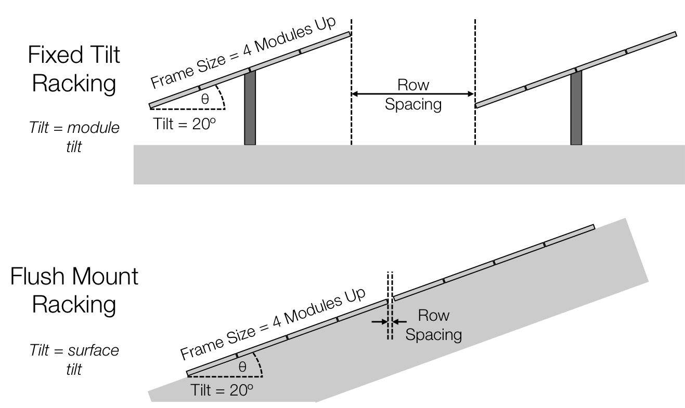

# Solar Farm Row Spacing Guideline for Thailand
## 725 W Module — 2T / 3T / 4T, Tilt 0° / 5° / 10° / 15°

> Engineering guideline สำหรับ Fixed-Tilt Solar Farm ในประเทศไทย โดยต่อยอดจากกรณีศึกษาเดิมและเพิ่ม 3T, Tilt 0° และกรณี Clear Row Gap = 0.50 m  
> **ไม่ใช่ข้อกำหนดตายตัวของมาตรฐาน** — ค่า Final Design ต้องตรวจด้วย PVsyst Near Shading / Unlimited Sheds และพิจารณา Yield, Land Utilization และ Project Economics ร่วมกัน

---

## 1. Design Basis

อ้างอิงโมดูล Jinko JKM700–725N-66HL5-BDV:

- Module size = **2.384 × 1.303 m**
- Layout = Landscape
- ระยะระหว่างโมดูลตามแนว Collector = **20 mm**
- Fixed Tilt
- แถวหันด้านใต้ (South-facing)
- พิจารณา Tilt = **0°, 5°, 10°, 15°**

### Collector Width

```text
2T = 2(1.303) + 1(0.020) = 2.626 m
3T = 3(1.303) + 2(0.020) = 3.949 m
4T = 4(1.303) + 3(0.020) = 5.272 m
```

> หมายเหตุ: เอกสารเดิมเคยใช้ 4T = 2 × 2T = 5.252 m เป็น simplified geometry  
> หากนับ inter-module gap 20 mm จริงระหว่างโมดูลทุกคู่ ค่า **4T exact = 5.272 m** ต่างกันเพียง 0.020 m แต่เอกสารฉบับนี้ใช้ 5.272 m เพื่อให้ geometry สอดคล้องกันทั้ง 2T/3T/4T

---


## ภาพประกอบ Geometry และ Row Spacing

### รูปที่ 1 — ตัวอย่าง Solar Farm แบบ Fixed-Tilt และแนวคิด Row Spacing

<p align="center">
  
</p>

**คำอธิบาย:** รูปนี้แสดงลักษณะการติดตั้งแผงแบบ Fixed-Tilt, ระยะห่างระหว่างแถว (Row Spacing) และตัวอย่างการวางแผงบนพื้นที่ลาดเอียง ซึ่งช่วยให้เห็นว่า **Slope ของพื้นที่** และ **Tilt ของแผง** เป็นคนละพารามิเตอร์และต้องพิจารณาร่วมกันในการวิเคราะห์เงาบัง

> สำหรับ GitHub ให้วางไฟล์ `9.2.Soalr Farm 4 Modules.png` ไว้ในโฟลเดอร์เดียวกับไฟล์ Markdown นี้

### รูปที่ 2 — นิยาม Collector Width, Horizontal Projection และ Clear Row Gap

<p align="center">
  
</p>

จากรูป:

```text
L = Collector Width ตามแนวลาดของโต๊ะแผง [m]

θ_tilt = Tilt Angle [°]

Horizontal Projection
= L × cos(θ_tilt)

D = Clear Row Gap [m]

Row Pitch
= L × cos(θ_tilt) + D
```

ดังนั้นต้องแยกคำว่า **Clear Row Gap (D)** ออกจาก **Pitch** ให้ชัดเจน:

```text
             <----------- Pitch ----------->

        / PV Table
       /  L
      / θ
-----+------------------+--------------------
     <--- L cos θ -----><---- D ---->
      Horizontal          Clear Row
      Projection          Gap
```

> ในเอกสารนี้คำว่า `Gap` หมายถึง **ระยะว่างแนวราบจาก horizontal projection ของขอบหลังโต๊ะแถวหน้า ถึงขอบหน้าโต๊ะแถวถัดไป** ไม่ใช่ระยะ Pitch ทั้งหมด

---

## 2. นิยามและสูตร

ให้

- `W` = Collector Width ตามแนวลาดของโต๊ะแผง [m]
- `β` = Tilt angle [°]
- `D` = Horizontal Projection [m]
- `H` = Height Difference ของโต๊ะแผง [m]
- `G` = Clear Row Gap [m]
- `P` = Row Pitch [m]
- `GCR` = Ground Coverage Ratio [-]
- `α_limit` = Profile / Shading Limit Angle [°]

สูตรพื้นฐาน:

```text
D = W × cos(β)

H = W × sin(β)

P = D + G

GCR = W / P

α_limit = atan(H / G)
```

ถ้ากำหนด Target Limit/Profile Angle ล่วงหน้า:

```text
G = H / tan(α_target)

P = D + G
```

### ความหมายเชิงวิศวกรรม

- `Pitch` คือระยะซ้ำจากแถวหนึ่งถึงแถวถัดไป
- `GCR` สูง = ติดตั้งแผงหนาแน่นขึ้น แต่ mutual shading มีแนวโน้มสูงขึ้น
- `α_limit` สูง = เริ่มเกิดเงาบังระหว่างแถวตั้งแต่ดวงอาทิตย์ยังอยู่สูง จึงเสี่ยง shading loss มากขึ้น
- PVsyst ระบุว่าการเพิ่ม GCR ทำให้ mutual shading loss เพิ่มขึ้น และแนะนำให้ใช้ limit angle โดยทั่วไปประมาณ **18–22°** ในการ optimize shed geometry

---

## 3. กรณี Clear Row Gap = 0.50 m

ตารางนี้ใช้ตอบคำถามว่า **ถ้าบังคับ Gap = 0.50 m จะเกิด geometry แบบใด**  
เป็น Sensitivity Case ไม่ใช่ Recommendation อัตโนมัติ

| Config | Tilt | W [m] | Horizontal Projection D [m] | Rise H [m] | Gap [m] | Pitch [m] | GCR | α_limit |
|---|---:|---:|---:|---:|---:|---:|---:|---:|
| 2T | 0° | 2.626 | 2.626 | 0.000 | 0.500 | 3.126 | 0.840 | 0.0° |
| 2T | 5° | 2.626 | 2.616 | 0.229 | 0.500 | 3.116 | 0.843 | 24.6° |
| 2T | 10° | 2.626 | 2.586 | 0.456 | 0.500 | 3.086 | 0.851 | 42.4° |
| 2T | 15° | 2.626 | 2.537 | 0.680 | 0.500 | 3.037 | 0.865 | 53.7° |
| 3T | 0° | 3.949 | 3.949 | 0.000 | 0.500 | 4.449 | 0.888 | 0.0° |
| 3T | 5° | 3.949 | 3.934 | 0.344 | 0.500 | 4.434 | 0.891 | 34.5° |
| 3T | 10° | 3.949 | 3.889 | 0.686 | 0.500 | 4.389 | 0.900 | 53.9° |
| 3T | 15° | 3.949 | 3.814 | 1.022 | 0.500 | 4.314 | 0.915 | 63.9° |
| 4T | 0° | 5.272 | 5.272 | 0.000 | 0.500 | 5.772 | 0.913 | 0.0° |
| 4T | 5° | 5.272 | 5.252 | 0.459 | 0.500 | 5.752 | 0.917 | 42.6° |
| 4T | 10° | 5.272 | 5.192 | 0.915 | 0.500 | 5.692 | 0.926 | 61.4° |
| 4T | 15° | 5.272 | 5.092 | 1.364 | 0.500 | 5.592 | 0.943 | 69.9° |

### Interpretation ของ Gap 0.50 m

- **Tilt 0°**: ไม่มี height difference จาก tilt (`H = 0`) จึงไม่มี row-to-row shade จาก geometry ของ tilt เอง แต่ยังต้องเผื่อ drainage, cleaning, access, terrain tolerance และโครงสร้าง
- **2T Tilt 10°**: `α_limit ≈ 42°` → compact มากเมื่อเทียบกับแนวคิด limit angle ~18–22°
- **3T / 4T Tilt 10°**: `α_limit` สูงยิ่งขึ้น เพราะโต๊ะกว้างและขอบหลังสูงขึ้น แต่ Gap คงเดิม 0.50 m
- ดังนั้น **Gap 0.50 m ไม่ควรถูก scale ใช้กับ 3T/4T โดยตรงโดยไม่ทำ Near-Shading simulation**

---

## 4. Preliminary Spacing จาก Target Limit Angle ≈ 20°

เพื่อให้เปรียบเทียบ 2T / 3T / 4T ด้วย shading geometry เดียวกัน ใช้:

```text
α_target = 20°
Gap = H / tan(20°)
```

| Config | Tilt | W [m] | Required Gap @20° [m] | Pitch [m] | GCR |
|---|---:|---:|---:|---:|---:|
| 2T | 5° | 2.626 | 0.629 | 3.245 | 0.809 |
| 2T | 10° | 2.626 | 1.253 | 3.839 | 0.684 |
| 2T | 15° | 2.626 | 1.867 | 4.404 | 0.596 |
| 3T | 5° | 3.949 | 0.946 | 4.880 | 0.809 |
| 3T | 10° | 3.949 | 1.884 | 5.773 | 0.684 |
| 3T | 15° | 3.949 | 2.808 | 6.623 | 0.596 |
| 4T | 5° | 5.272 | 1.262 | 6.514 | 0.809 |
| 4T | 10° | 5.272 | 2.515 | 7.707 | 0.684 |
| 4T | 15° | 5.272 | 3.749 | 8.841 | 0.596 |

### Base Case ที่เหมาะสำหรับเริ่ม PVsyst

สำหรับ **Tilt 10° / Target Profile Angle ≈ 20°**

| Configuration | Collector Width | Clear Gap | Pitch | GCR |
|---|---:|---:|---:|---:|
| **2T** | 2.626 m | **1.25 m** | **3.84 m** | 0.684 |
| **3T** | 3.949 m | **1.88 m** | **5.77 m** | 0.684 |
| **4T** | 5.272 m | **2.52 m** | **7.71 m** | 0.684 |

> จุดสำคัญ: เมื่อรักษา `α_limit` เดียวกัน Geometry จะ scale ตาม Collector Width ทำให้ 2T/3T/4T มี GCR ใกล้เคียงกัน

---

## 5. เปรียบเทียบ Gap 0.50 m กับ Base Case

### Tilt 10°

| Configuration | Gap 0.50 m: Pitch / GCR / α_limit | Base @ α≈20°: Gap / Pitch / GCR | Engineering Interpretation |
|---|---|---|---|
| 2T | 3.09 m / 0.851 / 42.4° | 1.25 m / 3.84 m / 0.684 | Gap 0.50 m = compact case; ต้องเช็ก annual shading loss |
| 3T | 4.39 m / 0.900 / 53.9° | 1.88 m / 5.77 m / 0.684 | Gap 0.50 m = compact case; ต้องเช็ก annual shading loss |
| 4T | 5.69 m / 0.926 / 61.4° | 2.52 m / 7.71 m / 0.684 | Gap 0.50 m = compact case; ต้องเช็ก annual shading loss |

---

## 6. สิ่งที่ต้องเทียบใน PVsyst

สำหรับแต่ละ 2T / 3T / 4T และ Tilt 0° / 5° / 10° / 15° ให้ทำ sensitivity อย่างน้อย:

```text
Case A : Gap = 0.50 m
Case B : Gap ตาม α_limit ≈ 20°
Case C : Gap เพิ่มขึ้นจาก Case B เพื่อดู diminishing return
```

พารามิเตอร์ที่ต้องสรุป:

1. Near Shading Loss [%]
2. Electrical Shading Loss [%]
3. Specific Production [kWh/kWp/year]
4. Performance Ratio [%]
5. Annual Energy [MWh/year]
6. Installed Capacity [MWp]
7. Land Utilization [MWp/rai]
8. Energy Density [MWh/rai/year]
9. CAPEX [THB/MWp]
10. LCOE / Project IRR หากมีข้อมูลเศรษฐศาสตร์

### PVsyst Input ที่ควรตรวจ

- Orientation: **Unlimited Sheds** สำหรับ preliminary regular-row study
- Tilt
- Azimuth
- Pitch
- Sensitive Width / Collector Width
- Number of sheds
- Inactive bands
- Electrical shading / partition
- Module orientation
- Albedo และ bifacial parameters ถ้าใช้ bifacial module
- Near Shading 3D Scene สำหรับ Final Layout ที่มีถนน, inverter station, terrain หรือ spacing ไม่สม่ำเสมอ

---

## 7. Design Recommendation สำหรับประเทศไทย

### แนวทางเลือก Tilt

| Tilt | ข้อดี | ข้อควรระวัง | การใช้งาน |
|---:|---|---|---|
| **0°** | ความหนาแน่นสูง, ไม่มี row-height shading จาก tilt | น้ำ/ฝุ่นระบายยาก, self-cleaning ต่ำ | ใช้เฉพาะเมื่อโครงสร้างและ O&M รองรับ |
| **5°** | compact, ลด shading, density สูง | self-cleaning ยังจำกัด | เหมาะกับงานเน้น MWp/พื้นที่ |
| **10°** | balance ระหว่าง yield, drainage, cleaning และ density | ต้อง optimize pitch | **Recommended baseline study** |
| **15°** | รับรังสีบนระนาบดีขึ้นบางช่วง | rise สูงขึ้น → ต้องเพิ่ม gap/pitch | ใช้เมื่อพื้นที่เพียงพอและ PVsyst ให้ผลคุ้ม |

### Recommendation

> สำหรับ Conceptual / Preliminary Design ในประเทศไทย ให้ใช้ **Tilt 10°** เป็น Baseline แล้วเปรียบเทียบ Tilt 5° และ 15° ใน PVsyst

> สำหรับ 2T, 3T และ 4T **อย่ากำหนด Clear Gap เท่ากันทั้งหมด** เพราะ Collector Width และ Rise ต่างกัน

> หากต้องการรักษา shading geometry ใกล้เคียงกัน ให้กำหนดจาก **Target Profile / Limit Angle** หรือ scale Pitch/GCR แล้วตรวจ Annual Shading Loss ด้วย PVsyst

---

## 8. Reference

### [R1] IEC 62548-1:2023 + AMD1:2025
**Photovoltaic (PV) arrays — Part 1: Design requirements**  
International Electrotechnical Commission (IEC).  
https://webstore.iec.ch/en/publication/110893

ใช้เป็นมาตรฐานหลักด้าน PV array design และข้อกำหนดด้านความปลอดภัย/การติดตั้ง โดย **ไม่ได้กำหนด Row Gap ตายตัวสำหรับ Solar Farm**

### [R2] PVsyst — Ground Coverage Ratio (GCR)
PVsyst Documentation.  
https://www.pvsyst.com/help/glossary/meteo-data/gcr-ground-coverage-ratio.html

PVsyst อธิบาย GCR สำหรับ regular sheds / trackers และระบุว่า **GCR สูงขึ้นทำให้ mutual shading losses สูงขึ้น**

### [R3] PVsyst — Sheds Mutual Shadings
https://www.pvsyst.com/help/project-design/orientations-in-v8/sheds-mutual-shadings.html

ใช้สำหรับ simplified 2D model ของ row-to-row mutual shading ในระบบ Fixed-Tilt แบบแถวยาวสม่ำเสมอ

### [R4] PVsyst — Orientation / Unlimited Sheds
https://www.pvsyst.com/help/project-design/orientations-in-v8/orientations-procedure.html

ใช้กำหนด Pitch, Sensitive Width, number of sheds, inactive bands, GCR และ limit/profile angle

### [R5] PVsyst — Sheds Tilt Optimization
https://www.pvsyst.com/help/project-design/orientations-in-v8/shed-optimization.html

PVsyst แนะนำการ optimize tilt/GCR โดยคำนึงถึง annual yield และ mutual shading และระบุว่า limit angle โดยทั่วไปควรจำกัดประมาณ **18–22°**

### [R6] PVsyst — Near Shadings
https://www.pvsyst.com/help/project-design/shadings/index.html

ใช้ Final Verification ของ near-shading เมื่อ layout จริงมี geometry ซับซ้อนกว่าระบบ Unlimited Sheds

### [R7] Tonita et al., Solar Energy, 2023
E. M. Tonita, A. C. J. Russell, C. E. Valdivia, K. Hinzer,  
**“Optimal ground coverage ratios for tracked, fixed-tilt, and vertical photovoltaic systems for latitudes up to 75°N,”**  
Solar Energy, Vol. 258, 2023, pp. 8–15.  
DOI: **10.1016/j.solener.2023.04.038**  
https://www.sciencedirect.com/science/article/pii/S0038092X23002682

งานวิจัยนี้ใช้ประกอบแนวคิดว่า optimum GCR/row spacing ต้องพิจารณา latitude, system geometry และ land-use trade-off ไม่ใช่ใช้ spacing ค่าเดียวทุกพื้นที่

---

## 9. สรุปสำหรับนำไปใช้

```text
Module: Jinko 700–725 W
Size: 2.384 × 1.303 m
Orientation: Landscape
System: Fixed Tilt / South-facing

Collector Width
2T = 2.626 m
3T = 3.949 m
4T = 5.272 m

Recommended Study
Tilt = 0°, 5°, 10°, 15°
Gap Sensitivity = 0.50 m + Base Case from α_limit ≈ 20°

Baseline:
Tilt 10°
2T Gap ≈ 1.25 m / Pitch ≈ 3.84 m
3T Gap ≈ 1.89 m / Pitch ≈ 5.77 m
4T Gap ≈ 2.51 m / Pitch ≈ 7.71 m

Final decision:
PVsyst Annual Near Shading + Electrical Shading
+ Specific Yield
+ MWp/rai
+ MWh/rai/year
+ Project Economics
```

---

> **Engineering Note:** เป้าหมายของการออกแบบ Solar Farm ไม่ใช่การทำให้ Shading Loss = 0% เสมอไป แต่คือการหา optimum ระหว่าง Energy Yield, Installed Capacity, Land Area และ CAPEX/LCOE ของโครงการ
