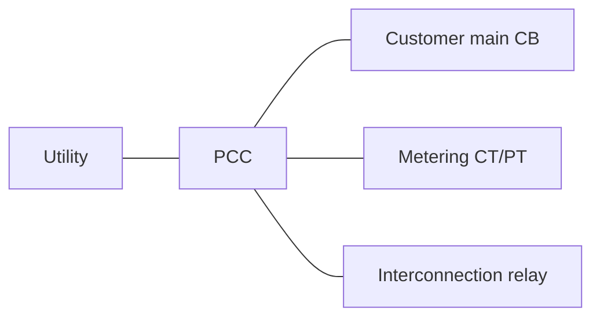
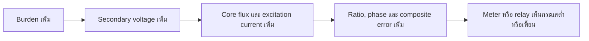
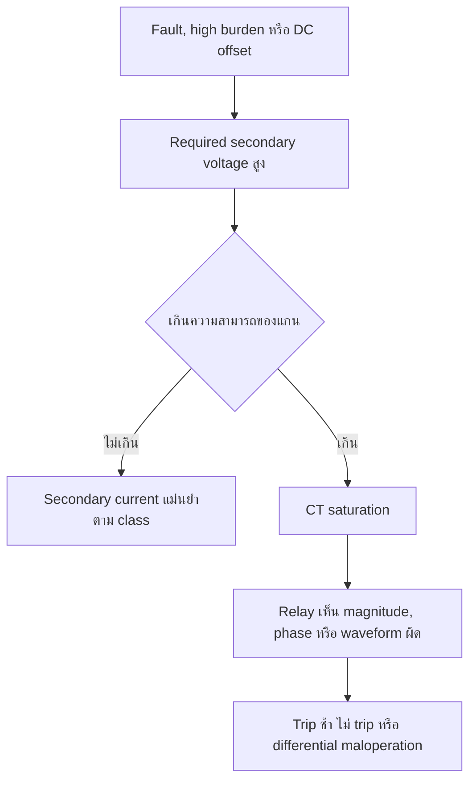
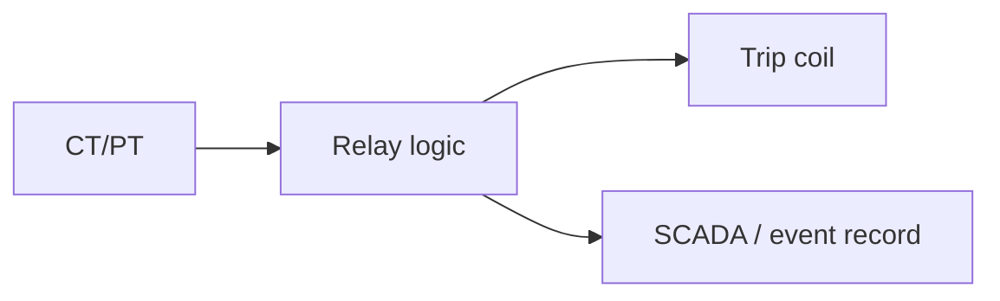
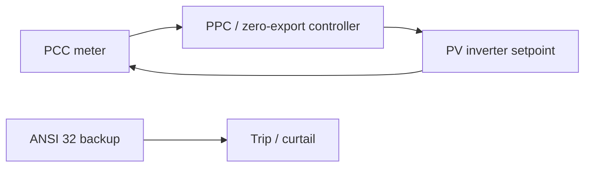
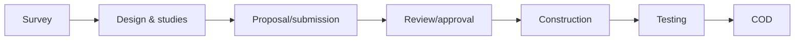
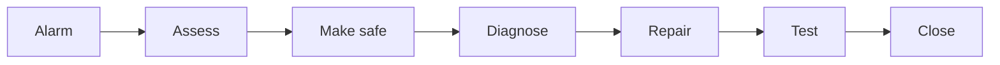

# คู่มือวิศวกรรม Solar Grid-Connected ฉบับรวมเล่ม

คู่มือสำหรับการออกแบบ ตรวจสอบ และเดินระบบ Solar Grid-Connected ที่ระดับ 400 V, 22 kV และ 115 kV

> เอกสารนี้รวมทุกบทไว้ในหน้าเดียวสำหรับ GitHub; ไฟล์แยกรายบทยังคงมีไว้สำหรับแก้ไขและอ้างอิงรายเรื่อง

## สารบัญ

- [1. ระบบ Solar Grid-Connected](#-1-ระบบ-solar-grid-connected)
- [2. PCC](#-2-pcc-point-of-common-coupling)
- [3. Current Transformer](#-3-current-transformer-ct)
- [4. PT / VT / CVT](#-4-pt--vt--cvt)
- [5. การคำนวณ CT Burden](#-5-การคำนวณ-ct-burden)
- [6. CT Saturation](#-6-ct-saturation)
- [7. Metering System](#-7-metering-system)
- [8. Protection System](#-8-protection-system)
- [9. Reverse Power](#-9-reverse-power-ansi-32)
- [10. Zero Export System](#-10-zero-export-system)
- [11. การออกแบบ 400 V](#-11-การออกแบบ-400-v)
- [12. การออกแบบ 22 kV](#-12-การออกแบบ-22-kv)
- [13. การออกแบบ 115 kV](#-13-การออกแบบ-115-kv)
- [14. ข้อกำหนด Utility](#-14-ข้อกำหนด-utility)
- [15. ขั้นตอนขออนุมัติโครงการ](#-15-ขั้นตอนขออนุมัติโครงการ)
- [16. Commissioning](#-16-commissioning)
- [17. Operation & Maintenance](#-17-operation--maintenance)
- [18. กรณีศึกษา](#-18-กรณีศึกษา)
- [19. Engineering Checklists](#-19-engineering-checklists)
- [20. มาตรฐานและเอกสารอ้างอิง](#-20-มาตรฐานและเอกสารอ้างอิง)

---

Output:
# 1. ระบบ Solar Grid-Connected

Solar Rooftop ใช้พลังงาน ณ จุดผลิต (self-consumption); Solar Farm ส่งผ่านระบบรวบรวมสู่ grid. Net billing/net metering เป็นกลไกการชดเชยพลังงานที่ต้องเป็นไปตามประกาศที่ใช้บังคับ ขณะที่ zero export จำกัดกำลังสุทธิไหลออกที่ PCC.

```text
Grid ─ PCC ─ Main switchboard ─ Load
             └─────────────── PV inverter
```

| โหมด | ทิศทางกำลังที่ PCC | ประเด็นออกแบบ |
|---|---|---|
| Import | Grid → Site | demand, protection |
| Export | Site → Grid | interconnection, revenue meter |
| Zero export | ≈ 0 kW export | controller latency และ backup protection |

ตัวอย่าง: โหลด 800 kW, PV 600 kW → import โดยประมาณ 200 kW (ก่อนพิจารณา losses/reactive power).

## Design basis ที่ต้องเก็บก่อนออกแบบ

| ข้อมูล | ใช้ตัดสินใจ |
|---|---|
| 15-min load profile และ maximum demand | ขนาด PV, zero-export margin, CT ratio |
| network voltage/fault level และ transformer data | switchgear duty, relay coordination |
| inverter certificate และ control modes | anti-islanding, reactive power, ramp rate |
| utility agreement | PCC, export entitlement, metering/protection |
| site constraints | cable route, earthing, flood/lightning, access |

ลำดับคิด: กำหนด operating philosophy → เลือก PCC → ทำ load flow/short circuit → กำหนด protection และ metering → ทำ interface test. IEEE 1547 ให้กรอบเรื่อง interconnection, interoperability, response ภาวะผิดปกติ, power quality และการทดสอบ แต่ค่าที่ใช้จริงต้องมาจาก utility ที่อนุมัติโครงการ [IEEE SCC21](https://sagroups.ieee.org/scc21/standards/1547rev/).


---

# 2. PCC (Point of Common Coupling)

PCC คือจุดที่ระบบผู้ใช้เชื่อมร่วมกับระบบสาธารณูปโภค ใช้กำหนดขอบเขตวัดคุณภาพไฟฟ้า, metering, export และ protection. จุดตัดความรับผิดชอบจริงให้ยึด single-line และสัญญา interconnection ที่อนุมัติ.



| ระดับแรงดัน | ตัวอย่าง PCC | ข้อผิดพลาดพบบ่อย |
|---|---|---|
| 400 V | หน้า MDB/utility meter | วัดหลังโหลดบางส่วน |
| 22 kV | incoming feeder/switchgear | CT ทิศทางกลับด้าน |
| 115 kV | bay ตาม approved SLD | สับสนระหว่าง POI และ ownership boundary |

ตัวอย่างตรวจรับ: เปิด PV ที่โหลดต่ำแล้วเปรียบเทียบ meter ที่ PCC กับ meter inverter เพื่อยืนยัน direction และ phase.

## PCC design review

1. ระบุ PCC บน SLD, layout และ cable schedule เป็นชื่อเดียวกัน
2. แยก “PCC”, “point of isolation”, “revenue-meter point” และ “ownership boundary” หากเป็นคนละตำแหน่ง
3. ใส่ CT/PT ที่ใช้ตัดสิน import/export ให้ครบทั้งสามเฟสและทำ phase association matrix
4. ระบุ breaker ที่ protection ต้องสั่งตัดและ interlock/reclose philosophy

| สถานการณ์ | การตีความที่ถูกต้อง |
|---|---|
| PV อยู่หลัง MDB | Meter/PPC ต้องวัดที่ PCC ไม่ใช่เฉพาะ feeder PV |
| มี generator สำรอง | ศึกษา contribution, transfer scheme และ anti-islanding เพิ่ม |
| มีหลายอาคาร | ระบุว่า PCC อยู่ก่อนหรือหลัง internal feeder ทุกเส้น |


---

# 3. Current Transformer (CT)

CT ลดกระแสปฐมภูมิให้ meter/relay ใช้งานได้อย่างปลอดภัย. เลือก ratio จาก maximum continuous current, minimum current ที่ต้องแม่นยำ, fault duty, class, burden และ core allocation—not from ratio alone.

| งาน | class ที่พบ | หมายเหตุ |
|---|---|---|
| Revenue metering | 0.1, 0.2, 0.2S | ตาม utility/metering specification |
| General metering | 0.5, 0.5S, 1.0 | ตรวจ accuracy range |
| Overcurrent | 5P/10P, 3P | ตรวจ ALF และ burden |
| Differential | PX/TPS/TPX/TPY/TPZ | ต้องตรวจ transient performance |

ตัวอย่างโหลด 2.5 MVA ที่ 22 kV: $I=2500/(\sqrt{3}\times22)=65.6\ \text{A}$; CT 100/1 A เป็นเพียง candidate ต้องตรวจ fault/protection study.

```text
P1 → primary conductor → P2     S1 → test block → relay; S2 → return
```

## วิธีเลือก CT อย่างเป็นระบบ

| ขั้น | คำถาม | ผลลัพธ์ |
|---|---|---|
| 1 | normal/max/future current เท่าใด | candidate ratio |
| 2 | minimum current ใดต้องแม่นยำ | metering class/range |
| 3 | fault และ clearing time เท่าใด | protection class/ALF/knee point |
| 4 | secondary route และ devices อะไรบ้าง | total burden |
| 5 | ต้องแยก core ใด | core schedule |

CT คือหม้อแปลงกระแสที่มี excitation current จึงมี ratio error และ phase displacement ตาม class/burden. IEC 61869-2 ครอบคลุม CT แบบ inductive สำหรับอุปกรณ์วัดและป้องกัน รวมถึงการปรับข้อกำหนดด้าน transient performance [IEC 61869-2](https://webstore.iec.ch/en/publication/6050). ใช้ nameplate และ data sheet เป็นแหล่งค่าพิกัด ไม่อนุมานจากชื่อ class อย่างเดียว.

**ห้ามปฏิบัติ:** เปิดวงจร secondary ขณะ CT primary มีกระแส, ต่อ S1/S2 ผิด, ใช้ earthing หลายจุดโดยไม่เป็นไปตามแบบ, หรือถอด test link โดยไม่ short secondary ก่อน.


---

Output:
# 4. PT / VT / CVT

PT/VT ลดแรงดันเพื่อวัดและป้องกัน; CVT ใช้แพร่หลายในแรงดันสูงและอาจใช้สำหรับ carrier coupling. ratio, burden, accuracy class, fuse/isolator และ ferroresonance mitigation ต้องเป็นไปตามแบบ.

| อุปกรณ์ | การใช้งาน | ตัวอย่าง |
|---|---|---|
| VT/PT inductive | 22 kV/115 kV metering & relay | 22 kV/110 V |
| CVT | EHV measurement/protection | 115 kV/110 V (ตามแบบ) |
| ไม่มี VT | LV meter ต่อโดยตรง | 400 V เมื่อ meter rated รองรับ |

```text
Bus ─ Fuse/isolator ─ VT/CVT ─ test terminal ─ meter + relay
```

ตัวอย่าง: secondary 110 V ต้องตรวจ phase rotation และ fuse supervision ก่อนเปิดใช้ ANSI 27/59/32.

## จุดควบคุมของวงจรแรงดัน

| รายการ | เหตุผล |
|---|---|
| ratio และ tap | ส่งผลต่อ voltage scaling และ directional element |
| accuracy/burden class | revenue/PQ/relay อาจต้องใช้ core แยก |
| fuse supervision | ฟิวส์ขาดทำให้ 27/59/32 เห็นแรงดันผิด |
| single-point secondary earthing | safety และลด circulating current |
| ferroresonance/control wiring | สำคัญกับ VT/CVT ตาม manufacturer |

ก่อนนำวงจร VT ไปใช้กับ directional/reverse-power relay ต้องทำ secondary injection สามเฟสและยืนยัน sequence ABC, phase-to-neutral/phase-to-phase และ vector compensation ของ transformer.


---

# 5. การคำนวณ CT Burden

## 5.1 หลักการและขอบเขต

CT แปลงกระแสปฐมภูมิเป็นกระแสทุติยภูมิมาตรฐาน 1 A หรือ 5 A เพื่อป้อน meter และ relay โดย burden รวมคืออิมพีแดนซ์ของ **สายไป-กลับ**, ขั้วต่อ/test switch, meter และ relay ที่ CT ต้องขับ ณ กระแสพิกัด

$$S_{burden}=I_s^2 \times Z_{total}\quad [VA]$$

สำหรับสายทองแดง DC-resistance approximation (ใช้เป็น screening; งาน protection ต้องใช้ค่า AC impedance/ข้อมูลผู้ผลิตเมื่อเกี่ยวกับ transient):

$$R_{loop}=\rho \times \frac{2L}{A}\quad;\quad \rho=0.0175\ \Omega\cdot mm^2/m$$
| รายการ | สิ่งที่ต้องยืนยัน | หน่วย |
|---|---|---:|
| CT | ratio, class, rated burden, ALF/knee point และ core ที่ใช้ | A, VA, V |
| Cable | ระยะ one-way, ขนาด, วัสดุ, route และจำนวน loop | m, mm² |
| Device | burden ที่ input 1 A/5 A ตาม datasheet | VA หรือ Ω |
| Terminal | test block, fuse/test switch, terminal, contact | VA หรือ Ω |

> ห้ามใช้ CT secondary ร่วมระหว่าง metering และ protection หากแบบ/utility/ผู้ผลิตไม่ได้อนุญาต และห้ามเปิดวงจร CT secondary ขณะ primary มีกระแส.

## 5A. ผลกระทบเมื่อ CT Burden เกิน (CT Overburden)

CT **ไม่ใช่ ideal current source**. กระแสปฐมภูมิที่อ้างอิงมายัง secondary ต้องแบ่งเป็นกระแสที่ส่งให้ burden และกระแสกระตุ้นแกน (excitation current):

$$I'_p=I_s+I_e$$

เมื่อ burden เพิ่มขึ้น CT ต้องสร้างแรงดันทุติยภูมิ (V_s=I_s Z_b) สูงขึ้น เพื่อให้แรงดันนี้เกิดได้ flux ในแกนและ magnetizing current จะสูงขึ้นตาม excitation curve. ใกล้ knee point ความชันของ curve เปลี่ยนมาก: เพิ่มแรงดันเล็กน้อยแต่ (I_e) เพิ่มมาก กระแสที่เหลือส่งให้ meter/relay ลดลง จึงเกิด ratio error และ phase displacement; สำหรับ protection ผลรวมเรียกว่า **composite error** ภายใต้เงื่อนไข fault/burden ที่มาตรฐานระบุ.



| ระดับ | อาการตัวอย่าง | ความเสี่ยง |
|---|---|---|
| 1 | Meter 285 A เมื่อจริง 300 A (-5%) | kWh, demand, export คลาดเคลื่อน |
| 2 | Export จริง 100 kW แต่ meter เห็น 95 kW | ANSI 32 ไม่รับรู้ หรือ zero-export control ผิด |
| 3 | Fault 5,000 A แต่ relay เห็น 4,200 A | pickup ต่ำ, trip delay หรือไม่ trip |
| 4 | เข้า saturation/knee region | รูปคลื่น secondary บิดเบี้ยว; 87T/87B/87L เสี่ยง misoperation/security loss |

คำว่า “flux collapse” ในภาคปฏิบัติหมายถึง CT ไม่สามารถรักษา flux/แรงดันทุติยภูมิที่จำเป็นเพื่อจำลองกระแสปฐมภูมิได้อย่างเชิงเส้น; flux ไม่ได้หายไปทันที แต่แกนเข้าสู่ saturation และ output current เพี้ยนอย่างรุนแรง.

## 5B. ตัวอย่างคำนวณละเอียด: CT 1 A เทียบ 5 A

**ข้อมูลร่วม:** ระยะทาง one-way 150 m, สายทองแดง 4 mm², ดังนั้น loop length = 300 m.

$$R_{cable}=0.0175 \times 300 / 4 = 1.31\ \Omega$$

| รายการ | CT 400/1 A | CT 400/5 A |
|---|---:|---:|
| Cable burden | $1^2 \times 1.31=1.31\ \text{VA}$ | $5^2 \times 1.31=32.75\ \text{VA}$ |
| Meter + relay + terminal | 0.5 + 0.2 + 0.2 = 0.90 VA | สมมติรวม 2.00 VA* |
| **Total** | **2.21 VA** | **34.75 VA** |
| CT rated burden | 15 VA | 15 VA |
| ผล | **PASS** (14.7%) | **FAIL** (231.7%) |

\*ตัวอย่าง 5 A ใช้ burden ของอุปกรณ์ตามโจทย์ 1+1 VA; ต้องแทนด้วย datasheet จริง. อุปกรณ์ 1 A และ 5 A มี burden ไม่เท่ากัน จึงห้ามคัดลอกค่า.

**ข้อสรุป:** เฉพาะ burden ของสายที่มี resistance เดียวกัน CT 5 A สูงกว่า CT 1 A เป็น $5^2/1^2=25$ เท่า. จึงนิยมใช้ 1 A ในสถานีหรือวงจรระยะไกล เมื่อ device และมาตรฐานระบบรองรับ.

## 5C. เลือกขนาดสายจาก burden ที่ยอมได้

**โจทย์:** CT 400/1 A, rated burden 15 VA, ระยะ 200 m. สมมติ device burden รวม 1.0 VA และกำหนด design margin 70% ของ rated burden.

1. Available cable burden = $0.70\times15-1.0=9.5\ \text{VA}$
2. ที่ 1 A, allowable loop resistance = $9.5/1^2=9.5\ \Omega$
3. $A_{min}=0.0175\times(2\times200)/9.5=0.737\ \text{mm}^2$

ดังนั้นเลือกสายมาตรฐาน **อย่างน้อย 1.0 mm²** ตามการคำนวณ burden นี้ แต่การเลือกจริงต้องตรวจ minimum mechanical strength, insulation, voltage drop during test, installation standard, spare cores และข้อกำหนด owner/utility; 1.5 หรือ 2.5 mm² มักเหมาะกว่าเมื่อเผื่อการเดินสายและอนาคต.

## Design rules of thumb

- CT 1 A เหมาะเมื่อระยะวงจรยาวกว่า ~50 m หรือ burden สายเป็นตัวควบคุม.
- CT 5 A เหมาะกับระยะสั้นและอุปกรณ์เดิมที่รองรับ 5 A.
- ออกแบบทั่วไปให้ calculated steady-state burden ≤70% ของ rated burden เพื่อเผื่ออุณหภูมิ, aging, terminal resistance และ future device. กฎนี้ไม่แทนการตรวจ transient performance/knee-point สำหรับ protection.
- ตรวจ polarity, ratio, phase, core allocation และ shorting arrangement พร้อม burden ทุก component ก่อนอนุมัติแบบ.


---

Output:
# 6. CT Saturation

## 6.1 กลไก

ความหนาแน่นฟลักซ์ (flux density) ในแกน CT ถูกกำหนดจากแรงดันทุติยภูมิและเวลาโดยประมาณ: $v=N_s\,d\Phi/dt$. เมื่อ fault current, DC offset, burden หรือ secondary loop resistance สูง CT ต้องการแรงดันมากขึ้น; เมื่อถึงบริเวณอิ่มตัว (saturation region) excitation current เพิ่มเร็วมากและกระแส secondary ไม่จำลอง primary อย่างซื่อสัตย์.

**Knee-point voltage** ใช้กับ CT class ที่เกี่ยวข้องตามนิยามมาตรฐาน/ผู้ผลิต: เป็นจุดบน excitation curve ที่การเพิ่มแรงดันเล็กน้อยทำให้ excitation current เพิ่มมาก. อย่าใช้ค่าดังกล่าวแทน ALF, rated burden หรือ transient performance โดยไม่ตรวจ class และมาตรฐานที่เกี่ยวข้อง.



## 6A. Case study: Solar Farm 20 MW

**อาการ:** Reverse power relay trip ผิดพลาดระหว่างเหตุการณ์ระบบ และ zero-export response ไม่สอดคล้องกับกำลังจริง.

| หัวข้อ | ผลตรวจ |
|---|---|
| CT ratio | ถูกต้องตามโหลดปกติ |
| Relay type และ setting | ถูกต้องตามเอกสารตั้งค่า |
| สาย CT secondary | เดินไกลกว่าที่ระบุในแบบ ทำให้ loop resistance สูง |
| Burden total | เกิน rated/design margin ของ CT |
| ข้อสรุป | saturation/measurement error เกิดจาก secondary cable burden ไม่ใช่ ratio หรือ pickup setting เพียงอย่างเดียว |

**แนวทางแก้:** สำรวจ as-built length/size ทุก core, วัด resistance แบบ loop, ตรวจ burden ของ relay/meter/test block จาก datasheet, แยก core ตามหน้าที่, เปลี่ยนเป็น CT 1 A หรือเพิ่มสาย/ลดระยะ/เลือก CT burden และ class ที่เหมาะสม แล้วทำ secondary injection และ functional trip test ใหม่. ต้องประสาน protection study ก่อนเปลี่ยน CT หรือ setting.

## 6B. สรุปความรุนแรง

| ระดับ | อาการ | ผลกระทบ |
|---|---|---|
| ต่ำ | Meter error | ค่าไฟและ energy accounting ผิด |
| ปานกลาง | Reverse-power error | zero export ผิดหรือ ANSI 32 ไม่ทำงานตามเจตนา |
| สูง | Overcurrent measurement error | trip ช้า/coordination เปลี่ยน |
| สูงมาก | Saturation | protection fail หรือรูปคลื่นผิด |
| วิกฤต | Differential maloperation/security loss | risk ต่อ transformer, bus หรือ line และอาจดับทั้งสถานี |

## SLD และรายการตรวจสอบ

```text
Utility ── PCC ──[ CT cores: Meter | 32 | 50/51 | 87 ]── CB ── Transformer ── PV
                      │
       each core → shorting test block → assigned device only
```

ก่อน energize ให้ยืนยัน: (1) CT class/ratio/burden/knee point ตรง approved drawing, (2) loop resistance as-built, (3) total burden และ 70% margin, (4) S1/S2 polarity และ phase mapping, (5) no unintended open circuit, (6) injection test, event record และ trip matrix ครบ.


---

# 7. Metering System

| ระบบ | หน้าที่ | จุดควบคุม |
|---|---|---|
| Revenue meter | settlement | utility-approved CT/PT และ seal |
| Check meter | ตรวจสอบ revenue | independent channel |
| PQ meter | harmonic/event | CT/PT phase mapping |
| SCADA meter | operation | time sync/communication |

```text
CT/PT → test block → revenue meter
      └→ check/PQ/SCADA (เฉพาะ core/วงจรที่อนุมัติ)
```

ตัวอย่าง: เปรียบเทียบ MW ของ revenue กับ SCADA หลัง correction ratio; ค่าคลาดเคลื่อนเกินเกณฑ์โครงการให้ตรวจ ratio, polarity และ burden.

## Metering architecture และ data quality

| ชั้นข้อมูล | จุดประสงค์ | วิธีควบคุม |
|---|---|---|
| Settlement | billing/export | seal, calibration, approved multiplier |
| Operations | dispatch/zero export | time sync, alarm, redundant comms เมื่อจำเป็น |
| Engineering | event/PQ diagnosis | waveform/event retention, naming standard |

ตรวจค่า **raw secondary**, CT/PT multiplier, sign convention และ energy register (import/export) แยกกัน. ห้ามใช้ SCADA point เพียงจุดเดียวเป็นหลักฐานการชำระเงินหากไม่ใช่ revenue meter ที่ได้รับอนุมัติ.


---

# 8. Protection System

| ANSI | หน้าที่ | ตัวอย่างใน solar interconnection |
|---|---|---|
| 27/59 | under/overvoltage | islanding/grid abnormality |
| 81/81R | frequency/ROCOF | grid disturbance |
| 32 | reverse power | export supervision |
| 50/51, 50N/51N | overcurrent/earth fault | feeder backup |
| 67/67N | directional OC/EF | multi-source system |
| 87T/87B/87L | differential | transformer/bus/line primary |
| 25, 46, 47, 86, 50BF, 74TC | synchronism/unbalance/lockout/failure | ตาม design basis |



ตัวอย่าง setting ต้องมาจาก fault/coordination study—not copied from another plant.

## Protection philosophy

Protection ที่ดีต้องมี sensitivity, selectivity, speed, reliability และ security. นิยาม zone of protection, main/backup, CT/PT inputs, breaker trip paths, DC supply, intertrip และ loss-of-communication response ตั้งแต่ SLD stage.

| เอกสารควบคุม | เนื้อหาขั้นต่ำ |
|---|---|
| Protection philosophy | zone, primary/backup, operating states |
| Setting report | assumptions, calculations, setting group/version |
| Trip matrix | relay output → lockout/CB และ alarm |
| Test plan | injection, end-to-end, functional/witness |

IEC 60255-1 ระบุ common requirements สำหรับ measuring relays/protection และรวมบริบท control, monitoring, communication และ process interface [IEC 60255-1](https://webstore.iec.ch/en/publication/59762). EMC และ safety ของอุปกรณ์เป็นคนละมิติที่ต้องตรวจตามมาตรฐาน/ผู้ผลิตด้วย.


---

Output:
# 9. Reverse Power (ANSI 32)

ANSI 32 ใช้แรงดันและกระแสพร้อมทิศทาง/มุมเฟส จึงไวต่อ CT/PT polarity, phase association และ sign convention. ใช้เป็น protection หรือ supervisory backup ตาม approved philosophy.

```text
Grid → PCC → Site  = import (+)
Site → PCC → Grid  = export (− หรือ + ตาม relay convention)
```

| Test | ผลที่ควรเห็น |
|---|---|
| secondary injection direction | MW sign ตรง convention |
| PV ramp at low load | pickup ตาม threshold/time delay |
| CT/PT phase swap simulation | alarm/fail-safe ตาม design |

ตัวอย่าง threshold 50 kW ไม่ใช่ค่ามาตรฐานทั่วไป ต้องเลือกเหนือ noise/measurement uncertainty และตาม utility agreement.

## Logic ที่ควรระบุในแบบ

```text
PCC MW sign + valid VT/CT
  → export threshold exceeded for T32
  → alarm / curtail command / trip (ตาม approved philosophy)
```

| ตัวแปร | หลักคิด |
|---|---|
| pickup | ต่ำกว่า export ที่อนุญาต แต่สูงกว่า noise/error band |
| time delay | ผ่าน transient ปกติ แต่ป้องกันผิดเงื่อนไขได้ทันเวลา |
| direction | ตรวจด้วย true three-phase power ไม่ใช่กระแสอย่างเดียว |
| VT fail/block | ระบุว่าจะ block, alarm หรือ trip อย่างปลอดภัย |

บันทึก sign convention ไว้บน drawing, HMI และ test sheet เดียวกันเสมอ เพื่อป้องกัน “positive MW” มีความหมายต่างกันระหว่าง PPC, meter และ relay.


---

# 10. Zero Export System



| Failure mode | การตอบสนองที่ควรกำหนด |
|---|---|
| meter/CT invalid | hold, derate หรือ trip ตาม approved philosophy |
| communication loss | inverter fallback setpoint/stop |
| controller delay | export limit margin และ backup 32 |

ตัวอย่างโหลดลด 300 kW: PPC ต้องลด PV ก่อนกำลังสุทธิเกิน export limit โดยพิจารณา sampling, comms และ inverter ramp.

## Control design

ให้วัด real power ที่ PCC, กรองสัญญาณเท่าที่จำเป็น, คำนวณ permissible PV output แล้วสั่ง inverter ด้วย ramp limit. ต้องทดลอง worst case ที่โหลดลดเร็ว, PV ramp ขึ้น, comms latency และ meter invalid.

| Parameter | ผลกระทบ |
|---|---|
| sample/scan interval | ช้าทำให้ export overshoot |
| deadband | แคบเกินทำให้ hunting; กว้างเกินทำให้ import มาก |
| ramp rate | ต้องทัน load step โดยไม่กระชาก |
| export reserve | กัน error, latency และ measurement uncertainty |
| fallback | loss of meter/PPC/comms ต้องได้สถานะปลอดภัย |

ANSI 32 ไม่ใช่ตัวควบคุมกำลังต่อเนื่องแทน PPC แต่เป็นชั้น supervisory/backup ตาม philosophy ที่อนุมัติ.


---

# 11. การออกแบบ 400 V

```text
PV inverters → AC combiner → ACB/MDB → PCC → Utility
```

| ขนาดตัวอย่าง | กระแสโดยประมาณที่ 400 V, pf 1 |
|---|---:|
| 500 kW | 722 A |
| 1 MW | 1,443 A |
| 2 MW | 2,887 A |

คำนวณจาก $I=P/(\sqrt{3}\times V\times pf)$. ตรวจ busbar/cable derating, fault level, ACB breaking capacity, earthing, anti-islanding, metering CT และ utility interface ก่อนเลือกอุปกรณ์.

## Design checklist

| ระบบย่อย | ตรวจเชิงวิศวกรรม |
|---|---|
| AC collection | ampacity, voltage drop, harmonics, neutral/PE arrangement |
| MDB | ACB/MCCB rating, selectivity, short-circuit withstand, arc-flash |
| Transformer | impedance, vector group, tap, inrush, earthing |
| PV inverter | fault contribution, anti-islanding และ control mode |

สำหรับ 1 MW ที่ 400 V กระแสประมาณ 1,443 A แสดงว่าการรวม inverter จำนวนมากบน LV อาจทำให้ busduct/cable และ ACB เป็นข้อจำกัด; พิจารณา step-up ที่เหมาะสมจาก layout และ loss study ไม่ใช่กำลังอย่างเดียว.


---

Output:
# 12. การออกแบบ 22 kV

```text
PV → LV collection → step-up transformer → 22 kV switchgear/RMU → PCC
```

| Solar plant | กระแสที่ 22 kV, pf 1 |
|---|---:|
| 1 MW | 26.2 A |
| 5 MW | 131.2 A |
| 10 MW | 262.4 A |
| 20 MW | 524.9 A |

ตรวจ insulation level, CT/PT cores, relay coordination, transformer vector group, cable ampacity, switching duty, arc-flash และ approved protection interface. ตัวอย่าง 5 MW: $5000/(\sqrt{3}\times22)=131.2\ \text{A}$.

## RMU/Switchgear interface

| หัวข้อ | สิ่งที่ระบุในแบบ |
|---|---|
| Bus/feeder rating | continuous current, short-time withstand, making/breaking duty |
| CT/PT | core allocation, class, burden, polarity และ cable schedule |
| Earthing | neutral method, earth-fault sensitivity, touch/step study |
| Protection | 50/51, 50N/51N, 67/67N/27/59/81/32 ตาม scheme |
| SCADA | protocol, time sync, SOE, remote/local interlock |

หลังเลือก ratio ต้องตรวจว่ากระแสโหลดต่ำยังอยู่ในช่วงที่ meter/relay ต้องการ และ fault study ยังเพียงพอให้ pickup/selectivity ไม่เสีย.


---

# 13. การออกแบบ 115 kV

```text
Plant collector → GSU → 115 kV bay (CT/PT/CVT, CB, DS, LA) → Grid
```

| Export | กระแสที่ 115 kV, pf 1 |
|---|---:|
| 20 MW | 100.4 A |
| 50 MW | 251.0 A |
| 100 MW | 502.0 A |

ตัวอย่าง 60 MVA: $60{,}000/(\sqrt{3}\times115)=301\ \text{A}$. ต้องทำ grid impact, insulation coordination, protection/teleprotection และ bay design ตามเจ้าของระบบ.

## Substation engineering deliverables

| Deliverable | ประเด็น |
|---|---|
| Load flow/reactive study | voltage control, transformer tap, capacitor/reactor |
| Short-circuit study | CB duty, CT performance, equipment withstand |
| Insulation coordination | BIL/LIWL, arrester, clearances |
| Protection/telecom | 87L/21/50BF/86 ตาม interface และ channel availability |
| Grounding study | GPR, touch/step, shield wire/grid design |

การใช้ CVT, line CT, telecom protection หรือ revenue metering ที่ 115 kV ให้ยึด utility bay standard และ protection interface document; คู่มือนี้ไม่กำหนด settings/clearances แทนเจ้าของระบบ.


---

# 14. ข้อกำหนด Utility

| หัวข้อ | ต้องยืนยันกับ PEA/MEA/EGAT/ERC/สัญญา |
|---|---|
| PCC | จุดเชื่อมต่อและ ownership boundary |
| Metering | CT/PT class, meter, seal, communication |
| Protection | functions, settings, trip interface, witness test |
| Export | export limit, 32, PPC/curtailment |
| Documents | SLD, studies, test reports, as-built |


อย่าใช้ตารางนี้แทนเอกสาร utility ฉบับล่าสุด: ข้อกำหนดต่างกันตามพื้นที่ ระดับแรงดัน และวันที่ยื่นโครงการ.

## วิธีบริหาร requirement

สร้าง requirement register ที่มี source/revision, owner, design response, evidence และ approval status. เอกสาร PEA บางโครงการกำหนดขั้นตอนเชื่อมต่อ, เอกสาร, สัญญา และการติดตั้งตามหลักวิศวกรรม ดังนั้นต้องขอ checklist ฉบับเฉพาะโครงการจากเขตการไฟฟ้า [PEA](https://ppim.pea.co.th/project/solar/VSPP-RT1/announcement/62a014db5bdc7f2be137bc09).

| คำถามก่อน submit | หลักฐาน |
|---|---|
| export อนุญาต/จำกัดเท่าใด | agreement/control narrative |
| ใครเป็นเจ้าของ CT/PT/meter | metering SLD และ datasheet |
| relay function/test ใดจำเป็น | approved protection schedule |
| remote signal ใดต้องส่ง | SCADA point list/interface test |


---

Output:
# 15. ขั้นตอนขออนุมัติโครงการ



| Gate | หลักฐานขั้นต่ำ |
|---|---|
| Design freeze | SLD, layout, load/PV data |
| Technical review | protection, short-circuit, grid-impact ตามที่ขอ |
| Pre-energization | FAT/SAT, test forms, as-built |
| COD | witness results, meter/SCADA acceptance |

ตัวอย่าง: หากย้ายตำแหน่ง CT จากแบบที่อนุมัติ ให้ประเมิน PCC/metering/protection impact และยื่น revision ก่อนติดตั้ง.

## Document-control rule

ใช้เลข revision เดียวบน SLD, settings, cable schedule, I/O list และ test sheet. ทุก utility comment ต้องมี disposition: accepted, clarified หรือ rejected พร้อมหลักฐานปิดประเด็น. ห้ามนำแบบ “for construction” ไปทดสอบโดยไม่มี as-built mark-up เมื่อหน้างานต่างจากแบบ.


---

# 16. Commissioning

| Test | หลักฐาน |
|---|---|
| CT/PT ratio, polarity, phase | test sheet และ nameplate |
| secondary continuity/IR | measured record |
| relay secondary injection | pickup/time/event |
| 32 direction/zero export | MW trend และ trip matrix |
| end-to-end/SCADA | command, alarm, time sync |

```text
Approved drawings → physical inspection → cold checks → injection → functional trip → energization → performance test
```

ตัวอย่าง functional test: โหลดต่ำและ ramp PV ภายใต้ใบอนุญาต/แผน switching; บันทึก PCC MW, PPC setpoint และ ANSI 32 behavior.

## ลำดับการทดสอบที่ปลอดภัย

1. ตรวจเอกสาร, isolation และ permit-to-work
2. cold check: wiring continuity, terminal ID, earth, CT shorting link
3. secondary injection: ratio/polarity/logic/trip output โดยไม่สั่งตัดอุปกรณ์จริงจนควบคุมได้
4. functional test: breaker/DC/lockout/interlock/SCADA/PPC
5. energization ตาม switching program และ witness requirement

| ผลที่ต้องเก็บ | ตัวอย่าง |
|---|---|
| Test record | measured value, expected value, pass/fail, instrument calibration |
| Event evidence | relay oscillography/SOE/HMI trend |
| Configuration | relay setting file, PPC version, inverter firmware |
| Acceptance | responsible engineer/utility sign-off |


---

# 17. Operation & Maintenance

| ความถี่ | งาน |
|---|---|
| รายวัน/remote | inverter availability, PCC import/export, alarms |
| รายเดือน | trend meter discrepancy, communication, visual inspection |
| รายปี | relay test ตามแผน, torque/thermal scan, calibration review |
| หลังเหตุขัดข้อง | event download, CT/PT circuit inspection, settings control |



ตัวอย่าง: revenue/SCADA MW ต่างผิดปกติ ให้ตรวจ timestamp, multiplier, CT ratio และ CT burden ก่อนปรับ setting.

## Change management

ทุกการเปลี่ยน CT/PT, relay setting, PPC parameters, inverter firmware หรือ communication mapping ต้องผ่าน MOC: เหตุผล → risk assessment → approval → test → backup/rollback → as-built update. เหตุผลคือการเปลี่ยนเล็กน้อย เช่น CT ratio multiplier สามารถเปลี่ยนทั้ง metering, 32 direction และ zero-export feedback พร้อมกันได้.


---

Output:
# 18. กรณีศึกษา

| กรณี | อาการ | สาเหตุหลักที่ต้องตรวจ | แนวแก้ |
|---|---|---|---|
| PV > load | export เกิน | PPC margin/latency | tune curtailment + backup |
| CT ratio ผิด | MW scale ผิด | ratio/multiplier | correct drawing/meter config |
| CT burden เกิน | relay/meter ต่ำ | cable/device burden | ดูบท 5 |
| CT saturation | trip security/dependability ผิด | fault/DC/burden | ดูบท 6 |
| PCC ผิด | utility reject | boundary/SLD | revise approved interface |
| 32 ผิด | trip ไม่ตรง | polarity/phase | injection test |
| communication fail | PV ไม่ลด | PLC/network/fallback | fail-safe design |
| utility reject | COD เลื่อน | documents/tests | close comment register |

ทุกกรณีต้องแยกอาการ-หลักฐาน-สาเหตุ-การแก้ไข และทำ regression test ก่อนคืนระบบ.

## Root-cause template

```text
Event time / operating state / PCC MW-MVAr / relay event / PPC command
→ verify measurement chain → verify wiring/configuration → verify equipment capability
→ corrective action → repeat test under controlled condition
```

กรณี CT burden เกินให้บันทึก actual one-way route, conductor size, measured loop resistance, device VA และ CT nameplate ก่อนสรุปว่า CT saturation; ห้ามแก้ด้วยการลด pickup ของ relayโดยไม่มี coordination study.


---

# 19. Engineering Checklists

| ช่วงงาน | ตรวจ |
|---|---|
| Survey | load profile, site, PCC, utility data |
| Design | SLD, ratings, fault/protection/grid studies |
| CT/PT | ratio/class/core/burden/polarity/test block |
| Protection | settings approval, trip matrix, DC supply |
| Commissioning | injection, direction, end-to-end, records |
| Utility approval | comment closure, witness, as-built |

```text
[ ] Approved drawing  [ ] As-built verified  [ ] Test result accepted  [ ] Settings controlled
```

ตัวอย่าง gate: ห้าม energize หาก CT secondary continuity/polarity และ trip-circuit test ยังไม่มี signed record.

## Pre-energization minimum

| สถานะ | หลักฐานปิดงาน |
|---|---|
| Engineering | approved SLD, studies, settings, interfaces |
| Construction | as-built, torque/IR/earth records, labels |
| Control | PPC/fallback logic และ I/O point-to-point |
| Protection | injection, trip matrix, breaker/DC circuit test |
| Compliance | permits, utility witness, punch-list disposition |


---

# 20. มาตรฐานและเอกสารอ้างอิง

| เอกสาร | การใช้งาน |
|---|---|
| IEC 61869 series | Instrument transformers |
| IEC 60255 series | Measuring relays and protection equipment |
| IEC 60364 series | LV electrical installations |
| IEC 61727 | PV systems—utility interface characteristics |
| IEC 62116 | Anti-islanding test procedure |
| IEEE C57.13 | Instrument transformers |
| IEEE 1547 | DER interconnection/interoperability |
| IEEE C37 series | Switchgear/protection related standards |
| วสท., PEA, MEA, EGAT, ERC | Thai installation, interconnection, regulatory requirements |

ให้ตรวจ edition, national adoption, contract specification และ utility circular ที่มีผล ณ วันออกแบบเสมอ. ตัวอย่างการใช้: IEC 61869 ใช้กำหนด CT/PT capability; IEC 60255 ใช้กับ relay; เอกสาร utility เป็นตัวกำหนด interface และ acceptance ของโครงการ.

## แนวทางอ่านมาตรฐาน

- IEC 61869-2: ใช้กับ inductive CT และให้แนวทางเรื่อง measurement/protection/transient performance [IEC](https://webstore.iec.ch/en/publication/6050)
- IEC 60255-1: ใช้เป็น common requirement ของ relay/protection รวมถึงระบบที่มี control/monitoring/communication [IEC](https://webstore.iec.ch/en/publication/59762)
- IEEE 1547: ใช้เป็นกรอบ DER interconnection, abnormal response, power quality, interoperability และ tests [IEEE SCC21](https://sagroups.ieee.org/scc21/standards/1547rev/)

รายการนี้เป็นแผนที่อ้างอิง ไม่ใช่การทำซ้ำเนื้อหาที่มีลิขสิทธิ์ของมาตรฐาน. ค่าตั้งและข้อกำหนดที่ใช้ยื่นอนุมัติต้องอ้าง edition/contract ที่โครงการบังคับใช้.

---

## ภาคผนวก A: ภาพและตัวอย่างอุปกรณ์ CT / PT / CVT

เพื่อหลีกเลี่ยงการคัดลอกรูปผลิตภัณฑ์ที่มีลิขสิทธิ์ลงใน repository ให้เปิดภาพและ data sheet จากหน้าผู้ผลิตโดยตรงด้านล่าง แล้วตรวจสอบพิกัดจริงกับ approved specification ของโครงการ

| อุปกรณ์ / ระดับแรงดันโดยประมาณ | ตัวอย่างหน้ารูปและข้อมูลทางการ | ใช้ศึกษา |
|---|---|---|
| CT outdoor, 25–170 kV | [Hitachi Energy COF](https://www.hitachienergy.com/us/en/products-and-solutions/instrument-transformers/current-transformers-and-sensors) | รูปแบบ CT oil-insulated สำหรับ metering/protection |
| CT outdoor, 36–800 kV | [Hitachi Energy IMB](https://www.hitachienergy.com/in/en/products-and-solutions/instrument-transformers/current-transformers-and-sensors/imb-36-800-kv) | CT สำหรับ HV/EHV และการเลือกจำนวน core |
| CT gas-insulated, 72.5–800 kV | [Hitachi Energy TG](https://www.hitachienergy.com/products-and-solutions/instrument-transformers/current-transformers-and-sensors/tg-72-5-800-kv) | CT สำหรับ GIS / สภาพแวดล้อมเฉพาะ |
| VT / CVT / combined IT, 25–800 kV | [Instrument transformer portfolio](https://www.hitachienergy.com/us/en/products-and-solutions/instrument-transformers) | เปรียบเทียบ inductive VT, CVT และ combined CT/VT |
| Combined CT/VT, 123–145 kV | [Combined current/voltage transformers](https://www.hitachienergy.com/us/en/products-and-solutions/instrument-transformers/combined-current-voltage-transformers) | แนวคิดรวม CT และ VT ใน housing เดียว |
| LPIT ใน GIS | [Siemens Energy GIS / LPIT](https://www.siemens-energy.com/global/en/home/products-services/product-offerings/gas-insulated-switchgear.html) | electronic current/voltage measurement ใน GIS |

> ลิงก์เหล่านี้เป็นภาพอ้างอิงประเภทอุปกรณ์ ไม่ใช่การรับรองรุ่นหรือพิกัดสำหรับโครงการ. สำหรับ 400 V มักเป็น CT แบบ ring/window หรือ split-core ในตู้ MDB; สำหรับ 22 kV ใช้ CT/VT ใน switchgear หรือ outdoor ตามแบบ; สำหรับ 115 kV พบ outdoor CT/VT/CVT หรือ GIS instrument transformer ตาม bay configuration.


---
