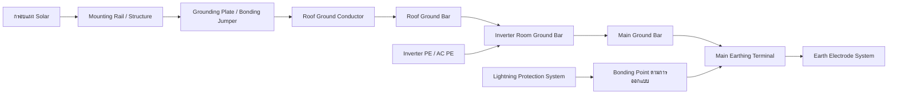
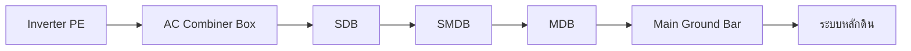
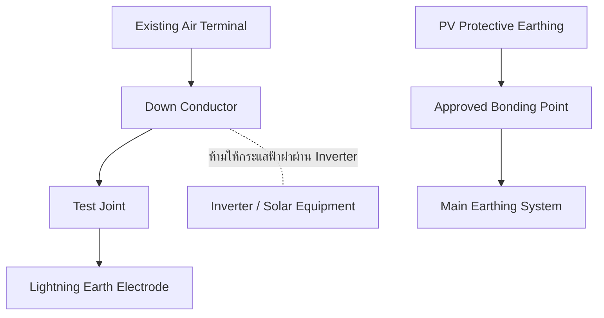

# วิเคราะห์ระบบ Grounding สำหรับ Solar Rooftop

เอกสารสรุปและวิเคราะห์ระบบ Grounding, Earthing และ Bonding สำหรับงาน Solar Rooftop จากแบบอ้างอิงในโฟลเดอร์นี้ เหมาะสำหรับใช้เป็นข้อมูลประกอบการตรวจแบบ จัดทำ BOQ ตรวจงานติดตั้ง และเตรียมเอกสารส่งมอบบน GitHub

> **คำเตือน:** เอกสารนี้เป็น Engineering Guideline ไม่ใช่แบบก่อสร้างที่อนุมัติแล้ว ขนาดสาย จำนวนหลักดิน ตำแหน่ง Bonding และค่า Earth Resistance ต้องได้รับการยืนยันโดยวิศวกรผู้ออกแบบจากผลคำนวณ ข้อมูลระบบจริง คู่มือผู้ผลิต มาตรฐานโครงการ และข้อกำหนดของเจ้าของงาน

## สารบัญ

- [1. ขอบเขตและข้อมูลอ้างอิง](#1-ขอบเขตและข้อมูลอ้างอิง)
- [2. ภาพรวมระบบที่วิเคราะห์](#2-ภาพรวมระบบที่วิเคราะห์)
- [3. หลักการ Grounding และ Bonding](#3-หลักการ-grounding-และ-bonding)
- [4. เส้นทางการต่อ Ground ที่ควรตรวจสอบ](#4-เส้นทางการต่อ-ground-ที่ควรตรวจสอบ)
- [5. ขนาดสายที่พบในแบบ](#5-ขนาดสายที่พบในแบบ)
- [6. หลักดินและค่าความต้านทานดิน](#6-หลักดินและค่าความต้านทานดิน)
- [7. การประสานกับ Lightning Protection](#7-การประสานกับ-lightning-protection)
- [8. ข้อกำหนดงานติดตั้ง](#8-ข้อกำหนดงานติดตั้ง)
- [9. Inspection and Test Plan](#9-inspection-and-test-plan)
- [10. Checklist ตรวจหน้างาน](#10-checklist-ตรวจหน้างาน)
- [11. จุดเสี่ยงและข้อผิดพลาดที่พบบ่อย](#11-จุดเสี่ยงและข้อผิดพลาดที่พบบ่อย)
- [12. BOQ และเอกสารส่งมอบ](#12-boq-และเอกสารส่งมอบ)
- [13. สรุปเพื่อการตัดสินใจ](#13-สรุปเพื่อการตัดสินใจ)

## 1. ขอบเขตและข้อมูลอ้างอิง

### แหล่งข้อมูลใน workspace

1. แบบรวมระบบ Grounding ของ Solar Rooftop: `ต่อ Ground ระบบ Solar Roof 1.png`
2. แบบรายละเอียดบริเวณหลังคา: `ต่อ Ground ระบบ Solar Roof 2.png`
3. ข้อมูลตั้งต้นสำหรับจัดทำคู่มือ: `ระบบ Groundding-Solar-Prompt.md`

### ขอบเขตระบบ

การวิเคราะห์ครอบคลุมตั้งแต่เสาไฟฟ้าและระบบเดิมของอาคาร ห้อง MDB ห้อง Inverter อุปกรณ์ AC/DC บริเวณหลังคา โครงสร้างโลหะ ระบบ Lightning Protection และการเชื่อมต่อเข้าระบบหลักดินเดิม

## 2. ภาพรวมระบบที่วิเคราะห์

จากแบบอ้างอิงพบองค์ประกอบหลักดังนี้

| พื้นที่ | อุปกรณ์หรือระบบที่พบ | ประเด็นที่ต้องตรวจสอบ |
|---|---|---|
| เสาไฟฟ้า | Surge Arrester, CT, VT, Relay/PCM Panel | สาย Ground 16 mm² THW, ระยะห่างหลักดิน, จุดต่อเข้าระบบเดิม |
| ห้อง MDB เดิม | Existing MDB, SMDB, Existing Grounding System | ขนาดสาย Ground Main ที่ระบุเป็น `XX` ต้องคำนวณจากระบบจริง |
| ห้อง Inverter | Inverter หลายเครื่อง, AC Combiner Box, SDB, Consumer Unit, Monitoring Panel | PE ของทุกอุปกรณ์ต้องกลับสู่ Ground Bar ที่กำหนด |
| บริเวณหลังคา | Module, Mounting Structure, Grounding Plate, Wireway, Ladder, Walkway | Bond โลหะทุกส่วนที่สัมผัสได้และตรวจความต่อเนื่องข้ามรอยต่อ |
| ระบบฟ้าผ่าเดิม | Existing Air Terminal, Existing Lightning System, Faraday/Down Conductor | ต้องประเมิน Separation Distance และจุด Bonding ก่อนติดตั้ง |
| หลักดิน | Ground Rod/ระบบหลักดินเดิมและจุดวัด | ค่าในแบบต่ำกว่า 5 Ω เป็นค่าเฉพาะแบบตัวอย่าง ไม่ใช่เกณฑ์สากลสำหรับทุกโครงการ |

### แบบ Grounding อ้างอิง

> ต้องเก็บรูปภาพทั้งสองไฟล์ไว้ใน Repository เดียวกับเอกสารนี้ หากต้องการให้ GitHub แสดงภาพได้


### Block Diagram ระบบรวม



### Ground Main ของระบบไฟฟ้า



เส้นทางจริงต้องอ้างอิง Single Line Diagram, Grounding Diagram, Fault Study และรายละเอียดของระบบไฟฟ้าเดิม ไม่ควรใช้โครงสร้างอาคารเป็น PE โดยอัตโนมัติ เว้นแต่มีการออกแบบและรับรองความต่อเนื่องทางไฟฟ้าอย่างชัดเจน

## 3. หลักการ Grounding และ Bonding

### คำศัพท์สำคัญ

| คำศัพท์ | ความหมายในการใช้งาน |
|---|---|
| Earthing / Grounding | การเชื่อมต่อส่วนที่กำหนดเข้ากับดินหรือระบบอ้างอิงศักย์ไฟฟ้า |
| Protective Earthing (PE) | ตัวนำเพื่อความปลอดภัยสำหรับระบายกระแส Fault และทำให้อุปกรณ์ป้องกันทำงาน |
| Equipment Grounding | การต่อส่วนโลหะของอุปกรณ์และตู้เข้ากับ PE |
| Equipotential Bonding | การเชื่อมส่วนโลหะให้มีศักย์ใกล้เคียงกัน ลด Touch Voltage |
| Functional Grounding | Grounding ที่จำเป็นต่อการทำงานของอุปกรณ์หรือสัญญาณ ไม่ใช่ตัวแทนของ PE |
| Lightning Protection Grounding | ระบบตัวนำและหลักดินสำหรับกระแสฟ้าผ่า ต้องออกแบบแยกตามระบบ LPS |
| DC Grounding | การ Ground กรอบแผง โครงสร้าง กล่อง DC และ Chassis ตามคู่มืออุปกรณ์ |
| AC Grounding | การต่อ PE จาก Inverter, Combiner, SDB, SMDB และ MDB |
| MET / MGB | จุดรวมตัวนำดินหลักและ Ground Bar หลักของอาคารหรือระบบ |
| Earth Electrode | หลักดิน กริดดิน Ground Ring หรือระบบโลหะที่ออกแบบให้สัมผัสดิน |
| Ground Loop | เส้นทาง Ground ที่เกิดเป็นวงรอบ ต้องควบคุมรูปแบบเพื่อลด Impedance และปัญหาสัญญาณ |

### หน้าที่ของ Grounding ใน Solar Rooftop

- ลดความเสี่ยงไฟดูดและแรงดันสัมผัส
- ระบายกระแส Fault ให้เครื่องป้องกันตัดวงจร
- ทำให้ส่วนโลหะที่สัมผัสได้มีศักย์ใกล้เคียงกัน
- ช่วยรองรับ Surge และประสานงานกับ SPD
- ลดความเสียหายต่อ Inverter, Monitoring และอุปกรณ์สื่อสาร
- สนับสนุนการทำงานของระบบ Lightning Protection ตามการออกแบบ

### DC และ AC Grounding

โดยทั่วไปไม่ควรนำขั้ว `DC+` หรือ `DC−` ต่อลงดินเอง เว้นแต่ระบบหรือผู้ผลิต Inverter กำหนดไว้โดยชัดเจน การต่อขั้ว DC ลงดินผิดตำแหน่งอาจทำให้เกิด Ground Fault หรือทำให้อุปกรณ์ตรวจจับฉนวนทำงานผิดปกติ

Neutral กับ PE ต้องเชื่อมกันเฉพาะตำแหน่งที่ระบบไฟฟ้าและมาตรฐานกำหนด ห้ามเพิ่มจุด N-PE Bond ที่ตู้ Inverter โดยพลการ เพราะอาจทำให้มีกระแสไหลในสาย PE และทำให้ RCD/RCBO ทำงานผิดปกติ

## 4. เส้นทางการต่อ Ground ที่ควรตรวจสอบ

| ลำดับ | อุปกรณ์ต้นทาง | จุดต่อปลายทาง | ตัวนำ/อุปกรณ์ | หน้าที่ |
|---:|---|---|---|---|
| 1 | Solar Module Frame | Mounting Rail | Grounding Clamp/Lug | ทำให้กรอบแผงอยู่ในศักย์เดียวกับโครงสร้าง |
| 2 | Mounting Rail | Grounding Plate | Bonding Jumper | ข้ามรอยต่อที่อาจไม่ต่อเนื่องทางไฟฟ้า |
| 3 | Grounding Plate | Roof Ground Conductor | สาย PE ตามการคำนวณ | นำ Ground จากแผงเข้าสู่ระบบหลังคา |
| 4 | Wireway/Cable Tray | Roof Ground Conductor | Bonding Jumper | ข้าม Joint และจุดที่มีสีเคลือบ |
| 5 | Service Ladder/Walkway | Main Roof Ground | สาย Bonding | Bond ส่วนโลหะที่สัมผัสได้ |
| 6 | Guard Rail/Safety Lifeline | Roof Ground Bar | สาย Bonding | ลดความต่างศักย์ระหว่างอุปกรณ์ |
| 7 | DC Combiner Box | Inverter Room Ground Bar | PE | Ground ตู้และ SPD ฝั่ง DC |
| 8 | Inverter PE | Inverter Room Ground Bar | PE | ระบายกระแส Fault จาก Chassis |
| 9 | AC Combiner Box | Inverter Room Ground Bar | PE | Ground ตู้ AC และอุปกรณ์ป้องกัน |
| 10 | SDB/SMDB | Main Ground Bar | Ground Main | เชื่อมตู้ย่อยเข้าระบบหลัก |
| 11 | MDB | MET/Main Ground Bar | Ground Main | จุดรวมระบบไฟฟ้าอาคาร |
| 12 | Main Ground Bar | Earth Electrode System | Bare Copper/ตัวนำตามแบบ | เชื่อมระบบเข้าหลักดิน |
| 13 | Surge Arrester | Ground Bar/หลักดิน | ตัวนำสั้นและตรง | ระบาย Surge ตามแบบ |
| 14 | Lightning Protection | จุด Bonding ที่ออกแบบ | Down/Bonding Conductor | ประสานศักย์และควบคุมเส้นทางกระแสฟ้าผ่า |
| 15 | Monitoring Panel | Ground Bar | PE/Functional Ground ตามคู่มือ | ป้องกันความเสียหายและสัญญาณรบกวน |

## 5. ขนาดสายที่พบในแบบ

| อุปกรณ์/ระบบ | ขนาดที่พบในแบบ | ประเภทสาย | สถานะ |
|---|---:|---|---|
| Grounding Plate / โครงสร้างแผง | 6 mm² | THW | ต้องตรวจสอบการคำนวณและผู้ผลิต |
| Wireway | 6 mm² | THW | ต้องตรวจสอบ |
| Service Ladder | 16 mm² | THW | ต้องตรวจสอบ |
| Service Walkway | 16 mm² | THW | ต้องตรวจสอบ |
| Guard Rail | 16 mm² | THW | ต้องตรวจสอบ |
| Safety Lifeline | 16 mm² | THW | ต้องตรวจสอบ |
| Inverter | 10 mm² | THW | ต้องตรวจสอบคู่มือผู้ผลิต |
| Monitoring Panel | 4 mm² | THW | ต้องตรวจสอบ |
| Ground Bar Connection | 16 mm² | THW | ต้องตรวจสอบ |
| Main Ground | 50 mm² | Bare Copper | ต้องตรวจสอบ Fault/Lightning Study |
| MDB/SMDB Ground Main | XX mm² | THW | ต้องคำนวณจากระบบจริง |
| Fence and Structure | XX mm² | THW | ต้องคำนวณและตรวจความต่อเนื่อง |

การเลือกขนาด PE ต้องพิจารณาขนาดสาย Phase, กระแสลัดวงจร, เวลาตัดวงจร, วัสดุและฉนวนของสาย อุณหภูมิ วิธีเดินสาย ความแข็งแรงทางกล และข้อกำหนดของผู้ผลิต

### สมการ Adiabatic สำหรับตัวอย่างการพิจารณา

```text
S = I × √t / k
```

- `S` = พื้นที่หน้าตัดตัวนำ (mm²)
- `I` = กระแส Fault (A)
- `t` = เวลาที่อุปกรณ์ป้องกันตัดวงจร (s)
- `k` = ค่าคงที่ตามวัสดุตัวนำ ฉนวน และอุณหภูมิ

> **ตัวอย่างเพื่ออธิบายวิธีคำนวณเท่านั้น:** หาก `I = 5,000 A`, `t = 0.2 s` และสมมติ `k = 115` จะได้ `S ≈ 19.45 mm²` จากนั้นต้องเลือกขนาดมาตรฐานที่เหมาะสมและตรวจสอบข้อกำหนดอื่นอีกครั้ง ห้ามใช้เป็นค่าก่อสร้างโดยตรง

| Circuit | Phase Cable | Fault Current (A) | Clearing Time (s) | k | Calculated PE (mm²) | Selected PE | Remark |
|---|---|---:|---:|---:|---:|---|---|
| Inverter AC | TBD | TBD | TBD | TBD | TBD | TBD | รอ Fault Study และคู่มือ Inverter |
| SDB/SMDB | TBD | TBD | TBD | TBD | TBD | TBD | ตรวจสอบตามระบบจริง |
| Main Ground | TBD | TBD | TBD | TBD | TBD | TBD | พิจารณา Lightning/Mechanical Duty เพิ่ม |

## 6. หลักดินและค่าความต้านทานดิน

แบบอ้างอิงระบุข้อความเกี่ยวกับค่าความต้านทานดินต่ำกว่า `5 Ω` และระยะห่างหลักดินบางส่วนไม่น้อยกว่า `7 m` อย่างไรก็ตาม ค่าดังกล่าวต้องถือเป็นข้อกำหนดของแบบตัวอย่างจนกว่าจะยืนยันกับเอกสารโครงการ

ระบบหลักดินที่อาจพิจารณาได้ ได้แก่ Earth Rod, Ground Grid, Ground Ring, Foundation Earth, Earth Pit, Inspection Pit, Exothermic Welding และ Mechanical Clamp การเลือกใช้ต้องพิจารณาค่า Soil Resistivity, พื้นที่ติดตั้ง การกัดกร่อน และข้อกำหนดของระบบ Lightning Protection

วิธีทดสอบที่ควรพิจารณา:

- Fall-of-Potential หรือ 3-Point Test
- Clamp-on Ground Resistance Test เมื่อเงื่อนไขหน้างานเหมาะสม
- Continuity Test ของสายและจุด Bonding
- Earth Loop Impedance Test
- ตรวจสอบค่าและเงื่อนไข Acceptance Criteria ตามเอกสารอนุมัติ

| Test Point | Test Method | Measured Value | Acceptance Criteria | Result | Date |
|---|---|---:|---|---|---|
| MGB-01 | TBD | TBD Ω | ตามแบบ/มาตรฐานโครงการ | TBD | TBD |
| Roof Ground Bar | TBD | TBD Ω | ตามแบบ/มาตรฐานโครงการ | TBD | TBD |
| Lightning Earth | TBD | TBD Ω | ตาม LPS Design | TBD | TBD |

## 7. การประสานกับ Lightning Protection

ระบบ Protective Earthing ไม่ใช่ระบบ Lightning Protection โดยตรง จึงต้องตรวจสอบแยกกันในประเด็นต่อไปนี้

- ห้ามใช้สาย PE ขนาดเล็กเป็น Down Conductor ของระบบฟ้าผ่า
- ห้ามต่อแผง Solar เข้ากับ Air Terminal โดยไม่มีการออกแบบ
- ตรวจสอบ Separation Distance ระหว่างแผง สาย DC อุปกรณ์ และ Down Conductor
- หากรักษาระยะไม่ได้ ต้องออกแบบ Bonding ตามระบบ LPS และประเมิน Side Flash
- สาย DC+, DC− และ PE ควรเดินใกล้กันเพื่อลด Loop Area โดยไม่สร้างเส้นทางกระแสฟ้าผ่าผ่านอุปกรณ์ Solar
- ลดความยาวสาย SPD และหลีกเลี่ยงการขดสาย
- หมายเหตุในแบบที่ให้ Bond เข้าระบบ Faraday เดิมไม่เกิน 30 m ต้องถือเป็นข้อกำหนดเฉพาะแบบ และต้องยืนยันกับ LPS Design/มาตรฐานโครงการ



## 8. ข้อกำหนดงานติดตั้ง

- ใช้ Grounding Lug, Clamp, Cable Lug และ Bi-metal Lug ให้ตรงกับวัสดุและขนาดสาย
- ขัดหรือเตรียมผิวโลหะบริเวณ Bond ตามวิธีที่ผู้ผลิตกำหนด ห้ามใช้สีเป็นทางนำกระแส
- ใช้เครื่องมือ Crimp และ Die ที่เหมาะสม พร้อมบันทึกผลตรวจสอบ
- ขัน Bolt ตามค่า Torque ของผู้ผลิตและจัดทำ Torque Record
- ติดตั้ง Flexible Bonding Jumper ข้ามบานพับ Expansion Joint, Flexible Joint, Rail และ Cable Tray Joint ที่ไม่มีการรับรองความต่อเนื่อง
- ป้องกัน UV น้ำขัง ขอบโลหะบาดสาย การกัดกร่อน และการสัมผัสโลหะต่างชนิด
- ห้ามติดตั้ง Fuse, MCCB หรือ Switch ในสาย PE
- ห้ามต่อสาย PE ซ้อนหลายเส้นใต้ Bolt เดียว เว้นแต่ Terminal รองรับ
- เดินสาย SPD ให้สั้น ตรง และมีพื้นที่ Loop ต่ำ
- ติด Label ที่ต้นทาง ปลายทาง Ground Bar และ Test Point
- ถ่ายภาพจุดต่อที่ซ่อนก่อนปิดฝ้า ปิดราง หรือปิดงาน

## 9. Inspection and Test Plan

| ลำดับ | รายการตรวจสอบ | วิธีตรวจ | Acceptance Criteria | ผู้รับผิดชอบ | Record |
|---:|---|---|---|---|---|
| 1 | ชนิดและขนาดสาย | ตรวจ Marking/วัดขนาด/เทียบแบบ | ตรง Approved Drawing และ Calculation | Contractor/Inspector | Cable Schedule |
| 2 | Ground Bar และ Lug | ตรวจวัสดุ รูเจาะ และการยึด | ตรง Specification/ผู้ผลิต | Inspector | Material Inspection |
| 3 | จุด Bonding | ตรวจหน้างานและภาพถ่าย | ผิวสัมผัสดี ต่อเนื่อง ไม่มีสีคั่น | Contractor/Inspector | Photo Record |
| 4 | Torque | ตรวจด้วย Torque Tool | ตามผู้ผลิต | Contractor | Torque Record |
| 5 | Continuity | ใช้เครื่องทดสอบที่เหมาะสม | ผ่านเกณฑ์โครงการ | Testing Team | Test Report |
| 6 | Earth Resistance | 3-Point/วิธีที่อนุมัติ | ตามแบบและ Acceptance Criteria | Testing Team | Earth Test |
| 7 | Earth Loop Impedance | ทดสอบที่จุดกำหนด | สอดคล้องกับระบบป้องกัน | Testing Team | Loop Test |
| 8 | SPD Ground Lead | ตรวจเส้นทางและความยาว | สั้น ตรง ไม่ขด | Inspector | SPD Checklist |
| 9 | N-PE Connection | ตรวจตู้และจุด Bond | มีเฉพาะตำแหน่งที่ออกแบบ | Designer/Inspector | Panel Check |
| 10 | As-built | เทียบของจริงกับแบบ | ระบุจุดต่อและค่าทดสอบครบ | Contractor/Designer | As-built |

## 10. Checklist ตรวจหน้างาน

### ก่อนติดตั้ง

- [ ] Approved Grounding Diagram
- [ ] Single Line Diagram และ Ground Main Schedule
- [ ] Short-Circuit/Fault Calculation
- [ ] คู่มือ Inverter และ SPD
- [ ] แบบหรือรายงาน Lightning Protection เดิม
- [ ] ตำแหน่ง Main Ground Bar และ MET
- [ ] ผล Soil Resistivity หรือข้อมูลหลักดินเดิม
- [ ] วิธีเชื่อมระบบ Ground ใหม่กับระบบเดิมได้รับอนุมัติ

### ระหว่างติดตั้ง

- [ ] สายและอุปกรณ์ตรงตาม Approved Material
- [ ] Grounding Plate/Clamp รองรับการ Bonding
- [ ] Rail และ Module Frame มีความต่อเนื่องครบถ้วน
- [ ] Cable Tray, Wireway, Ladder, Walkway และ Fence ถูก Bond ข้าม Joint
- [ ] จุดต่อไม่มีสีหรือวัสดุฉนวนคั่น
- [ ] มี Flexible Bonding Jumper ในจุดที่จำเป็น
- [ ] Ground Bar ติดตั้งแน่น มี Label และมีพื้นที่ตรวจสอบ
- [ ] ตรวจ Torque และป้องกันการกัดกร่อนแล้ว
- [ ] ตรวจระยะจาก Down Conductor และระบบ LPS
- [ ] สาย SPD สั้น ตรง และไม่ขด

### หลังติดตั้ง

- [ ] Continuity Test
- [ ] Earth Resistance Test
- [ ] Earth Loop Impedance Test
- [ ] ตรวจ N-PE Connection
- [ ] ตรวจ RCD/RCBO และอุปกรณ์ป้องกัน
- [ ] ตรวจ SPD Indicator และ Backup Protection
- [ ] ตรวจ Label และ Test Point
- [ ] จัดทำ Torque Record และ Test Report
- [ ] จัดทำ As-built Drawing
- [ ] ส่งภาพถ่ายจุดต่อที่ซ่อน

## 11. จุดเสี่ยงและข้อผิดพลาดที่พบบ่อย

1. ใช้ขนาดสายตามแบบตัวอย่างโดยไม่คำนวณจาก Fault Current และ Clearing Time
2. ต่อ Ground แผงหรือ Rail ไม่ครบทุกส่วน
3. ใช้ Clamp ที่ไม่รับรองการ Bonding หรือใช้ Bolt เหล็กทั่วไปจนเกิดสนิม
4. จุดต่อมีสีเคลือบ สนิม หรือวัสดุฉนวนคั่น
5. Cable Tray ไม่ Bond ข้ามรอยต่อ
6. ใช้โครงสร้างเหล็กแทน PE โดยไม่มีการรับรองความต่อเนื่อง
7. ต่อ Neutral กับ Earth ซ้ำหลายตำแหน่ง
8. Ground Inverter ไม่กลับถึง Main Ground Bar
9. ต่อ Ground Rod ใหม่แยกจากระบบเดิมจนเกิด Potential Difference
10. เดินสาย SPD ยาวหรือขดเป็นวง
11. เดินสาย Ground เป็นวงรอบขนาดใหญ่โดยไม่ประเมินผลกระทบ
12. ไม่มี Test Point, Label, Torque Record หรือ As-built Drawing

## 12. BOQ และเอกสารส่งมอบ

### รายการ BOQ ที่ควรพิจารณา

| Item | Description | Unit | Quantity | Specification | Remark |
|---|---|---|---:|---|---|
| 1 | Insulated PE Conductor | m | TBD | ขนาดตาม Calculation | แยก AC/DC ตามระบบ |
| 2 | Bare Copper Ground Conductor | m | TBD | ขนาดตาม Ground/LPS Design | พิจารณาการกัดกร่อน |
| 3 | Ground Bar | set | TBD | Copper Bar พร้อม Label | เผื่อช่องสำรอง |
| 4 | Ground Rod/Earth Electrode | set | TBD | ตาม Soil Study และแบบ | ต้องทดสอบหลังติดตั้ง |
| 5 | Grounding Clamp/Lug | set | TBD | Approved Type | ตรวจวัสดุต่างชนิด |
| 6 | Bonding Jumper | set | TBD | Flexible/ขนาดตามแบบ | ใช้ข้าม Joint |
| 7 | Grounding Plate/Washer | set | TBD | Approved PV System | ตรงกับ Module/Rail |
| 8 | Test Link/Inspection Pit | set | TBD | เข้าถึงได้ | ระบุตำแหน่งใน As-built |
| 9 | Corrosion Protection | lot | TBD | ตามผู้ผลิต | จุดต่อภายนอกอาคาร |
| 10 | Label/Marker | lot | TBD | ทน UV/สภาพแวดล้อม | ระบุต้นทาง-ปลายทาง |

### เอกสารส่งมอบ

- Approved Grounding Diagram และ Ground Bar Schedule
- Grounding/Fault Calculation
- Lightning Protection Assessment
- Manufacturer Installation Manual
- Material Approval
- Cable Schedule
- Torque Record
- Continuity Test Report
- Earth Resistance และ Earth Loop Impedance Report
- SPD Inspection Report
- As-built Drawing
- Photographic Record

## 13. สรุปเพื่อการตัดสินใจ

ระบบในแบบมีแนวคิดหลักที่ถูกต้องในเชิงโครงสร้าง คือรวบรวม Ground จากแผง โครงสร้าง อุปกรณ์ Inverter ตู้ไฟ และระบบ Lightning Protection เข้าสู่ระบบ Grounding หลักของอาคารผ่าน Ground Bar และ Main Earthing System อย่างไรก็ตาม ประเด็นที่ต้องปิดก่อนอนุมัติก่อสร้างมี 5 เรื่องสำคัญ

1. ยืนยันขนาดสายทั้งหมด โดยเฉพาะรายการ `XX mm²` และสาย Main 50 mm²
2. ยืนยันจุด N-PE Bond และเส้นทาง PE ของ Inverter/ตู้ไฟ
3. ยืนยันวิธี Bond กับ Grounding และ Lightning Protection เดิม
4. ยืนยันค่า Earth Resistance, Separation Distance และข้อกำหนดระยะห่างของโครงการ
5. จัดทำ Calculation, ITP, Test Report และ As-built ให้ครบก่อนส่งมอบ

### มาตรฐานและเอกสารที่ต้องตรวจสอบ

ควรตรวจสอบฉบับที่ได้รับอนุมัติของโครงการจากแหล่งทางการก่อนใช้งานจริง เช่น มาตรฐานการติดตั้งทางไฟฟ้าสำหรับประเทศไทยของ วสท., IEC 60364, IEC 60364-5-54, IEC 60364-7-712, IEC 62548, IEC 62305, IEC 61643, IEC 62446, IEC 61730, คู่มือผู้ผลิต Inverter, ข้อกำหนดการไฟฟ้า และข้อกำหนดของเจ้าของโครงการ

> หากยังไม่มีแบบคำนวณและเอกสารอนุมัติ ห้ามถือค่าที่อ่านจากแบบตัวอย่าง เช่น 6, 10, 16 หรือ 50 mm² และค่าต่ำกว่า 5 Ω เป็นข้อกำหนดใช้งานทั่วไป

