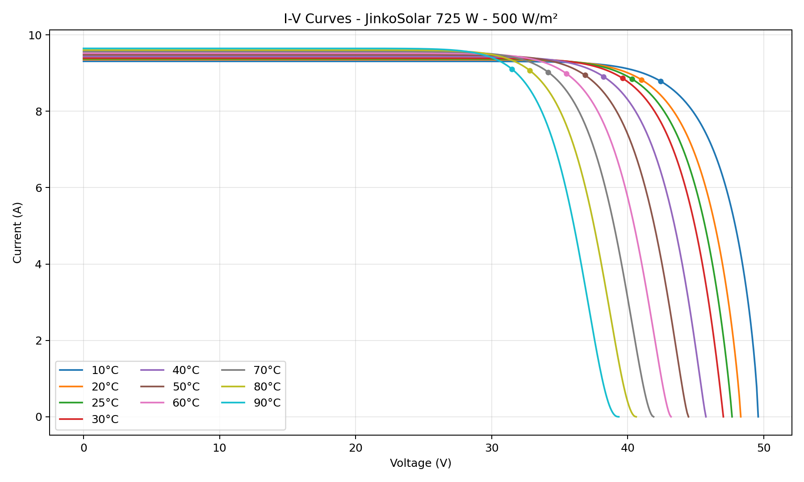
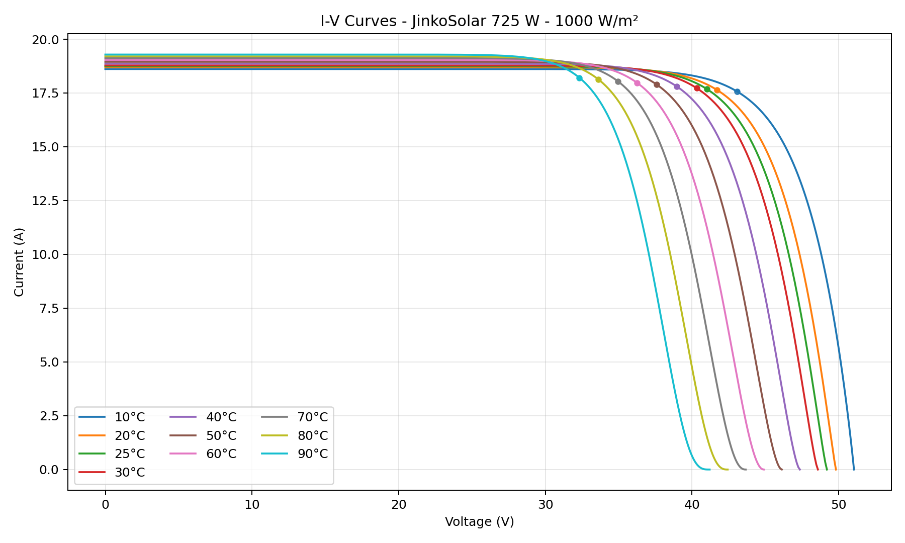
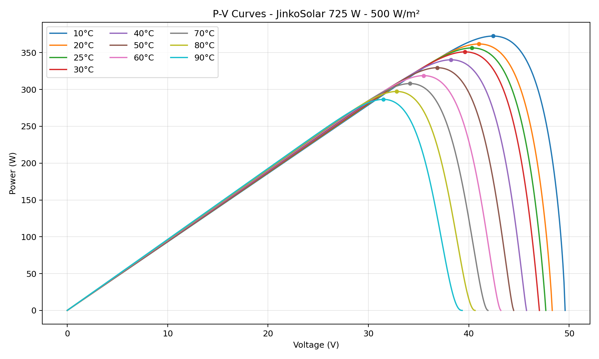
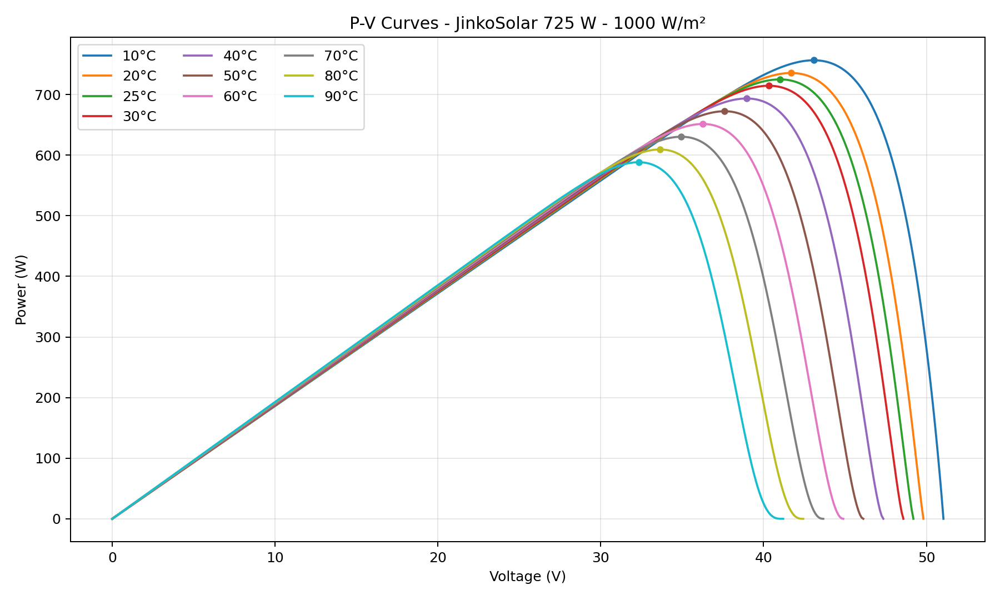
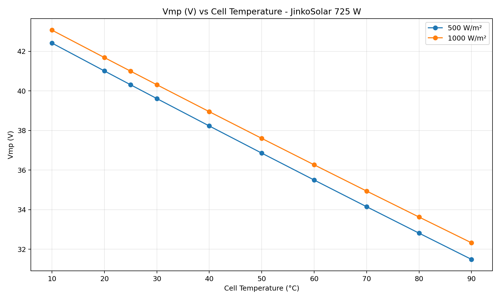
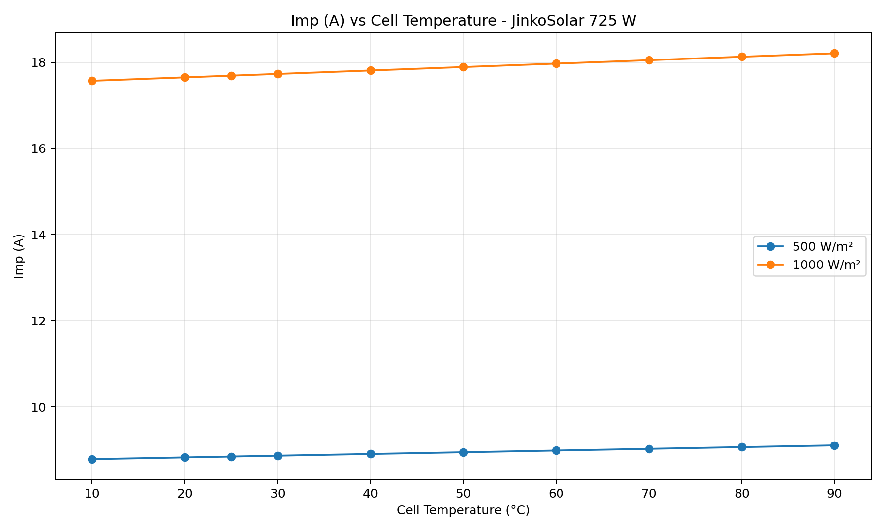
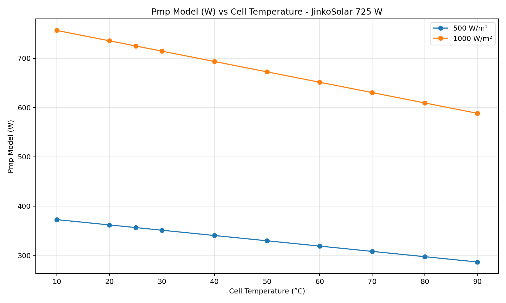
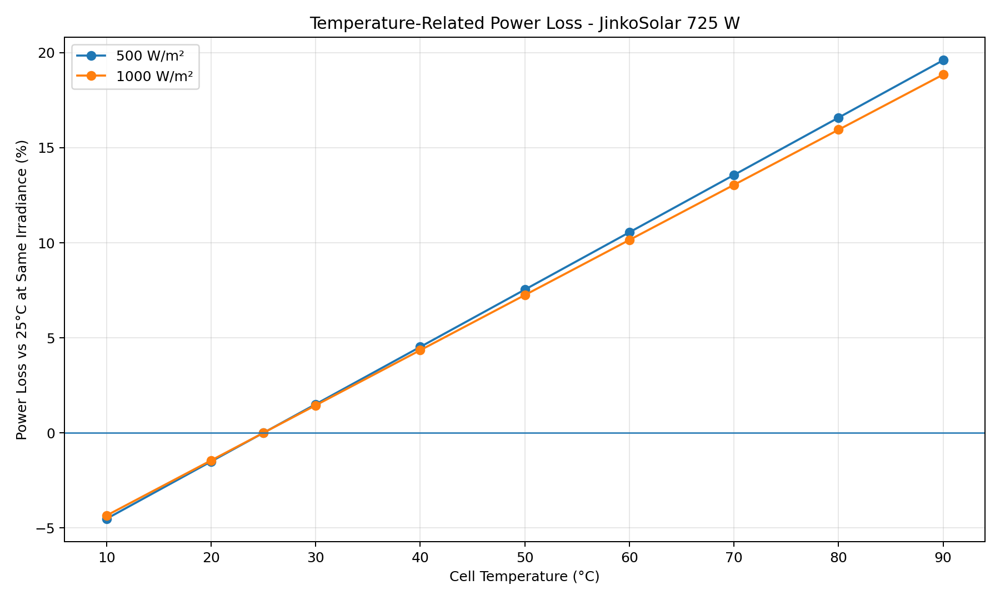

# JinkoSolar 725 W - I-V / P-V Curve Analysis

วิเคราะห์ผลของ **Irradiance** และ **Cell Temperature** ต่อแรงดัน กระแส และกำลัง
ของแผง JinkoSolar รุ่น `JKM725N-66HL5-BDV-Z2C2-OC`

## 1. Datasheet Reference

| Parameter | Value |
|---|---:|
| Pmax | **725 W** |
| Vmp | **41.00 V** |
| Imp | **17.69 A** |
| Voc | **49.20 V** |
| Isc | **18.74 A** |
| Temperature coefficient of Pmax | **-0.29 %/°C** |
| Temperature coefficient of Voc | **-0.25 %/°C** |
| Temperature coefficient of Isc | **+0.045 %/°C** |
| STC | **1000 W/m², Cell Temperature 25°C, AM1.5** |

Source: JinkoSolar datasheet `JKM700-725N-66HL5-BDV-Z2C2-OC`, page 2.

### Correction from the previous version

เวอร์ชันนี้ใช้ **Vmp = 41.00 V จาก datasheet โดยตรง**

ไม่ใช้ค่าที่คำนวณย้อนจาก:

```text
725 / 17.69 = 40.98 V
```

เพราะ datasheet ระบุค่าที่ผ่านการปัดเศษแยกแต่ละ parameter:

```text
41.00 V × 17.69 A = 725.29 W
Nominal Pmax         = 725.00 W
Difference           = 0.29 W (0.040%)
```

ดังนั้น **41.00 V คือค่าอ้างอิงที่ถูกต้องสำหรับ Vmp ใน package นี้**

---

## 2. Conditions

- Irradiance = **500 W/m²** และ **1000 W/m²**
- Cell Temperature = **10, 20, 25, 30, 40, 50, 60, 70, 80, 90°C**
- STC reference = **1000 W/m², 25°C**

> Datasheet ระบุ Operating Temperature = **-40°C ถึง +70°C**  
> ค่า **80°C และ 90°C เป็น engineering extrapolation** เพื่อดูแนวโน้มเท่านั้น

---

## 3. Calculation Model

### Current

```text
Isc(G,T) = Isc_STC × G/1000 × [1 + αIsc(T-25)]

Imp(G,T) = Imp_STC × G/1000 × [1 + αIsc(T-25)]
```

### Voc

```text
Voc(1000,T) = Voc_STC × [1 + βVoc(T-25)]

Voc(G,T)
= Voc(1000,T)
+ n × Ns × kT/q × ln(G/1000)
```

### Vmp

ที่ 1000 W/m² กำหนดให้จุดอ้างอิงผ่าน **Vmp = 41.00 V ที่ 25°C**
และสัมพันธ์กับ `Pmax` และ `Imp`:

```text
Vmp(1000,T)
= 41.00
× [1 + γPmax(T-25)]
/ [1 + αIsc(T-25)]
```

สำหรับ irradiance ต่ำกว่า 1000 W/m² มีการใส่ logarithmic voltage correction
เพื่อประมาณการการเลื่อนของ MPP voltage

```text
Vmp(G,T)
= Vmp(1000,T)
+ K × n × Ns × kT/q × ln(G/1000)
```

โดย package นี้ใช้ `K = 0.45` เป็น simplified engineering approximation

> Datasheet มี I-V/P-V graph ที่หลาย irradiance สำหรับรุ่น 710 W
> แต่ไม่มี numerical curve data สำหรับรุ่น 725 W ที่ 500 W/m²
> ดังนั้นค่าที่ 500 W/m² เป็น **modeled estimate** ไม่ใช่ manufacturer-certified curve data

### Pmp

```text
Pmp ≈ Vmp × Imp
```

โดย normalize ความต่างจากการปัดเศษ `41.00 × 17.69 = 725.29 W`
กลับไปที่ nominal STC = **725 W**

### Power Loss

เทียบกับ 25°C ที่ irradiance เดียวกัน:

```text
Power Loss (%)
= [1 - Pmp(G,T) / Pmp(G,25°C)] × 100
```

เทียบกับ STC 725 W:

```text
Power Loss vs STC (%)
= [1 - Pmp(G,T) / 725] × 100
```

ค่าติดลบหมายถึงกำลังสูงกว่า reference

---

## 4. Sampling Table - 500 W/m²

|   Cell Temperature (degC) |   Voc (V) |   Isc (A) |   Vmp (V) |   Imp (A) |   Pmp model (W) |   Vmp change vs 25C same G (%) |   Imp change vs 25C same G (%) |   Power loss vs 25C same G (%) |   Power loss vs STC 725W (%) |
|--------------------------:|----------:|----------:|----------:|----------:|----------------:|-------------------------------:|-------------------------------:|-------------------------------:|-----------------------------:|
|                        10 |    49.594 |     9.307 |    42.421 |     8.785 |         372.534 |                          5.231 |                         -0.675 |                         -4.521 |                       48.616 |
|                        20 |    48.313 |     9.349 |    41.012 |     8.825 |         361.792 |                          1.736 |                         -0.225 |                         -1.507 |                       50.098 |
|                        25 |    47.672 |     9.37  |    40.312 |     8.845 |         356.421 |                          0     |                          0     |                          0     |                       50.839 |
|                        30 |    47.031 |     9.391 |    39.616 |     8.865 |         351.049 |                         -1.728 |                          0.225 |                          1.507 |                       51.58  |
|                        40 |    45.75  |     9.433 |    38.231 |     8.905 |         340.303 |                         -5.162 |                          0.675 |                          4.522 |                       53.062 |
|                        50 |    44.469 |     9.475 |    36.859 |     8.945 |         329.556 |                         -8.566 |                          1.125 |                          7.537 |                       54.544 |
|                        60 |    43.188 |     9.518 |    35.499 |     8.984 |         318.806 |                        -11.94  |                          1.575 |                         10.553 |                       56.027 |
|                        70 |    41.906 |     9.56  |    34.151 |     9.024 |         308.055 |                        -15.285 |                          2.025 |                         13.57  |                       57.51  |
|                        80 |    40.625 |     9.602 |    32.814 |     9.064 |         297.302 |                        -18.601 |                          2.475 |                         16.587 |                       58.993 |
|                        90 |    39.344 |     9.644 |    31.488 |     9.104 |         286.547 |                        -21.889 |                          2.925 |                         19.604 |                       60.476 |

---

## 5. Sampling Table - 1000 W/m²

|   Cell Temperature (degC) |   Voc (V) |   Isc (A) |   Vmp (V) |   Imp (A) |   Pmp model (W) |   Vmp change vs 25C same G (%) |   Imp change vs 25C same G (%) |   Power loss vs 25C same G (%) |   Power loss vs STC 725W (%) |
|--------------------------:|----------:|----------:|----------:|----------:|----------------:|-------------------------------:|-------------------------------:|-------------------------------:|-----------------------------:|
|                        10 |    51.045 |    18.614 |    43.074 |    17.571 |         756.538 |                          5.059 |                         -0.675 |                          -4.35 |                        -4.35 |
|                        20 |    49.815 |    18.698 |    41.688 |    17.65  |         735.512 |                          1.679 |                         -0.225 |                          -1.45 |                        -1.45 |
|                        25 |    49.2   |    18.74  |    41     |    17.69  |         725     |                          0     |                          0     |                           0    |                         0    |
|                        30 |    48.585 |    18.782 |    40.315 |    17.73  |         714.487 |                         -1.671 |                          0.225 |                           1.45 |                         1.45 |
|                        40 |    47.355 |    18.866 |    38.954 |    17.809 |         693.462 |                         -4.991 |                          0.675 |                           4.35 |                         4.35 |
|                        50 |    46.125 |    18.951 |    37.604 |    17.889 |         672.437 |                         -8.282 |                          1.125 |                           7.25 |                         7.25 |
|                        60 |    44.895 |    19.035 |    36.267 |    17.969 |         651.412 |                        -11.543 |                          1.575 |                          10.15 |                        10.15 |
|                        70 |    43.665 |    19.119 |    34.942 |    18.048 |         630.387 |                        -14.776 |                          2.025 |                          13.05 |                        13.05 |
|                        80 |    42.435 |    19.204 |    33.628 |    18.128 |         609.362 |                        -17.98  |                          2.475 |                          15.95 |                        15.95 |
|                        90 |    41.205 |    19.288 |    32.326 |    18.207 |         588.337 |                        -21.156 |                          2.925 |                          18.85 |                        18.85 |

---

## 6. I-V Curves

### 500 W/m²



### 1000 W/m²



---

## 7. P-V Curves

### 500 W/m²



### 1000 W/m²



---

## 8. Summary Graphs

### Vmp vs Temperature



### Imp vs Temperature



### Pmp vs Temperature



### Power Loss vs Temperature



---

## 9. Engineering Interpretation

### Temperature increases

- `Voc` ลดลง
- `Vmp` ลดลงชัดเจน
- `Isc` และ `Imp` เพิ่มขึ้นเล็กน้อย
- `Pmp` โดยรวมลดลง เพราะผลของแรงดันที่ลดลงมากกว่าการเพิ่มของกระแส

ที่ `1000 W/m²`:

```text
25°C -> Pmp = 725 W
70°C -> temperature-related loss ≈ 13.05%
```

ซึ่งสัมพันธ์โดยตรงกับ:

```text
45°C × 0.29%/°C = 13.05%
```

### Irradiance decreases from 1000 to 500 W/m²

- Current ลดลงประมาณครึ่งหนึ่ง
- Power ลดลงใกล้เคียงครึ่งหนึ่ง
- Voltage ลดลงน้อยกว่ากระแสมาก
- MPP เลื่อนไปทางแรงดันต่ำลงเล็กน้อย

---

## 10. Limitations

กราฟนี้เป็น **simplified engineering reconstruction** จากค่าบน datasheet

เหมาะสำหรับ:

- Technical explanation
- Preliminary engineering comparison
- GitHub documentation
- Temperature / irradiance trend analysis

ไม่ควรใช้แทน:

- Manufacturer PAN file
- PVsyst validated component model
- Flash-test data
- Manufacturer-certified I-V curve data

---

## 11. Package Structure

```text
jinko_725w_markdown_package_v2/
├── README.md
├── CHANGELOG.md
├── assets/
│   ├── iv_curves_500wm2.png
│   ├── iv_curves_1000wm2.png
│   ├── pv_curves_500wm2.png
│   ├── pv_curves_1000wm2.png
│   ├── vmp_vs_temperature.png
│   ├── imp_vs_temperature.png
│   ├── pmp_vs_temperature.png
│   └── power_loss_vs_temperature.png
└── data/
    ├── summary_table.csv
    └── curve_samples.csv
```
