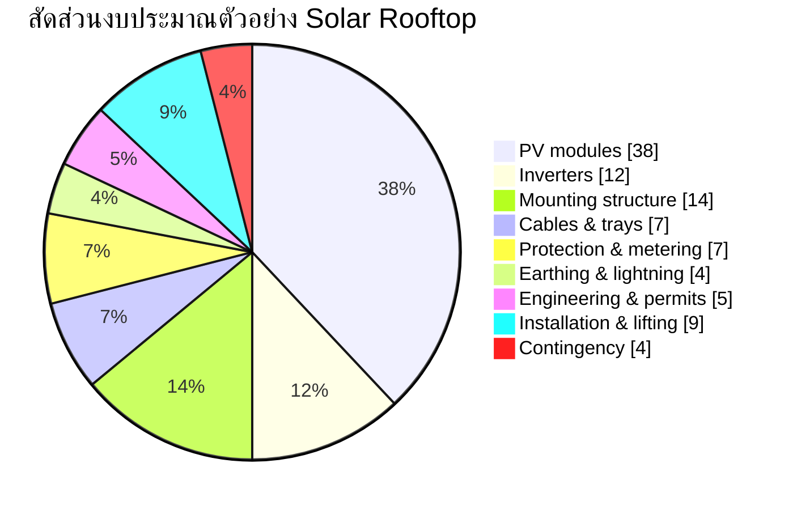

# รายงานวิเคราะห์เบื้องต้นโครงการ Solar Rooftop ในประเทศไทย

## บทสรุปผู้บริหาร

ตามเอกสารสรุปความต้องการที่แนบมา โจทย์นี้ต้องการรายงาน Deep Research สำหรับโครงการ Solar Rooftop ในประเทศไทยที่ครอบคลุมตั้งแต่การสำรวจหน้างาน การออกแบบทางวิศวกรรม การประเมินความคุ้มค่า การจัดทำ Proposal เพื่อผู้บริหาร ไปจนถึงการขออนุมัติงบประมาณและการเชื่อมต่อกับการไฟฟ้า แต่ข้อมูลโครงการจริงยังเว้นว่างอยู่หลายหัวข้อสำคัญ เช่น จังหวัด/พิกัด ประเภทอาคาร ขนาดหม้อแปลง โหลดไฟฟ้าราย 15 นาทีหรือรายชั่วโมง แบบโครงสร้างหลังคา SLD เดิม และงบประมาณจริง ดังนั้นรายงานฉบับนี้จึงเป็น **Preliminary Assessment** ที่ใช้ได้สำหรับตั้งต้นโครงการและขอข้อมูลเพื่อทำการออกแบบจริงในรอบถัดไป โดยระบุสมมติฐานให้ชัดเจนทุกจุด fileciteturn0file0

ในเชิงวิธีทำงาน ข้อเสนอที่เหมาะสมที่สุดในตอนนี้ไม่ใช่ “สรุปขนาดระบบตายตัวทันที” แต่เป็นการตั้ง **Decision Gate แบบ Proceed with Conditions** กล่าวคือ โครงการ Solar Rooftop มีแนวโน้มคุ้มค่าและทำได้ หากอาคารมีหลังคารับน้ำหนักได้ ระบบไฟฟ้าเดิมรองรับการต่อขนาน และโหลดกลางวันมีขนาดมากพอให้กินไฟเองได้สูง โดยเฉพาะในอัตรา TOU ที่ช่วง Peak อยู่ในเวลากลางวัน ซึ่งทำให้มูลค่าการลดค่าไฟของไฟฟ้าโซลาร์สูงขึ้นสำหรับลูกค้าธุรกิจจำนวนมากในพื้นที่ PEA citeturn14view1turn12view0

สำหรับการเชื่อมต่อระบบในพื้นที่ของการไฟฟ้าส่วนภูมิภาค PEA มีช่องทางอย่างเป็นทางการผ่านระบบ PPIM สำหรับอย่างน้อยสามเส้นทางที่เกี่ยวข้องกับงานนี้ ได้แก่ การตรวจสอบจุดเชื่อมโยง การขอเชื่อมต่อกรณีติดตั้งใช้เองไม่ขายไฟ และโครงการ Solar Rooftop ที่ขายไฟฟ้าส่วนที่เหลือให้ PEA โดยหน้า PPIM ยังเชื่อมไปยังหน้าจดแจ้ง/ยกเว้นของ กกพ. ด้วย จึงควรถือว่าเรื่อง interconnection, metering, protection, anti-islanding, และสถานะใบอนุญาต/ยกเว้น เป็นประเด็นต้นน้ำที่ต้องเคลียร์ตั้งแต่ก่อนออกแบบละเอียด citeturn11view0turn45view1

ในเชิงเทคนิค ซอฟต์แวร์ PVsyst 8.1 รองรับการออกแบบและจำลองแบบรายชั่วโมงหรือย่อยกว่านั้น พร้อมโหลดโปรไฟล์ การจำกัดกำลังส่งเข้ากริด การรวมหม้อแปลง และการวิเคราะห์ loss diagram อย่างเป็นระบบ ขณะที่ IEA PVPS Task 13 เน้นชัดว่าโครงการ PV ที่ให้ผลทั้งทางเทคนิคและเศรษฐศาสตร์ดีในระยะยาวต้องอาศัย quality management ตั้งแต่ช่วงต้นโครงการ ร่วมกับ monitoring และการวิเคราะห์ข้อมูลเพื่อ O&M เชิงคาดการณ์ ไม่ใช่ดูเฉพาะราคาต่อวัตต์ตอนจัดซื้อเท่านั้น citeturn37view0turn37view1turn36view0turn36view1

เพื่อให้ผู้บริหารเห็นภาพ รายงานนี้จึงสรุป “ตัวอย่างฐานคำนวณ” สำหรับโครงการเชิงพาณิชย์/อุตสาหกรรมในไทยภายใต้สมมติฐานอนุรักษ์นิยม โดยยัง **ไม่ใช่ผล final design** ตัวอย่างนี้ใช้สมมติฐานอาคารโหลดกลางวันสูง ระบบ 3 เฟส หลังคาใช้การได้ประมาณ 5,000 ตารางเมตร ค่าไฟหลีกเลี่ยงเฉลี่ย 4.20 บาท/กิโลวัตต์ชั่วโมง CAPEX สมมติ 25 บาท/Wp อายุโครงการ 25 ปี degradation 0.5%/ปี และ inverter replacement ปีที่ 13 ทั้งหมดนี้เป็น “สมมติฐานผู้วิเคราะห์” ที่ต้องแทนด้วยข้อมูลจริงจากบิล/โหลด/ใบเสนอราคาในรอบถัดไป

| ทางเลือก | แนวคิด | ขนาดโดยประมาณ | ผลิตไฟฟ้าปีแรก | Self-consumption | CAPEX สมมติ | Payback อย่างง่าย | NPV 25 ปี | IRR |
|---|---:|---:|---:|---:|---:|---:|---:|---:|
| A | เน้นกินไฟเองสูงสุด | 350 kWp / 300 kWac | 0.51 GWh/ปี | 98% | 8.75 ลบ. | 4.3 ปี | 11.6 ลบ. | 22.3% |
| B | ใช้พื้นที่หลังคาสูงสุด | 700 kWp / 600 kWac | 1.02 GWh/ปี | 75% | 17.5 ลบ. | 5.7 ปี | 13.1 ลบ. | 16.4% |
| C | จุดคุ้มค่าทางเศรษฐกิจ | 500 kWp / 400 kWac | 0.73 GWh/ปี | 90% | 12.5 ลบ. | 4.7 ปี | 14.1 ลบ. | 20.2% |

หมายเหตุ: ตารางนี้เป็น **ตัวอย่างเชิงแบบจำลอง** เพื่อใช้คุยกับผู้บริหารเมื่อยังไม่มีข้อมูลจริงครบ ไม่ใช่ข้อเสนอราคาหรือการรับประกันผลผลิตจริง ตัวเลขใช้วิธีคิดตามกรอบ PVsyst/NPV/LCOE มาตรฐานงาน PV และสมมติฐานทางธุรกิจที่ต้องยืนยันอีกครั้งด้วยบิลไฟฟ้า โหลดโปรไฟล์ และใบเสนอราคาจริง citeturn37view0turn37view1turn34view1

ข้อเสนอเพื่อขออนุมัติในรอบนี้จึงควรเป็นการขออนุมัติ **งบศึกษาและออกแบบละเอียด** มากกว่างบ EPC เต็มจำนวน โดยให้อนุมัติ 3 เรื่องพร้อมกัน คือ การเก็บข้อมูลโหลดไฟและเอกสารระบบเดิม การสำรวจโครงสร้าง/หลังคา/ไฟฟ้า และการทำ preliminary interconnection check กับการไฟฟ้า หากขั้นตอนนี้ผ่าน จึงค่อยสรุปขนาดระบบ ข้อกำหนดอุปกรณ์ และงบลงทุนที่เชื่อถือได้ในระดับ Preliminary หรือ Detailed estimate ต่อไป citeturn11view0turn45view2turn46view1turn36view0

## กรอบโครงการ ข้อมูลตั้งต้น และข้อมูลที่ยังขาด

เอกสาร brief ระบุขอบเขตที่ต้องการไว้อย่างละเอียดมาก ทั้งในด้านวิศวกรรม โครงสร้าง ระบบไฟฟ้า ความปลอดภัย การเงิน ใบอนุญาต มาตรฐาน และเอกสารสำหรับเสนอผู้บริหาร แต่ยังไม่ได้ให้ข้อมูลโครงการจริงที่จำเป็นต่อการตัดสินใจ เช่น ชื่อโครงการ สถานที่ ประเภทมิเตอร์/การไฟฟ้า ประเภทโหลด พื้นที่หลังคาใช้การได้จริง ข้อจำกัดการหยุดจ่ายไฟ และข้อมูล BESS ดังนั้นขั้นตอนแรกของผู้ว่าจ้างควรเป็นการ “แปลง TOR ให้เป็น Data Package” ก่อน fileciteturn0file0

### ข้อมูลที่ทราบแล้วและยังไม่ทราบ

| หมวด | สถานะ | สิ่งที่ทราบ | สิ่งที่ยังไม่ทราบ |
|---|---|---|---|
| วัตถุประสงค์ | ทราบ | ต้องการประเมินเทคนิค การเงิน ใบอนุญาต Proposal และงบลงทุน fileciteturn0file0 | เกณฑ์ Go/No-Go ที่ผู้บริหารใช้จริง เช่น payback target หรือ IRR hurdle rate |
| รูปแบบโครงการ | ยังไม่ชัด | พิจารณาได้ทั้ง self-consumption, ขายไฟ, PPA, CAPEX, ESCO fileciteturn0file0 | ต้องการโมเดลใดเป็นหลัก |
| พื้นที่ติดตั้ง | ยังไม่ชัด | เป็น Solar Rooftop ในประเทศไทย fileciteturn0file0 | จังหวัด พิกัด ระดับความสูง สิ่งกีดขวาง สภาพแวดล้อม |
| ไฟฟ้าเดิม | ยังไม่ชัด | ต้องตรวจหม้อแปลง MDB SLD protection earthing ฯลฯ fileciteturn0file0 | แรงดัน ระบบสาย ขนาดหม้อแปลง fault level จุดเชื่อมต่อจริง |
| โหลดไฟฟ้า | ยังไม่ชัด | ต้องมีบิล 12–24 เดือน และโหลด 15 นาที/รายชั่วโมง fileciteturn0file0 | load shape กลางวัน/กลางคืน, demand pattern, วันหยุด |
| โครงสร้าง | ยังไม่ชัด | ต้องตรวจแบบโครงสร้าง อายุหลังคา น้ำรั่ว กัดกร่อน แรงลม ฯลฯ fileciteturn0file0 | รับน้ำหนักได้เท่าไร ต้องเสริมหรือไม่ |
| ใบอนุญาต | ยังไม่ชัด | ต้องทำ permit matrix และตรวจ กฟน./กฟภ./กกพ./อาคาร/โรงงาน/อัคคีภัย fileciteturn0file0 | เคสนี้เข้าข้อยกเว้นหรือไม่ ต้องขออะไรบ้าง |

### คำถามกลับไม่เกิน 15 ข้อ

| ลำดับ | คำถามที่ต้องถามเจ้าของพื้นที่ | เหตุผล |
|---|---|---|
| 1 | โครงการอยู่ในพื้นที่ MEA หรือ PEA | กำหนดชุดเอกสารเชื่อมต่อ ระบบยื่นคำขอ และข้อกำหนด interconnection |
| 2 | ประเภทอาคารคืออะไร | กระทบ load profile, ข้อกฎหมาย, ความปลอดภัย, วิธีติดตั้ง |
| 3 | มีบิลค่าไฟย้อนหลัง 12–24 เดือนหรือไม่ | ใช้หา base tariff, usage, demand, seasonality |
| 4 | มีข้อมูลโหลด 15 นาทีหรือรายชั่วโมงหรือไม่ | ใช้คำนวณ self-consumption, export, demand shaving |
| 5 | ขนาดหม้อแปลงและ SLD ปัจจุบันเป็นอย่างไร | ใช้ตรวจความสามารถในการเชื่อมต่อและ protection |
| 6 | พื้นที่หลังคาใช้การได้จริงกี่ตารางเมตร | ใช้แปลงเป็นขนาดติดตั้งได้จริง |
| 7 | หลังคามีอายุกี่ปี และมีประวัติรั่ว/ซ่อมหรือไม่ | ถ้าหลังคาใกล้หมดอายุไม่ควรติดตั้งก่อนซ่อมใหญ่ |
| 8 | มีแบบโครงสร้างและ structural calculation เดิมหรือไม่ | ใช้ตัดสินว่าต้องทำ reinforcement study หรือไม่ |
| 9 | อาคารหยุดงานได้หรือไม่ และช่วง shutdown คือเมื่อใด | ส่งผลต่อแผนก่อสร้างและ tie-in |
| 10 | มี generator/ATS/BESS เดิมอยู่แล้วหรือไม่ | กระทบ protection, EMS, anti-islanding |
| 11 | ต้องการ zero export หรือยอมส่งส่วนเกินได้ | กระทบขนาดระบบและอุปกรณ์ควบคุม |
| 12 | ถ้าต้องขายไฟ ต้องการขายภายใต้โครงการใด | กระทบโครงสร้างรายได้และเอกสารสัญญา |
| 13 | พื้นที่เป็น hazardous area หรือไม่ เช่น สถานีบริการน้ำมัน | ต้องทำ area classification และข้อกำหนดอุปกรณ์เพิ่ม |
| 14 | ผู้บริหารต้องการ payback/IRR ขั้นต่ำเท่าไร | ใช้คัดเลือกทางเลือก A/B/C |
| 15 | ต้องการรวม BESS หรือไม่ และเพื่ออะไร | peak shaving, backup, zero export smoothing, tariff arbitrage |

## ฐานความรู้ หลักคิดสำคัญ และข้อกำหนดภายนอก

ในทางปฏิบัติ โครงการ Solar Rooftop สำหรับอาคารเชิงพาณิชย์/อุตสาหกรรมไม่ใช่แค่ “เอาพื้นที่หลังคาคูณจำนวนแผง” แต่ต้องทำงานร่วมกัน 5 ระบบพร้อมกัน คือ โหลดไฟฟ้าเดิม โครงสร้างหลังคา ระบบไฟ AC/DC ระบบความปลอดภัย และกรอบการเชื่อมต่อ/ใบอนุญาต หากขาดข้อมูลด้านใดด้านหนึ่ง ผลลัพธ์ทางการเงินจะคลาดเคลื่อนทันที แม้ระบบจะดูคุ้มในระดับพลังงานก็ตาม citeturn36view0turn36view1turn37view0turn37view1

คำศัพท์สำคัญที่ต้องใช้ในรายงานผู้บริหารมีดังนี้  
**Self-consumption ratio** คือ สัดส่วนพลังงานโซลาร์ที่ถูกใช้ภายในไซต์เอง  
**Self-sufficiency ratio** คือ สัดส่วนความต้องการไฟฟ้าของไซต์ที่ถูกโซลาร์ครอบคลุม  
**Specific yield** คือ kWh/kWp/ปี ซึ่งช่วยเทียบประสิทธิภาพโครงการต่างพื้นที่/ต่างขนาด  
**Performance Ratio** เป็นตัวชี้วัดคุณภาพเชิงเทคนิคหลังหักผลของอากาศและ loss ต่าง ๆ  
**Zero export** คือการควบคุมไม่ให้มีการส่งไฟย้อนเข้าสู่โครงข่าย  
**Curtailment** คือการลดกำลังผลิตลงเพราะข้อจำกัดของโหลดหรือกริด  
คำเหล่านี้เป็นแกนกลางของทั้ง PVsyst และการวิเคราะห์เศรษฐศาสตร์โครงการ PV สมัยใหม่ citeturn37view0turn37view1

ในมุมสภาพแวดล้อมข้อมูลแสงอาทิตย์ของไทย งานวิจัยปี 2024 ที่พัฒนาแผนที่รังสีอาทิตย์ของประเทศไทยจากภาพดาวเทียม Himawari-8 และข้อมูลภาคพื้นดินจาก 53 สถานีในช่วง 2022–2023 รายงานว่าระบบประมาณค่า GHI ที่ดีที่สุดในงานนั้นให้ MAE ราว 78.58 W/m² และ RMSE ราว 118.97 W/m² ซึ่งดีพอสำหรับงาน pre-feasibility และ spatial screening แต่ยังไม่ใช่เหตุผลให้ละเลยการใช้ข้อมูล Meteo ที่เหมาะกับจุดติดตั้งจริงและการตรวจสอบผลกับรูปแบบการใช้ไฟในไซต์จริง citeturn32academia3

ในมุมคุณภาพโครงการ IEA PVPS Task 13 ปี 2026 ชี้ชัดว่า “การจัดการคุณภาพเชิงรุกตั้งแต่ต้นน้ำ” ช่วยลดความเสียหายปลายน้ำได้มากกว่าต้นทุนที่ต้องเพิ่มในช่วงพัฒนาโครงการ และการลงทุนใน monitoring/analytics ช่วยให้ predictive maintenance และ fault diagnosis มีประสิทธิภาพยิ่งขึ้น ข้อสรุปนี้สอดคล้องกับวิธีบริหารสินทรัพย์พลังงานยุคใหม่ ไม่ว่าจะเป็นโครงการขนาดใหญ่หรือ rooftop เชิงพาณิชย์ก็ตาม citeturn36view0turn36view1

ด้านค่าไฟ PEA ระบุบนหน้าอัตราค่าไฟว่าอัตรา TOU มีประกาศอัปเดตล่าสุด 23 มิถุนายน 2569 และในเอกสารประเภท TOU ระบุช่วง **Peak = 09:00–22:00 น. วันจันทร์–ศุกร์** และ **Off-Peak = 22:00–09:00 น. วันจันทร์–ศุกร์ รวมถึงวันเสาร์ อาทิตย์ และวันหยุดราชการทั้งวัน** ข้อมูลนี้สำคัญมาก เพราะ rooftop ที่ผลิตช่วงกลางวันย่อมมีแนวโน้มให้มูลค่าประหยัดสูงสุดกับลูกค้าที่มีโหลดกลางวันในช่วง Peak สูง เช่น โรงงาน สำนักงาน ห้าง และคลังสินค้าที่ทำงานต่อเนื่องกลางวัน citeturn12view0turn14view1

ในด้านการเชื่อมต่อ PEA แยกช่องทางอย่างเป็นทางการชัดเจนระหว่างหน้า “ประกาศและข้อกำหนดเกี่ยวกับการเชื่อมต่อระบบโครงข่ายไฟฟ้า” หน้า “ตรวจสอบจุดเชื่อมโยง” และหน้า “ขอเชื่อมต่อระบบผลิตไฟฟ้า” สำหรับกรณีติดตั้งใช้เองไม่ขายไฟ ขณะเดียวกัน PPIM ยังแสดงว่ามีโครงการ Solar Rooftop พ.ศ. 2569 สำหรับกรณีขายไฟฟ้าส่วนที่เหลือให้ PEA อีกเส้นทางหนึ่ง แปลว่าโมเดลธุรกิจ self-use กับ self-use+ขายส่วนเกิน ไม่ควรถูกรวมเป็นเคสเดียวตั้งแต่ต้น citeturn10view0turn11view0turn45view0turn45view1

### เอกสารข้อกำหนดที่ต้องตรวจในทางปฏิบัติ

| เอกสาร/มาตรฐาน/ข้อกำหนด | เจ้าของเอกสาร | สถานะการใช้งานในโครงการ | Edition ล่าสุดที่ตรวจยืนยันได้ | หมายเหตุ |
|---|---|---|---|---|
| ข้อกำหนดการเชื่อมต่อระบบโครงข่ายไฟฟ้า PEA | PEA | **ต้องปฏิบัติ** เมื่ออยู่ในพื้นที่ PEA | หน้าใช้งานปัจจุบัน ณ 15 ก.ค. 2569 citeturn10view0turn11view2 | ต้องแตกเป็น requirement list ราย protection/metering ก่อนออกแบบละเอียด |
| ระบบ PPIM: ตรวจสอบจุดเชื่อมโยง / ขอเชื่อมต่อ / Solar Rooftop | PEA | **ต้องปฏิบัติ** ตามกรณี | หน้าใช้งานปัจจุบัน ณ 15 ก.ค. 2569 citeturn11view0turn45view0turn45view1 | ใช้กำหนด workflow ยื่นคำขอจริง |
| อัตราค่าไฟฟ้า TOU / Ft / FiTv | PEA และ กกพ. | **ต้องใช้เป็นฐานการเงิน** | TOU page update 23 มิ.ย. 2569; Ft page และ FiTv 2569 แสดงบนหน้า tariff citeturn12view0turn13view1 | ค่า tariff ต้องแทนด้วยบิลจริงของไซต์ |
| PEA Product Acceptance / Smart Grid & Renewable equipment registry | PEA | **ต้องตรวจ** ก่อนล็อกสเปกอุปกรณ์ | หน้า Product Acceptance ปัจจุบัน; smartlist ถูกบล็อกใน session อัตโนมัติ citeturn46view1turn46view0 | inverter/relay/metering ต้องยืนยันรายการยอมรับจริงก่อนจัดซื้อ |
| PVsyst 8.1 documentation | PVsyst | **แนวทางแนะนำหลัก** | PVsyst 8.1 citeturn37view0 | ใช้เป็นฐาน simulation และ loss breakdown |
| IEA PVPS Task 13 | IEA PVPS | **แนวทางแนะนำหลัก** | รายงาน มิถุนายน 2026 citeturn36view0 | ใช้กำหนด quality gates, monitoring, O&M, risk approach |
| รายการ IEC/NEC/ไทยที่ผู้ว่าจ้างกำหนดให้ตรวจ เช่น IEC 60364-7-712, IEC 62548, IEC 62446-1, IEC 61730, IEC 61215, IEC 62109, IEC 62116, IEC 61000, IEC 61643-31, IEC 62305, IEC 62930, IEC 62933, IEC 62619, IEC 63056, NEC 690/705/706 | IEC / NFPA / ไทย | **ต้องตรวจยืนยันรายมาตรฐานก่อน IFC และ procurement** | **ยังไม่ยืนยัน Edition รายฉบับในรอบนี้** | รายการนี้มาจาก brief ของผู้ว่าจ้างและควรทำ standards register แยกพร้อม URL ต้นฉบับในรอบถัดไป fileciteturn0file0 |

### การแยกชั้นของข้อกำหนด

| ชั้นของข้อกำหนด | ความหมายทางปฏิบัติ | ตัวอย่างในโครงการนี้ |
|---|---|---|
| ข้อบังคับตามกฎหมาย/การอนุญาต | ถ้าไม่ผ่านจะเชื่อมต่อหรือเดินโครงการไม่ได้ | การยื่นคำขอ PEA/MEA, ขั้นตอน กกพ., การอนุญาตดัดแปลงอาคาร/โรงงาน/อัคคีภัย ตามกรณี citeturn11view0turn45view1 |
| มาตรฐานที่ต้องปฏิบัติในงานออกแบบ/ทดสอบ | ใช้เป็น design basis และ commissioning basis | utility interconnection requirements, protection, metering, product acceptance, commissioning documents citeturn10view0turn46view1 |
| แนวทางแนะนำเชิงวิศวกรรม | ช่วยให้ผลโครงการดีและลดความเสี่ยง | PVsyst simulation method, IEA PVPS quality framework, data-driven O&M, loss analysis citeturn37view0turn37view1turn36view0turn36view1 |

## วิธีสำรวจหน้างานและแนวทางออกแบบ

การสำรวจที่ดีควรถูกมองเป็น “การปิดความไม่แน่นอน” มากกว่าการ “ถ่ายรูปหลังคาแล้วกลับมาออกแบบ” เพราะข้อผิดพลาดที่แพงที่สุดมักไม่ใช่ราคาแผงหรือ inverter แต่เป็นเรื่องโครงสร้าง น้ำรั่ว เมนบอร์ดเดิมไม่รองรับ การประสาน protection ไม่ผ่าน การหยุดงานของไซต์ และข้อจำกัดเรื่องการเข้าพื้นที่ระหว่างดำเนินธุรกิจจริง citeturn36view0turn36view1

### Checklist เตรียมข้อมูลก่อนสำรวจ

| ลำดับ | รายการ | รายละเอียดที่ต้องตรวจ | เอกสาร/หลักฐาน | ผู้รับผิดชอบ |
|---|---|---|---|---|
| 1 | บิลค่าไฟ | ย้อนหลัง 12–24 เดือน, tariff type, demand, Ft | ใบแจ้งค่าไฟ | เจ้าของพื้นที่ |
| 2 | โหลดไฟฟ้า | 15 นาทีหรือรายชั่วโมงอย่างน้อย 3–12 เดือน | CSV / BMS / meter export | วิศวกรไฟฟ้า/เจ้าของพื้นที่ |
| 3 | หม้อแปลง/เมน | kVA, แรงดัน, breaker, busbar, protection | SLD, nameplate, test report | วิศวกรไฟฟ้า |
| 4 | SLD เดิม | จุดเชื่อมต่อที่เป็นไปได้, meter, CT/VT | As-built drawing | วิศวกรไฟฟ้า |
| 5 | แบบหลังคา/โครงสร้าง | member size, span, support, load limit | structural drawings | วิศวกรโครงสร้าง |
| 6 | อายุหลังคา | สภาพรั่ว กัดกร่อน อายุคงเหลือ | maintenance record | เจ้าของอาคาร |
| 7 | พื้นที่ใช้งานจริง | พื้นที่ติดตั้ง, ทางเดิน, setback, obstruction | roof plan / drone / survey | ทีมสำรวจ |
| 8 | ข้อจำกัดการทำงาน | shutdown window, work permit, safety rule | site rule / HSE manual | Project manager / HSE |
| 9 | แผนขยายโหลดอนาคต | เพิ่มเครื่องจักร/EV/BESS/สายการผลิตหรือไม่ | CAPEX plan ภายใน | ผู้บริหารไซต์ |
| 10 | รูปแบบธุรกิจ | CAPEX / PPA / Lease / ESCO / ขายไฟ | policy/board direction | ผู้บริหารการเงิน |

ตารางนี้สอดคล้องกับรายการใน brief ที่ระบุว่าต้องตรวจบิลค่าไฟ โหลดราย 15 นาที หม้อแปลง MDB SLD แบบหลังคา ข้อจำกัดการเข้าพื้นที่ และผู้มีอำนาจอนุมัติ ก่อนทำการออกแบบจริง fileciteturn0file0

### แบบฟอร์มสำรวจหน้างานฉบับย่อ

| หมวด | ประเด็นสำคัญที่ต้องเก็บ | เหตุผล |
|---|---|---|
| ข้อมูลสถานที่ | GPS, ทิศอาคาร, ระดับความสูง, น้ำท่วม, ฟ้าผ่า, การเข้าถึง, พื้นที่ inverter/MDB/BESS | ใช้ตั้ง meteo, logistics, safety, lightning strategy |
| หลังคา | ประเภทหลังคา, slope, orientation, obstruction, skylight, shadow, corrosion, leakage, walkway | ใช้วาง layout และประเมิน roof usable area |
| โครงสร้าง | member size/spacing, dead/live load, uplift, vibration, need reinforcement | ใช้ตัดสินว่าติดตั้งได้หรือไม่ และต้องเสริมหรือไม่ |
| ระบบ AC | แรงดัน, เฟส, transformer, MDB, breaker rating, short-circuit rating, PF, harmonics, earthing, SPD | ใช้วาง interconnection และ protection |
| ระบบ DC | string count, cable routing, DC isolator/fuse/SPD, UV protection, loop minimization, voltage drop | ใช้ลดความเสี่ยงทางไฟฟ้าและไฟไหม้ |
| ความปลอดภัย | work at height, safety line, emergency access, signage, isolation, fire response, hazardous area | ใช้ทำ HSE plan และ permit-to-work |

### แผนการทำงานตั้งแต่สำรวจถึง COD

```mermaid
flowchart LR
A[รวบรวมบิลไฟ โหลดโปรไฟล์ แบบอาคาร SLD] --> B[สำรวจหน้างานและตรวจสภาพหลังคา/ไฟฟ้า]
B --> C[Preliminary design และทางเลือก A B C]
C --> D[ตรวจจุดเชื่อมต่อกับการไฟฟ้า]
D --> E[ออกแบบละเอียดและคำนวณโครงสร้าง/ป้องกัน]
E --> F[ขออนุมัติงบประมาณ]
F --> G[ยื่นขออนุญาตและเอกสารต่อการไฟฟ้า/หน่วยงาน]
G --> H[จัดซื้อและก่อสร้าง]
H --> I[Testing & Commissioning]
I --> J[ขอเชื่อมต่อและ COD]
J --> K[O&M และ performance monitoring]
```

เส้นทางนี้สอดคล้องกับสิ่งที่ PPIM ของ PEA แยกออกเป็นขั้นตรวจสอบจุดเชื่อมโยง ขั้นโครงการ rooftop และขั้นคำขอเชื่อมต่อจริง จึงไม่ควรกระโดดจาก site survey ไป采购อุปกรณ์ทันทีโดยไม่เคลียร์ interconnection pathway ก่อน citeturn11view0turn45view2turn45view1

### Design basis เบื้องต้นที่แนะนำ

| ตัวแปรออกแบบ | แนวทางแนะนำเบื้องต้น | ที่มาหรือเหตุผล |
|---|---|---|
| เป้าหมายหลัก | ลดค่าไฟจากการกินไฟเองก่อน | ช่วง Peak ของ TOU อยู่กลางวัน จึงทำให้ self-consumption มีมูลค่าสูง citeturn14view1 |
| รูปแบบระบบ | Grid-connected rooftop, พิจารณา zero export ถ้า utility/โหลดกำหนด | สอดคล้องกับเส้นทาง self-use ของ PEA citeturn45view1 |
| ขนาดระบบเริ่มต้น | ใช้โหลดกลางวันและหลังคา usable area เป็นตัวกำหนดพร้อมกัน | ลดความเสี่ยง export สูงเกินจำเป็น |
| DC/AC ratio | เริ่มพิจารณาแถว 1.15–1.30 เป็นช่วงศึกษา | เป็นช่วงใช้งานแพร่หลายในงาน PV และสอดคล้องกับ logic ของ PVsyst/NREL สำหรับ commercial systems citeturn34view1turn37view0 |
| Loss budget | กำหนด soiling, thermal, mismatch, wiring, transformer, unavailability แยกรายการชัดเจน | PVsyst ระบุให้ตั้งค่าการสูญเสียแต่ละตัวแยกกันและแสดงผลใน loss diagram citeturn37view1 |
| Monitoring | ต้องมี data logger/portal + alarm + monthly KPI review | IEA PVPS เน้น data-driven O&M และ predictive maintenance citeturn36view0turn36view1 |
| อุปกรณ์ | ต้องยืนยันกับ Product Acceptance / smartlist ก่อนซื้อ | PEA แยกหน้า product acceptance และ registries ไว้เป็นทางการ citeturn46view1turn46view0 |

## แบบจำลองพลังงาน การเงิน และทางเลือกโครงการ

### วิธีจำลองที่ควรใช้

PVsyst 8.1 รองรับการศึกษาแบบ preliminary design ที่ใช้ข้อมูลพื้นที่และพารามิเตอร์ไม่มาก และรองรับ project design แบบจริงที่จำลองรายชั่วโมง/รายย่อย พร้อมกำหนด orientation, component selection, thermal behavior, wiring, mismatch, horizon shading, partial shading, load profile, grid limitation และ transformer losses ได้ครบ ซึ่งเหมาะตรงกับโจทย์ Solar Rooftop C&I ในไทยอย่างมาก citeturn37view0turn37view1

สำหรับรายงานรอบแรก ควรใช้ลำดับดังนี้  
เริ่มจาก 1) วิเคราะห์บิลและโหลด 2) กำหนดตัวเลือกหลังคา/ทิศ/มุมเอียง 3) ตั้ง loss assumptions อย่างโปร่งใส 4) ตรวจผล specific yield กับฐานข้อมูลรังสีอาทิตย์ของไทย/พื้นที่ใกล้เคียง 5) รัน self-consumption model และ 6) จึงทำ NPV/IRR/LCOE ไม่ควรเริ่มจาก “ตั้งขนาดระบบก่อน” แล้วค่อยหาวิธีทำให้ตัวเลขคุ้ม เพราะจะทำให้ผู้บริหารเห็นผลลวงว่าหลังคาใหญ่ = คุ้มกว่าเสมอ ซึ่งไม่จริงเมื่อ export value ต่ำหรือ zero export ถูกบังคับใช้ citeturn32academia3turn37view0turn37view1turn36view0

### สมมติฐานตัวอย่างสำหรับ Preliminary Assessment

| ตัวแปร | ค่า | หน่วย | แหล่งที่มา/สถานะ | หมายเหตุ |
|---|---:|---:|---|---|
| ที่ตั้ง | ไทย พื้นที่ C&I ตัวอย่าง | - | สมมติฐานผู้วิเคราะห์ | ต้องแทนด้วยจังหวัด/พิกัดจริง |
| พื้นที่หลังคา usable | 5,000 | ตร.ม. | สมมติฐานผู้วิเคราะห์ | หลังหัก setback/ทางเดินบางส่วน |
| ค่าไฟหลีกเลี่ยงเฉลี่ย | 4.20 | บาท/kWh | สมมติฐานผู้วิเคราะห์ | ต้องแทนด้วยบิลจริงและ tariff class จริง |
| อายุโครงการ | 25 | ปี | สมมติฐานผู้วิเคราะห์ | มาตรฐานทางการเงินทั่วไป |
| Discount rate | 8 | % | สมมติฐานผู้วิเคราะห์ | ผู้บริหารควรกำหนด hurdle rate จริง |
| Degradation | 0.5 | %/ปี | สมมติฐานผู้วิเคราะห์ | ต้องยืนยันตาม datasheet/ประกัน |
| O&M | 0.8 | %CAPEX/ปี | สมมติฐานผู้วิเคราะห์ | รวม cleaning + inspection + portal |
| Inverter replacement | ปีที่ 13, 10% CAPEX | - | สมมติฐานผู้วิเคราะห์ | ต้องแทนด้วยสเปกและ warranty จริง |
| Specific yield ฐานออกแบบ | 1,450 | kWh/kWp/ปี | สมมติฐานผู้วิเคราะห์อิงภูมิอากาศไทย/วิธี PVsyst | ต้องยืนยันด้วยพิกัดจริงและ meteo จริง |
| Export value ฐานอนุรักษ์นิยม | 0 | บาท/kWh | สมมติฐานผู้วิเคราะห์ | ใช้กันความเสี่ยงก่อนเคลียร์โมเดลขายไฟ |

### ทางเลือกเชิงออกแบบอย่างน้อย 3 แบบ

| รายการ | ทางเลือก A | ทางเลือก B | ทางเลือก C |
|---|---:|---:|---:|
| เป้าหมาย | Maximum self-consumption | Maximum available roof area | Economic optimum |
| kWp / kWac | 350 / 300 | 700 / 600 | 500 / 400 |
| จำนวนแผงสมมติ 600 W | 584 | 1,167 | 834 |
| จำนวน inverter สมมติ 100 kW | 3 | 6 | 4 |
| พื้นที่ติดตั้งโดยประมาณ | 2,600–3,000 ตร.ม. | 4,800–5,400 ตร.ม. | 3,500–4,100 ตร.ม. |
| ผลิตไฟฟ้าปีแรก | 507,500 kWh | 1,015,000 kWh | 725,000 kWh |
| Self-consumption | 98% | 75% | 90% |
| Export | ต่ำมาก | ปานกลางถึงสูง | ต่ำถึงปานกลาง |
| CAPEX สมมติ | 8.75 ลบ. | 17.50 ลบ. | 12.50 ลบ. |
| Payback อย่างง่าย | 4.3 ปี | 5.7 ปี | 4.7 ปี |
| NPV | 11.6 ลบ. | 13.1 ลบ. | 14.1 ลบ. |
| IRR | 22.3% | 16.4% | 20.2% |
| ข้อดี | ความเสี่ยงกริดต่ำ, export ต่ำ, permit ง่ายกว่า | ใช้หลังคาคุ้ม, ผลิตมากสุด | สมดุลพลังงาน-เงินลงทุนดีที่สุด |
| ข้อจำกัด | อาจพลาดพื้นที่/ศักยภาพหลังคาบางส่วน | export/cutailment สูงขึ้น, interconnection ซับซ้อนขึ้น | ต้องอาศัยข้อมูลโหลดจริงเพื่อยืนยัน |
| ความเสี่ยงหลัก | ขนาดเล็กเกินจนเสีย opportunity | หลังคา/หม้อแปลง/utility limit ไม่รองรับ | ตัวเลขคุ้มค่าจะเปลี่ยนมากถ้าโหลดจริงต่างจากสมมติ |

จากตัวอย่างนี้ ถ้าไม่มีรายได้จากการขายไฟส่วนเกินและให้ค่าน้ำหนักกับความแน่นอนของผลประหยัด **ทางเลือก C** มักเป็น candidate ที่เหมาะที่สุดสำหรับการนำเสนอผู้บริหารในรอบแรก เพราะให้ NPV สูงสุดในสามทางเลือก ภายใต้สมมติฐานเดียวกัน ขณะที่ทางเลือก A เหมาะมากถ้าไซต์มีข้อจำกัด utility หรือผู้บริหารต้องการลดความซับซ้อน ส่วนทางเลือก B จะน่าสนใจก็ต่อเมื่อพื้นที่มีโหลดกลางวันสูงมาก หรือมีโครงสร้าง tariff/สัญญารับซื้อส่วนเกินที่รองรับจริง citeturn37view0turn37view1turn36view0

### ผลผลิตรายเดือนของทางเลือก C

ตารางนี้เป็นเพียง “distribution ตัวอย่าง” สำหรับใช้คุยกับผู้บริหารเมื่อยังไม่มีพิกัดจริง, shading scene และ meteo file จริงใน PVsyst

| เดือน | ผลผลิตประมาณการ kWh |
|---|---:|
| ม.ค. | 64,525 |
| ก.พ. | 63,800 |
| มี.ค. | 68,150 |
| เม.ย. | 66,700 |
| พ.ค. | 63,075 |
| มิ.ย. | 58,000 |
| ก.ค. | 55,825 |
| ส.ค. | 54,375 |
| ก.ย. | 52,925 |
| ต.ค. | 57,275 |
| พ.ย. | 60,175 |
| ธ.ค. | 60,175 |
| **รวม** | **725,000** |

### รายการ Input/Output สำหรับ PVsyst ที่ต้องเตรียม

| กลุ่ม | Inputs ที่ต้องมี | Outputs ที่ต้องรายงาน |
|---|---|---|
| Site & Meteo | พิกัด, meteo source, horizon profile | GHI, incident irradiation, effective irradiation |
| Geometry | tilt, azimuth, layout, shading scene | monthly production, yield, shading loss |
| Equipment | module model, inverter model, stringing, MPPT range | clipping loss, inverter loading, mismatch |
| Electrical losses | DC/AC cable, transformer, auxiliaries, unavailability | loss diagram, AC delivered energy |
| Operation | load profile, grid limitation, zero export, tariff | self-consumption, export, curtailment, saving |
| Finance | CAPEX, OPEX, degradation, replacement | payback, NPV, IRR, LCOE |

PVsyst ระบุชัดว่าระบบสามารถตั้งค่า losses แยกรายการ เช่น IAM, soiling, irradiance loss, thermal loss, module quality, mismatch, degradation, DC/AC ohmic, transformer loss, auxiliaries และ system unavailability รวมทั้งมีเมนู P50-P90 evaluation สำหรับงานที่ต้องดูความไม่แน่นอนเชิงสถิติด้วย citeturn37view1

### BOQ และงบประมาณระดับต้นแบบ

| หมวดต้นทุน | สัดส่วนงบประมาณตัวอย่าง | หมายเหตุ |
|---|---:|---|
| PV modules | 38% | ต้องยืนยันยี่ห้อ/ประกัน/มาตรฐานก่อน |
| Inverters | 12% | ต้องเช็ก utility acceptance |
| Mounting structure | 14% | กระทบมากถ้าต้องทำ standing seam / เสริมโครงสร้าง |
| DC/AC cables + trays | 7% | ขึ้นกับระยะ inverter-MDB |
| Protection + ACDB/MDB mods + metering | 7% | รวม relay/SPD/isolation ที่เกี่ยวข้อง |
| Earthing + lightning | 4% | ต้องรวมตั้งแต่ต้น ไม่ใช่งบเผื่อท้ายงาน |
| Engineering + permit + utility application | 5% | มักถูกประเมินต่ำเกินจริง |
| Installation + lifting + temporary works | 9% | ขึ้นกับเวลาทำงานและข้อจำกัดไซต์ |
| Contingency | 4% | ควรมีก่อนขออนุมัติ |
| **รวม** | **100%** | ยังไม่รวมกรณี reinforcement ขนาดใหญ่หรือ BESS |

สำหรับวิธีคิดต้นทุนและ LCOE เอกสารของ NREL อธิบายแยกต้นทุนโมดูล, BOS power-scaling, BOS area-scaling, O&M และ yield อย่างเป็นระบบ ซึ่งเหมาะใช้เป็นกรอบคิดตรวจสอบความสมเหตุสมผลของ financial model แม้สุดท้ายการอนุมัติงบต้องอิงใบเสนอราคาจริงในประเทศไทยก็ตาม citeturn34view1

### Sensitivity Analysis ของทางเลือก C

| กรณีทดสอบ | NPV | IRR | ผลเชิงตีความ |
|---|---:|---:|---|
| Base case | 14.1 ลบ. | 20.2% | น่าลงทุนภายใต้สมมติฐานฐาน |
| CAPEX +10% | 12.7 ลบ. | 18.1% | ยังพอแข็งแรง |
| CAPEX +20% | 11.3 ลบ. | 16.4% | ยังไปต่อได้ แต่ margin ลดลงชัด |
| ค่าไฟลดลง 10% | 11.3 ลบ. | 17.9% | ผลตอบแทนลดตาม |
| ค่าไฟลดลง 20% | 8.4 ลบ. | 15.6% | เริ่มต้องคุม CAPEX มาก |
| ผลผลิตต่ำกว่าคาด 5% | 12.7 ลบ. | 19.1% | ผลกระทบชัด แต่ยังรับได้ |
| ผลผลิตต่ำกว่าคาด 10% | 11.3 ลบ. | 17.9% | ต้องระวัง shading/soiling/availability |
| Degradation สูงขึ้นเป็น 0.8%/ปี | 13.4 ลบ. | 19.9% | กระทบค่อยเป็นค่อยไป |
| เปลี่ยน inverter เร็วขึ้น | 13.9 ลบ. | 20.1% | กระทบไม่รุนแรงเท่า CAPEX หรือ tariff |

มุมมองที่สำคัญคือ ใน rooftop เชิงพาณิชย์ทั่วไป **ตัวแปรที่แรงที่สุดมักไม่ใช่ degradation** แต่เป็น 1) ค่าไฟที่หลีกเลี่ยงได้จริง 2) self-consumption ratio จริง 3) CAPEX EPC จริง 4) ข้อจำกัด utility/zero export และ 5) โครงสร้างหลังคาที่ต้องเสริมเพิ่มหรือไม่ ดังนั้นการเก็บข้อมูลโหลดและการสำรวจโครงสร้างจึงมัก “มีมูลค่ามากกว่าการต่อรองราคาแผงไม่กี่เปอร์เซ็นต์” หากมองทั้งโครงการ citeturn36view0turn37view0turn37view1

## การอนุญาต ก่อสร้าง O&M และความเสี่ยง

### Permit Matrix เบื้องต้น

| ลำดับ | หน่วยงาน/ระบบ | ใบอนุญาตหรือการดำเนินการ | กรณีที่ต้องทำ | สถานะในรอบนี้ |
|---|---|---|---|---|
| 1 | PEA / MEA | ตรวจสอบจุดเชื่อมต่อ | เมื่อจะต่อขนานกับโครงข่าย | ต้องยื่นเมื่อทราบ utility และ SLD จริง citeturn11view0turn45view2 |
| 2 | PEA / MEA | คำขอเชื่อมต่อกรณีติดตั้งใช้เองไม่ขายไฟ | self-consumption grid-tied | ต้องยืนยันจาก utility area จริง citeturn45view1 |
| 3 | PEA | โครงการ Solar Rooftop ขายไฟส่วนเหลือ | กรณีต้องการขายส่วนเกินในพื้นที่ PEA | เปิดเป็นอีกเส้นทางหนึ่งใน PPIM ปี 2569 citeturn11view0turn45view0 |
| 4 | กกพ. | จดแจ้งยกเว้น/ใบอนุญาตตามกรณี | ขึ้นกับรูปแบบและขนาดโครงการ | ต้องตรวจข้อกฎหมายจริงกับที่ปรึกษาใบอนุญาต; PPIM เชื่อมลิงก์ไปยังระบบ กกพ. citeturn11view0 |
| 5 | ท้องถิ่น/ควบคุมอาคาร | อนุญาตก่อสร้าง/ดัดแปลงอาคารตามกรณี | ถ้ามีงานกระทบโครงสร้าง/อาคาร | ต้องตรวจจังหวัด/ท้องถิ่นจริง |
| 6 | โรงงาน/เจ้าพนักงานโรงงาน | แจ้งหรือขออนุญาตตามกรณี | ถ้าเป็นโรงงานและงานมีผลต่อระบบควบคุม | ต้องตรวจรายกรณี |
| 7 | อัคคีภัย/ความปลอดภัย | แผนฉุกเฉิน ป้ายเตือน จุดตัดแยก ระบบดับเพลิง | ทุกโครงการ โดยเฉพาะ hazardous area | ต้องบูรณาการตั้งแต่ design review |
| 8 | ผู้บริหารองค์กร | อนุมัติงบ CAPEX / PPA / ESCO | ทุกรูปแบบ | ควรขออนุมัติเป็น Stage-gate |

เพราะเครื่องมือค้นหาในรอบนี้ดึงเอกสารกฎหมายไทยเฉพาะฉบับได้ไม่ครบ และ utility area ยังไม่ทราบ จึงควรถือว่า Permit Matrix ข้างต้นเป็น “เมทริกซ์ใช้งานจริงระดับต้นแบบ” ที่ต้องให้ที่ปรึกษากฎหมาย/ใบอนุญาตและเจ้าของพื้นที่ยืนยันอีกครั้งก่อนออกเอกสารเสนอคณะอนุมัติ fileciteturn0file0

### แผนก่อสร้างและควบคุมคุณภาพที่ควรมี

| เอกสารควบคุมงาน | จุดประสงค์ |
|---|---|
| Method Statement | กำหนดวิธีติดตั้ง โยกย้าย ลำเลียง ทำงานบนหลังคา และตัดต่อไฟฟ้า |
| Inspection & Test Plan | กำหนด hold point / witness point ของงานสำคัญ |
| Quality Control Plan | คุมวัสดุ งานติดตั้ง torque, waterproofing, labeling, as-built |
| HSE Plan | คุมงานบนที่สูง ไฟฟ้า อัคคีภัย แผนอพยพ |
| Lifting Plan | สำหรับ roof hoisting, crane, spreader, exclusion zone |
| Electrical Safety Plan | isolation, LOTO, live-working boundary, arc/short-circuit precautions |
| Testing & Commissioning Plan | polarity, insulation, Voc/Isc, IV curve, anti-islanding, monitoring, PR baseline |

### Hold points ที่แนะนำ

| Hold/Witness Point | สิ่งที่ต้องตรวจ |
|---|---|
| รับวัสดุเข้าไซต์ | serial, datasheet, certificate, damage, accepted list |
| ก่อนเริ่มติดตั้งโครง | roof condition, anchoring method, waterproof detail |
| ก่อนปิดงานสาย DC | routing, UV protection, clamp spacing, loop avoidance |
| ก่อน energize ฝั่ง AC | breaker settings, relay logic, SPD, earthing continuity |
| ก่อน commissioning | polarity, insulation resistance, inverter setup, export control |
| ก่อน COD | utility witness test, meter/metering, monitoring portal, O&M handover |

### O&M และการวัดผลหลัง COD

PVsyst และ IEA PVPS สะท้อนตรงกันว่าการดู “ผลผลิตรวมรายเดือน” อย่างเดียวไม่พอ ต้องวาง KPI หลัง COD ให้เห็นทั้ง production, PR, availability, alarm response, cleaning effectiveness, faults by category และ drift ของ performance ตามเวลา ขณะที่ NREL ชี้ให้เห็นว่าประเด็นอย่าง soiling ควรถูกมองเป็น measurable loss ไม่ใช่เรื่องความรู้สึกหน้างาน โดยนิยาม IWSR = 0.95 หมายถึงเสียพลังงานรายปีประมาณ 5% จากฝุ่น/คราบสกปรก citeturn37view1turn36view0turn34view0

| รายการ O&M | ความถี่แนะนำ |
|---|---|
| ตรวจ alarm และ production dashboard | รายวัน/รายสัปดาห์ |
| ทำ monthly performance review | รายเดือน |
| ทำความสะอาดแผง | ตามสภาพฝุ่น/คราบและผล loss จริง |
| Thermography | ทุก 6–12 เดือน |
| ตรวจ SPD / earthing / torque | ทุก 6–12 เดือน |
| ตรวจหลังคา น้ำรั่ว การกัดกร่อน | ทุก 6–12 เดือน และหลังพายุใหญ่ |
| IV curve / insulation test | ตามแผนประจำปีหรือเมื่อพบอาการผิดปกติ |

### Risk Register เบื้องต้น

| ความเสี่ยง | ผลกระทบ | ระดับ | มาตรการป้องกัน |
|---|---|---|---|
| หลังคารับน้ำหนักไม่พอ | ต้องลดขนาดหรือเสริมโครงสร้าง | สูง | ตรวจแบบ/คำนวณ/ทดสอบก่อนล็อก layout |
| น้ำรั่วจากจุดยึด | ค่าซ่อมสูงและกระทบธุรกิจ | สูง | เลือก mounting method และ waterproof detail ที่เหมาะกับชนิดหลังคา |
| เงาบังจริงมากกว่าที่คาด | ผลผลิตต่ำ | กลาง-สูง | survey/shading scene ดี ๆ และกันพื้นที่เสี่ยง |
| ระบบไฟเดิมไม่รองรับ | interconnection ล่าช้า/งบบาน | สูง | survey fault level / breaker / busbar / transformer ก่อนออกแบบ |
| reverse power / export เกิน | utility ไม่อนุมัติ | สูง | ทำ load matching และ export control |
| harmonics/PF issue | กระทบ PQ และการอนุมัติ | กลาง | ตรวจ inverter spec และทำ commissioning test |
| ฟ้าผ่า/Surge | downtime และ damage | กลาง-สูง | ออกแบบ LPS/earthing/SPD แบบครบระบบ |
| ไฟไหม้ DC | ความเสียหายรุนแรง | สูง | cable management, isolation, labeling, emergency procedure |
| อุปกรณ์ไม่อยู่ใน accepted list | เปลี่ยนสเปกกลางทาง | สูง | ตรวจ PEA/MEA acceptance ก่อนสั่งซื้อ citeturn46view1turn46view0 |
| ใบอนุญาต/utility ล่าช้า | COD เลื่อน | สูง | ทำ permit tracker และยื่นต้นน้ำ |
| ราคาวัสดุผันผวน | งบเกิน | กลาง | ขอราคา 2–3 ล็อตและกัน contingency |
| ผู้รับเหมาล่าช้า | กระทบธุรกิจและ COD | กลาง | milestone, LD, hold point ชัดเจน |
| อะไหล่ขาดแคลน | availability ต่ำ | กลาง | ทำ spare strategy เฉพาะ inverter/communication/SPD |
| Monitoring ถูกโจมตีทางไซเบอร์ | data loss/control risk | กลาง | แยก network, MFA, role-based access |
| BESS risk ถ้ามี | safety/permit/EMS ซับซ้อนขึ้น | สูง | แยก design review เฉพาะ BESS ตามมาตรฐานที่เกี่ยวข้อง fileciteturn0file0 |

## ข้อเสนอเชิงปฏิบัติ ข้อมูลที่ต้องขอเพิ่ม และประตูตัดสินใจ

### สิ่งที่ควรทำทันทีภายในรอบถัดไป

| ลำดับ | งานที่ต้องทำ | ผลลัพธ์ที่ได้ |
|---|---|---|
| 1 | ขอข้อมูลบิลและโหลด 12–24 เดือน | ตัดสิน self-consumption และขนาดระบบจริง |
| 2 | สำรวจหลังคาและตรวจแบบโครงสร้าง | ตัดสินขนาด usable roof area และความเสี่ยง reinforcement |
| 3 | เก็บข้อมูลระบบไฟเดิมและจุดเชื่อมต่อ | ตัดสิน interconnection concept และ protection scope |
| 4 | ตรวจ utility area และเปิดเคสกับ PEA/MEA | รู้เอกสารและข้อจำกัดเชื่อมต่อจริง |
| 5 | ขอใบเสนอราคา budgetary จาก EPC 2–3 ราย | ทำ CAPEX ช่วงความเชื่อมั่นได้ |
| 6 | ทำ PVsyst run จริงอย่างน้อย 3 ทางเลือก | เปรียบเทียบ A/B/C ด้วย meteo และ shading จริง |
| 7 | ทำ executive proposal 10–15 หน้า + technical appendix | พร้อมเสนอผู้บริหารและคณะงบประมาณ |

### ชุดเอกสารที่ควรส่งมอบในเฟส Preliminary Design

| เอกสาร | สถานะในรายงานนี้ | สิ่งที่ต้องต่อยอด |
|---|---|---|
| Executive Summary 1–2 หน้า | มีในรูปย่อ | ปรับเป็นเอกสารผู้บริหารหลังได้ข้อมูลจริง |
| Site Survey Checklist | มี | แปลงเป็นฟอร์มใช้งานหน้างาน |
| Design Basis | มี | เติมค่าจริงจาก utility/load/roof |
| Standards Register | มีระดับตั้งต้น | เติม edition/URL ต้นฉบับรายมาตรฐาน |
| Permit Matrix | มีระดับตั้งต้น | ยืนยันกับ utility area และที่ปรึกษากฎหมาย |
| PVsyst Input/Output Checklist | มี | เติม meteo จริงและผล run จริง |
| BOQ/Budgetary Cost | มีกรอบคิด | ขอราคา budgetary จริง |
| Financial Model | มีตัวอย่าง | แทนด้วยบิลจริงและ assumptions ที่อนุมัติแล้ว |
| Risk Register | มี | ประเมิน owner และ mitigation action จริง |
| Proposal ผู้บริหาร | มีโครงสาระสำคัญ | จัดหน้า final board paper |
| Approval Memo | มีสาระพร้อมใช้ | ปรับภาษาตามองค์กร |
| รายการข้อมูลที่ยังขาด | มี | ใช้เป็น action list หน้างาน |

### Final Decision Gate

ภายใต้ข้อมูลที่มีอยู่ตอนนี้ สถานะที่เหมาะสมที่สุดคือ **Need More Data** และหากต้องเลือกกรอบตัดสินใจเชิงบริหารให้ละเอียดขึ้น ให้ถือว่าเป็น **Proceed with Conditions** โดยเงื่อนไขก่อนอนุมัติ EPC เต็มจำนวนมีดังนี้

1. ต้องได้บิลค่าไฟและโหลดโปรไฟล์จริงอย่างน้อย 12 เดือน  
2. ต้องได้แบบหลังคาและผลตรวจโครงสร้างระดับที่พอเชื่อถือได้  
3. ต้องรู้ชัดว่าไซต์อยู่ในพื้นที่ PEA หรือ MEA  
4. ต้องยืนยันรูปแบบโครงการว่าจะ self-use อย่างเดียว หรือมี export/sale-of-surplus  
5. ต้องตรวจ accepted equipment list และ utility requirements ก่อนสั่งซื้อ  
6. ต้องมีงบประมาณแบบ Budgetary estimate จากผู้รับเหมามากกว่า 1 ราย  
7. ถ้ามี hazardous area หรือ BESS ต้องแยก HAZID/HAZOP หรือ safety review เฉพาะทางเพิ่ม citeturn11view0turn45view1turn46view1turn36view0

หากผู้บริหารต้องการข้อเสนอเชิงนโยบายสั้นที่สุดในบรรทัดเดียว:  
**ควรอนุมัติให้เดินหน้าเฟสสำรวจและออกแบบละเอียดทันที แต่ยังไม่ควรอนุมัติงบก่อสร้างเต็มจำนวนจนกว่าจะได้โหลดจริง โครงสร้างจริง ข้อจำกัด utility จริง และใบเสนอราคาจริง** fileciteturn0file0